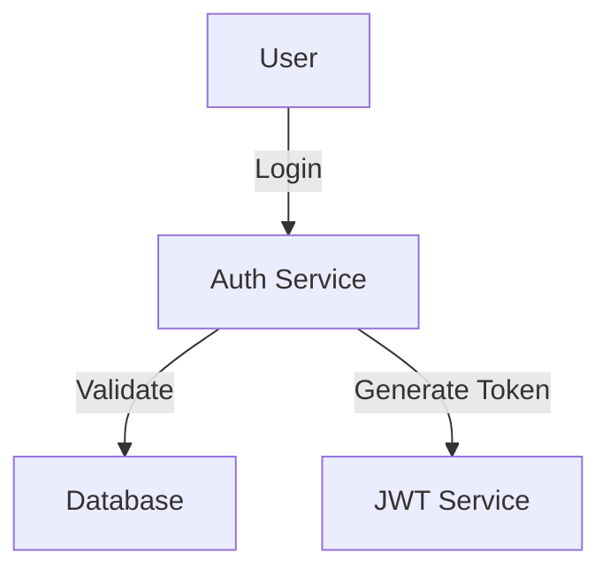

```mermaid
graph LR
    A[001-user-auth] --> B[002-user-profile]
    A --> C[003-api-gateway]
    B --> D[004-notification]
    C --> D
    D --> A
    
    style D fill:#ff6b6b
    %% 红色表示存在循ç¯ä¾èµ–
```

# Spec-Kit 扩展需求文档

**创建日期**: 2026-01-26  
**状态**: 需求收集阶段  
**目标**: 在 GitHub Spec-Kit 基础上添加企业级功能和团队协作增强

---

## 📋 目录

1. [命令和模板扩展](#1-命令和模板扩展)
2. [工具集成扩展](#2-工具集成扩展)
3. [团队规范和标准](#3-团队规范和标准)
4. [开发体验提升](#4-开发体验提升)
5. [分析和洞察](#5-分析和洞察)
6. [安全和合规](#6-安全和合规)
7. [学习和知识管理](#7-学习和知识管理)
8. [持续改进](#8-持续改进)
9. [实现优先级](#9-实现优先级)

---

## 1. 命令和模板扩展

### 1.1 质量保证命令

#### `/speckit.review` - 自动化代码审查
**描述**: 基于团队规范自动检查代码，生成审查清单和建议

**功能点**:
- 基于 `.specify/code-standards/` 下的规范文件自动检查代码
- 生成结构化的审查清单（Code Review Checklist）
- 集成静态分析工具结果（ESLint, SonarQube, etc.）
- 识别常见反模式和代码异味
- 提供改进建议和最佳实践参考

**输出文件**: `specs/[feature]/review-report.md`

**示例用法**:
```bash
/speckit.review
```

**预期输出结构**:
```markdown
# Code Review Report

## Summary
- Total Files Reviewed: 25
- Issues Found: 12 (3 critical, 5 major, 4 minor)
- Code Quality Score: 85/100

## Critical Issues
1. Security: Hardcoded API key in `config.ts`
2. Performance: N+1 query detected in `user-service.ts`
3. Security: SQL injection risk in `database.ts`

## Major Issues
[...]

## Best Practice Suggestions
[...]
```

---

#### `/speckit.security` - 安全审计
**描述**: 扫描依赖漏洞，检查敏感信息泄露，生成安全报告

**功能点**:
- 依赖漏洞扫描（集成 npm audit, Snyk, Dependabot）
- 敏感信息泄露检测（API keys, passwords, tokens）
- OWASP Top 10 检查清单
- 安全最佳实践验证
- 生成合规报告（GDPR, SOC2, etc.）

**输出文件**: `specs/[feature]/security-report.md`

**配置文件**: `.specify/security.yaml`
```yaml
security:
  dependency_scanning:
    enabled: true
    tools: [snyk, npm-audit]
  
  secrets_detection:
    enabled: true
    patterns:
      - "API_KEY"
      - "SECRET"
      - "PASSWORD"
  
  compliance:
    standards: [GDPR, SOC2]
```

---

#### `/speckit.performance` - 性能分析
**描述**: 识别性能瓶颈，生成优化建议，对比基准测试结果

**功能点**:
- 代码性能分析（时间复杂度、空间复杂度）
- 识别慢查询和 N+1 问题
- Bundle size 分析（前端项目）
- 生成性能优化建议
- 与基准测试结果对比

**输出文件**: `specs/[feature]/performance-report.md`

---

#### `/speckit.changelog` - 自动生成变更日志
**描述**: 从 spec 和 commits 生成 CHANGELOG，符合团队版本发布规范

**功能点**:
- 从 git commits 提取变更信息
- 从 spec.md 提取功能描述
- 自动分类（Feature, Fix, Breaking Change, Deprecated）
- 符合 Keep a Changelog 规范
- 支持自定义模板

**输出文件**: `CHANGELOG.md`

**示例输出**:
```markdown
# Changelog

## [1.2.0] - 2026-01-26

### Added
- User authentication with OAuth2 (Feature #001)
- Dashboard analytics widget (Feature #003)

### Fixed
- Payment processing timeout issue (Feature #002)

### Changed
- Updated API response format for /users endpoint

### Breaking Changes
- Removed deprecated /api/v1/auth endpoint
```

---

### 1.2 协作流程命令

#### `/speckit.handoff` - 交接文档生成
**描述**: 为功能交接生成完整文档

**功能点**:
- 自动提取架构决策记录（ADR）
- 记录技术债务和注意事项
- 生成依赖关系图
- 列出关键配置和环境变量
- 包含测试和部署说明

**输出文件**: `specs/[feature]/handoff.md`

---

#### `/speckit.estimate` - 工作量估算
**描述**: 基于 spec 和 plan 估算开发时间

**功能点**:
- 分析 tasks.md 的复杂度
- 考虑团队历史速度（velocity）
- 识别风险和不确定性
- 提供乐观/悲观/最可能三种估算
- 生成甘特图时间线

**输出文件**: `specs/[feature]/estimate.md`

**示例输出**:
```markdown
# Work Estimate

## Summary
- Optimistic: 3 days
- Most Likely: 5 days
- Pessimistic: 8 days
- Confidence: Medium (60%)

## Risk Factors
- High: Third-party API integration (no prior experience)
- Medium: Database migration (requires downtime)
- Low: UI implementation (standard patterns)

## Timeline
[Gantt chart or timeline visualization]
```

---

#### `/speckit.sync` - 同步外部工具状态
**描述**: 更新 Jira/Confluence/Slack 等外部工具的状态

**功能点**:
- 自动创建/更新 Jira tickets
- 同步 Confluence 文档
- 推送通知到 Slack/Teams
- 更新项目看板状态
- 记录同步历史

**配置文件**: `.specify/integrations.yaml`

---

### 1.3 文档生成命令

#### `/speckit.api-doc` - API 文档生成
**描述**: 从 contracts/ 生成 OpenAPI/Swagger 文档

**功能点**:
- 解析 `contracts/*.md` 生成 OpenAPI 3.0 规范
- 生成 Swagger UI 可视化文档
- 生成 SDK 示例代码（多语言）
- 创建 Postman collection
- 生成 API 测试用例

**输出文件**: 
- `specs/[feature]/contracts/openapi.yaml`
- `specs/[feature]/contracts/postman-collection.json`

---

#### `/speckit.architecture` - 架构图生成
**描述**: 从 spec 生成架构图和序列图

**功能点**:
- 生成 C4 模型图（Context, Container, Component, Code）
- 生成序列图（用户交互流程）
- 生成 ER 图（数据模型关系）
- 使用 Mermaid/PlantUML 格式
- 可导出为 PNG/SVG

**输出文件**: `specs/[feature]/diagrams/`

**示例**:


---

#### `/speckit.onboard` - 新成员入职文档
**描述**: 生成项目概览和学习路径

**功能点**:
- 生成项目技术栈概览
- 整理关键决策历史（ADRs）
- 创建学习路径和阅读顺序
- 列出开发环境设置步骤
- 包含常见问题（FAQ）

**输出文件**: `ONBOARDING.md`

---

## 2. 工具集成扩展

### 2.1 项目管理工具集成

#### Jira 集成
**描述**: 与 Atlassian Jira 双向同步

**功能点**:
- 自动创建 Jira tickets（基于 spec.md）
- 同步任务状态（planning → In Progress → Done）
- 关联 spec 到 Jira issue
- 更新工作量估算
- 同步评论和附件

**配置文件**: `.specify/integrations.yaml`
```yaml
integrations:
  jira:
    enabled: true
    url: "https://your-company.atlassian.net"
    project_key: "PROJ"
    auth:
      email: "${JIRA_EMAIL}"
      api_token: "${JIRA_API_TOKEN}"
    
    auto_create_tickets: true
    status_mapping:
      planning: "In Progress"
      implementing: "In Development"
      testing: "In QA"
      done: "Done"
    
    issue_template:
      type: "Story"
      labels: ["spec-kit", "auto-generated"]
      components: ["Backend", "Frontend"]
```

---

#### Confluence 集成
**描述**: 自动发布 spec 到 Confluence

**功能点**:
- 自动创建/更新 Confluence 页面
- 保持 spec.md 和 Confluence 同步
- 使用预定义模板
- 支持版本控制
- 自动生成目录

**配置**:
```yaml
integrations:
  confluence:
    enabled: true
    url: "https://your-company.atlassian.net/wiki"
    space_key: "TECH"
    auth:
      email: "${CONFLUENCE_EMAIL}"
      api_token: "${CONFLUENCE_API_TOKEN}"
    
    auto_publish_specs: true
    template_page_id: "123456789"
    parent_page_id: "987654321"
```

---

#### Slack/Teams 集成
**描述**: 推送通知和更新到团队聊天工具

**功能点**:
- Spec 创建/更新通知
- 审查请求通知
- CI/CD 状态更新
- 每日摘要报告
- 自定义 webhook 集成

**配置**:
```yaml
integrations:
  slack:
    enabled: true
    webhook_url: "${SLACK_WEBHOOK_URL}"
    channels:
      specs: "#specs-review"
      releases: "#releases"
      alerts: "#dev-alerts"
    
    notifications:
      spec_created: true
      spec_updated: true
      review_requested: true
      ci_failed: true
```

---

### 2.2 CI/CD 集成

#### GitHub Actions 模板
**描述**: 预配置的 CI/CD 工作流

**模板文件**: `.specify/ci-templates/github-actions/`
```yaml
# spec-validation.yml
name: Spec Validation

on:
  pull_request:
    paths:
      - 'specs/**'

jobs:
  validate:
    runs-on: ubuntu-latest
    steps:
      - uses: actions/checkout@v3
      - name: Validate Spec Completeness
        run: |
          # 检查必填字段
          # 验证格式正确性
      
      - name: Run Consistency Check
        run: specify analyze
      
      - name: Check Quality Gates
        run: |
          # 检查质量门禁
```

---

#### GitLab CI 模板
**描述**: GitLab CI/CD 配置

**模板文件**: `.specify/ci-templates/gitlab-ci/`

---

### 2.3 监控和告警

#### `/speckit.metrics` - 生成指标看板
**描述**: 项目健康度和团队效能指标

**功能点**:
- 功能交付速度（Lead Time, Cycle Time）
- Spec 质量评分
- 技术债务趋势
- 代码覆盖率趋势
- 团队协作指标

**输出**: Dashboard 数据或 HTML 报告

---

#### `/speckit.health` - 项目健康检查
**描述**: 全面的项目健康度检查

**功能点**:
- Spec 覆盖率（哪些功能有 spec）
- 文档更新度（是否与代码同步）
- 依赖过期检查
- 配置漂移检测
- 技术债务评估

**输出文件**: `health-report.md`

---

## 3. 团队规范和标准

### 3.1 公司特定模板

#### 目录结构
```
templates/company-standards/
├── constitution-template.md     # 公司架构原则
├── security-checklist.md        # 安全审查清单
├── code-style/
│   ├── javascript.md           # JavaScript/TypeScript 规范
│   ├── python.md               # Python 规范
│   ├── java.md                 # Java 规范
│   └── go.md                   # Go 规范
├── review-guidelines.md         # 代码审查指南
└── incident-response.md         # 事故响应模板
```

---

#### Constitution 模板示例
```markdown
# [公司名称] 技术架构原则

## 核心原则

### 1. 简单优于复杂
- 优先选择简单方案
- 避免过度工程
- 遵循 KISS 原则

### 2. 安全第一
- 所有 API 必须有认证和授权
- 敏感数据必须加密存储
- 定期进行安全审计

### 3. 性能优先
- 页面加载时间 < 3秒
- API 响应时间 < 200ms (P95)
- 数据库查询优化（避免 N+1）

## 技术栈标准

### 后端
- 语言: Java 17, Python 3.11+
- 框架: Spring Boot 3.x, FastAPI
- 数据库: PostgreSQL 15+, Redis 7+

### 前端
- 语言: TypeScript 5+
- 框架: React 18+, Next.js 14+
- 状态管理: Zustand, TanStack Query

### 基础设施
- 容器: Docker, Kubernetes
- CI/CD: GitHub Actions, ArgoCD
- 监控: Prometheus, Grafana

## 禁止使用
- ❌ 不得使用 `eval()`
- ❌ 禁止硬编码密钥和密码
- ❌ 避免使用已废弃的库（见 banned-deps.txt）
- ❌ 不得绕过代码审查流程

## 代码质量要求
- 单元测试覆盖率 ≥ 80%
- 集成测试覆盖率 ≥ 60%
- 所有公开 API 必须有文档
- 关键业务逻辑必须有注释
```

---

### 3.2 质量门禁配置

**配置文件**: `.specify/quality-gates.yaml`
```yaml
quality_gates:
  spec:
    must_have:
      - user_stories: 
          min: 3
          description: "每个 feature 至少需要 3 个用户故事"
      
      - acceptance_criteria: 
          min: 5
          description: "每个用户故事至少需要 5 个验收标准"
      
      - security_considerations: 
          required: true
          description: "必须包含安全考虑章节"
      
      - performance_requirements:
          required_if: "涉及数据库或 API"
    
    quality_score:
      min: 80
      factors:
        - completeness: 40%  # 完整性
        - clarity: 30%       # 清晰度
        - testability: 30%   # 可测试性
  
  plan:
    must_have:
      - data_model: 
          required_if: "使用数据库"
      
      - api_contracts: 
          required_if: "提供 API"
      
      - test_scenarios: 
          min: 10
          description: "至少 10 个测试场景"
      
      - tech_stack_compliance:
          required: true
          description: "必须符合公司技术栈标准"
    
    complexity_check:
      max_files: 50
      max_dependencies: 20
  
  implementation:
    code_quality:
      coverage:
        unit: 80%
        integration: 60%
        e2e: 40%
      
      linting:
        max_warnings: 10
        max_errors: 0
      
      complexity:
        max_cyclomatic: 10
        max_cognitive: 15
    
    security:
      vulnerability_scan: required
      secrets_detection: required
      dependency_check: required
    
    performance:
      bundle_size_limit: 500KB  # 前端
      api_response_time: 200ms   # 后端
      database_query_time: 50ms

# 门禁执行配置
enforcement:
  blocking:
    - spec.must_have
    - implementation.security
  
  warning:
    - spec.quality_score
    - plan.complexity_check
  
  auto_fix:
    - implementation.code_quality.linting
```

---

### 3.3 Agent 上下文增强

**文件**: `.cursor/rules/company-context.md`
```markdown
# [公司名称] 技术规范与上下文

## 技术栈
- **后端**: Java 17 + Spring Boot 3.2, Python 3.11 + FastAPI
- **前端**: React 18 + TypeScript 5 + Next.js 14
- **数据库**: PostgreSQL 15 (主库), Redis 7 (缓存)
- **消息队列**: Apache Kafka 3.5
- **搜索引擎**: Elasticsearch 8.x
- **容器编排**: Kubernetes 1.28

## 强制规范

### 安全
- ✅ 所有 API 必须有 rate limiting (100 req/min per user)
- ✅ 敏感数据必须使用 AES-256 加密
- ✅ 日志不得包含 PII (个人身份信息)
- ✅ 必须通过 SonarQube 扫描 (Quality Gate Pass)
- ✅ 所有密钥必须存储在 AWS Secrets Manager

### 性能
- ✅ API 响应时间 P95 < 200ms
- ✅ 数据库查询必须有索引（避免全表扫描）
- ✅ 前端 Bundle Size < 500KB (gzipped)
- ✅ 页面 First Contentful Paint < 1.5s

### 代码质量
- ✅ TypeScript strict mode 必须开启
- ✅ 所有公开函数必须有 JSDoc/Docstring
- ✅ 复杂函数（圈复杂度 > 10）必须拆分
- ✅ Magic numbers 必须定义为常量

## 禁止使用
- ❌ `eval()`, `Function()` 构造器
- ❌ `any` 类型（TypeScript）
- ❌ 硬编码的 API endpoints
- ❌ 未加密的敏感信息
- ❌ 过时的依赖（见 `.specify/banned-deps.txt`）

## 开发流程
1. 创建 feature branch: `git checkout -b 001-feature-name`
2. 编写 spec: `/speckit.specify "feature description"`
3. 创建 plan: `/speckit.plan`
4. 生成 tasks: `/speckit.tasks`
5. 实现功能: `/speckit.implement`
6. 代码审查: `/speckit.review`
7. 提交 PR，等待审批
8. 合并到 main，自动部署

## 常用命令模板

### API Endpoint 模板
```typescript
/**
 * @route POST /api/v1/users
 * @description Create a new user
 * @access Private (requires auth token)
 * @rateLimit 10 requests per minute
 */
router.post('/users', 
  authenticate,
  rateLimit({ max: 10, windowMs: 60000 }),
  validate(createUserSchema),
  async (req, res) => {
    // Implementation
  }
);
```

### Database Query 模板
```python
# Good: 使用索引，优化查询
users = await db.users.find(
    {"email": email},
    projection={"password": 0}  # 不返回敏感字段
).limit(100)

# Bad: 全表扫描
users = await db.users.find({}).to_list()
```

## 架构模式

### 后端分层架构
```
Controller (路由层)
  ↓
Service (业务逻辑层)
  ↓
Repository (数据访问层)
  ↓
Database
```

### 前端组件规范
```
src/
├── components/       # 可复用组件
├── features/         # 功能模块
├── pages/           # 页面
├── hooks/           # 自定义 Hooks
├── services/        # API 调用
├── stores/          # 状态管理
└── utils/           # 工具函数
```

## 监控和告警
- **APM**: Datadog
- **日志**: ELK Stack (Elasticsearch, Logstash, Kibana)
- **错误追踪**: Sentry
- **性能监控**: New Relic

## 联系方式
- 技术负责人: @tech-lead
- DevOps 团队: @devops-team
- 安全团队: @security-team
```

---

## 4. 开发体验提升

### 4.1 CLI 功能增强

#### `specify snapshot` - 快照管理
```bash
# 创建快照
specify snapshot create experiment-v1
# 快照已保存: experiment-v1 (23 specs, 2.3MB)

# 列出所有快照
specify snapshot list
# 1. experiment-v1 (2026-01-26 10:30)
# 2. before-refactor (2026-01-25 15:20)

# 恢复快照
specify snapshot restore experiment-v1
# 已恢复到 experiment-v1

# 删除快照
specify snapshot delete experiment-v1
```

---

#### `specify diff` - 对比功能
```bash
# 对比两个 feature
specify diff 001-user-auth 002-payment

# 对比输出
Differences between 001-user-auth and 002-payment:
  
  Shared Dependencies:
  - PostgreSQL
  - Redis
  
  Unique to 001-user-auth:
  - JWT library
  - Bcrypt
  
  Unique to 002-payment:
  - Stripe SDK
  - Payment Gateway API
  
  Potential Conflicts:
  - Both modify User table schema
  - Both require database migrations
```

---

#### `specify merge` - 合并功能
```bash
# 合并多个 feature 的 spec
specify merge --from 001-feature-a --to 002-feature-b --output 003-combined

# 提示冲突
Conflicts detected:
  1. data-model.md: User table schema differs
  2. plan.md: Technology stack conflicts
  
Merge strategy:
  [A] Keep 001-feature-a
  [B] Keep 002-feature-b
  [M] Manual merge
```

---

#### `specify export` - 导出文档
```bash
# 导出为 PDF
specify export 001-user-auth --format pdf --output docs/

# 导出为 HTML（带样式）
specify export 001-user-auth --format html --theme corporate

# 导出为 Word 文档
specify export 001-user-auth --format docx

# 导出所有 specs
specify export --all --format pdf
```

---

#### `specify search` - 全文搜索
```bash
# 搜索关键词
specify search "authentication"

# 结果
Found in 3 specs:
  001-user-auth/spec.md (5 matches)
    - Line 23: "User authentication via OAuth2"
    - Line 45: "Authentication token expires in 24h"
  
  003-api-gateway/plan.md (2 matches)
    - Line 67: "Route requires authentication"
  
  005-admin-panel/spec.md (1 match)
    - Line 12: "Admin authentication with 2FA"

# 搜索特定类型的文件
specify search "database" --type plan

# 正则表达式搜索
specify search "API-[0-9]+" --regex
```

---

#### `specify stats` - 项目统计
```bash
specify stats

# 输出
Project Statistics:
  
  Specs:
    Total: 15 features
    Status: 5 done, 7 in progress, 3 planned
  
  Lines of Code:
    Source: 12,543 lines
    Tests: 8,234 lines
    Coverage: 82%
  
  Documentation:
    Specs: 15 files, 2,345 lines
    Plans: 15 files, 3,456 lines
    Total: 5,801 lines
  
  Dependencies:
    Direct: 45
    Indirect: 234
    Outdated: 8 (2 critical)
  
  Technical Debt:
    TODO comments: 23
    FIXME comments: 7
    Deprecated APIs: 5
    Estimated hours: 40h
```

---

### 4.2 智能提示和自动补全

#### 上下文感知建议
```python
# specify_cli/suggestions.py

def get_next_step_suggestions(context: dict) -> list[str]:
    """基于当前状态建议下一步操作"""
    
    if has_spec_but_no_plan(context):
        return [
            "💡 Suggestion: Run `/speckit.plan` to create implementation plan",
            "📋 Next: Create technical design based on spec.md"
        ]
    
    if has_plan_but_no_tasks(context):
        return [
            "💡 Suggestion: Run `/speckit.tasks` to generate actionable tasks",
            "📋 Next: Break down the plan into implementation tasks"
        ]
    
    if has_outdated_dependencies(context):
        return [
            "⚠️  Warning: 8 dependencies are outdated",
            "💡 Suggestion: Run `npm update` or `pip install --upgrade`"
        ]
```

---

### 4.3 交互式向导

#### `specify wizard new-feature` - 新功能向导
```bash
specify wizard new-feature

# 交互式问答
┌─────────────────────────────────────────┐
│ Create New Feature - Step 1/6           │
├─────────────────────────────────────────┤
│                                         │
│ What is the feature name?              │
│ > User authentication with OAuth2      │
│                                         │
│ [Enter to continue]                     │
└─────────────────────────────────────────┘

┌─────────────────────────────────────────┐
│ Create New Feature - Step 2/6           │
├─────────────────────────────────────────┤
│                                         │
│ Which type of feature is this?         │
│   ▶ Backend API                         │
│     Frontend UI                         │
│     Full-stack                          │
│     Infrastructure                      │
│                                         │
└─────────────────────────────────────────┘

# ... 继续引导用户完成所有步骤
```

---

#### `specify wizard refactor` - 重构向导
```bash
specify wizard refactor

# 引导用户进行安全的重构
```

---

#### `specify wizard migrate` - 迁移向导
```bash
specify wizard migrate

# 技术栈迁移向导（如 Vue2 → Vue3）
```

---

## 5. 分析和洞察

### 5.1 智能分析命令

#### `/speckit.impact` - 影响分析
**描述**: 分析修改会影响哪些模块

**功能点**:
- 分析依赖关系图
- 识别受影响的模块和文件
- 评估回归风险（高/中/低）
- 生成建议的测试范围
- 列出需要通知的团队成员

**示例输出**:
```markdown
# Impact Analysis: Modify User Authentication

## Directly Affected
- `auth-service` (High Risk)
- `user-api` (High Risk)
- `session-manager` (Medium Risk)

## Indirectly Affected
- `admin-panel` (Medium Risk)
- `mobile-app` (Low Risk)
- `notification-service` (Low Risk)

## Recommended Testing
- Unit tests: auth-service, user-api
- Integration tests: login flow, session management
- E2E tests: full authentication flow

## People to Notify
- @backend-team (owners of auth-service)
- @frontend-team (consumers of user-api)
```

---

#### `/speckit.dependencies` - 依赖关系图
**描述**: 可视化 feature 之间的依赖

**功能点**:
- 生成依赖关系图
- 识别循环依赖
- 建议解耦方案
- 显示关键路径
- 导出为 Mermaid/GraphViz

**示例输出**:


---

#### `/speckit.debt` - 技术债务追踪
**描述**: 识别和追踪技术债务

**功能点**:
- 扫描 TODO/FIXME 注释
- 识别代码异味
- 评估债务严重性
- 优先级排序
- 生成偿还计划

**示例输出**:
```markdown
# Technical Debt Report

## Summary
- Total Debt: 120 hours (estimated)
- Critical: 15 items (40h)
- High: 25 items (50h)
- Medium: 30 items (30h)

## Critical Issues
1. **Database N+1 queries** (8h)
   - Location: user-service.ts:45
   - Impact: Performance degradation
   - Fix: Add batch loading

2. **Hardcoded API endpoints** (4h)
   - Location: config.ts:12
   - Impact: Deployment issues
   - Fix: Move to environment variables

## Recommended Action Plan
Week 1: Address all critical issues (40h)
Week 2-3: Address high priority issues (50h)
Month 2: Address medium priority issues (30h)
```

---

### 5.2 团队协作分析

#### `/speckit.knowledge-map` - 知识地图
**描述**: 识别团队知识分布

**功能点**:
- 分析代码贡献历史
- 识别每个模块的专家
- 发现知识孤岛（单点故障）
- 建议 pair programming 配对
- 生成培训计划

**示例输出**:
```markdown
# Knowledge Map

## Module Experts
- auth-service: @alice (80%), @bob (60%)
- payment-service: @charlie (90%) ⚠️ Single Point of Failure
- notification-service: @david (70%), @alice (50%)

## Knowledge Gaps
⚠️ payment-service: Only 1 expert
💡 Suggestion: Pair @charlie with @bob for knowledge transfer

## Recommended Pairing
- Week 1: @charlie + @bob (payment-service)
- Week 2: @alice + @eve (auth-service)
```

---

#### `/speckit.bottleneck` - 瓶颈分析
**描述**: 识别开发流程瓶颈

**功能点**:
- 分析 Lead Time / Cycle Time
- 识别等待时间最长的环节
- 分析代码审查延迟
- 生成流程优化建议

**示例输出**:
```markdown
# Bottleneck Analysis

## Development Flow
Average Lead Time: 5.2 days
  - Spec Creation: 0.5 days
  - Planning: 1 day
  - Implementation: 2 days ⚠️
  - Code Review: 1.5 days ⚠️ BOTTLENECK
  - Testing: 0.2 days

## Issues Identified
1. **Code Review Delay** (1.5 days average)
   - Cause: Only 2 reviewers available
   - Impact: Blocks 60% of PRs
   - Suggestion: Add 2 more reviewers

2. **Implementation Time** (2 days average)
   - Cause: Frequent context switching
   - Suggestion: Allocate focused development time
```

---

## 6. 安全和合规

### 6.1 安全扫描集成

**配置文件**: `.specify/security.yaml`
```yaml
security:
  # 依赖扫描
  dependency_scanning:
    enabled: true
    tools:
      - name: snyk
        severity_threshold: high
        auto_fix: true
      
      - name: npm-audit
        enabled: true
      
      - name: dependabot
        enabled: true
        auto_merge: minor_patches_only
  
  # 密钥检测
  secrets_detection:
    enabled: true
    tools:
      - name: trufflehog
        enabled: true
      - name: git-secrets
        enabled: true
    
    patterns:
      - regex: "(?i)api[_-]?key"
      - regex: "(?i)password"
      - regex: "(?i)secret"
      - regex: "[0-9a-f]{32,}"  # Potential tokens
  
  # 静态代码分析
  static_analysis:
    tools:
      - name: sonarqube
        quality_gate: pass
        coverage_threshold: 80%
      
      - name: eslint-security
        enabled: true
  
  # 合规检查
  compliance:
    standards:
      - name: GDPR
        enabled: true
        checks:
          - data_encryption
          - right_to_deletion
          - consent_management
      
      - name: SOC2
        enabled: true
        checks:
          - access_control
          - audit_logging
          - data_backup
      
      - name: HIPAA
        enabled: false
    
    auto_check: true
    block_on_violation: true

# 安全策略
policies:
  password:
    min_length: 12
    require_special_chars: true
    require_numbers: true
    require_uppercase: true
  
  api_keys:
    rotation_period_days: 90
    storage: aws_secrets_manager
  
  encryption:
    algorithm: AES-256-GCM
    key_storage: aws_kms
```

---

### 6.2 合规性检查

#### `/speckit.compliance` - 合规检查
**描述**: 验证是否符合 GDPR/SOC2 等标准

**功能点**:
- 检查数据隐私合规性
- 验证访问控制机制
- 审查日志记录
- 检查数据加密
- 生成合规报告

**示例输出**:
```markdown
# Compliance Report: GDPR

## Summary
Status: ⚠️ Partial Compliance (85%)
Last Check: 2026-01-26

## Compliance Status

### ✅ Compliant (10/12)
- Data encryption at rest
- Data encryption in transit
- Access control implemented
- Audit logging enabled
- Data backup procedures
- [...]

### ❌ Non-Compliant (2/12)
1. **Right to Deletion** (Article 17)
   - Issue: No API endpoint for user data deletion
   - Required: Implement DELETE /api/users/:id
   - Deadline: 2026-02-15

2. **Consent Management** (Article 7)
   - Issue: Cookie consent not implemented
   - Required: Add cookie consent banner
   - Deadline: 2026-02-10

## Recommendations
1. Implement user data deletion API
2. Add explicit cookie consent mechanism
3. Update privacy policy
```

---

#### `/speckit.audit` - 审计日志
**描述**: 记录和追踪所有变更

**功能点**:
- 记录所有 spec 变更
- 追踪决策历史
- 记录谁在何时做了什么
- 生成审计报告
- 支持审计查询

**数据结构**:
```json
{
  "audit_logs": [
    {
      "timestamp": "2026-01-26T10:30:00Z",
      "user": "alice@company.com",
      "action": "spec.created",
      "resource": "specs/001-user-auth/spec.md",
      "details": {
        "feature": "User Authentication",
        "branch": "001-user-auth"
      }
    },
    {
      "timestamp": "2026-01-26T11:15:00Z",
      "user": "bob@company.com",
      "action": "plan.updated",
      "resource": "specs/001-user-auth/plan.md",
      "changes": {
        "added": ["JWT library"],
        "removed": ["Session-based auth"]
      }
    }
  ]
}
```

---

## 7. 学习和知识管理

### 7.1 文档和教程生成

#### `/speckit.tutorial` - 生成教程
**描述**: 从实际 spec 生成学习材料

**功能点**:
- 提取关键概念和步骤
- 生成代码演练（walkthrough）
- 创建交互式示例
- 生成最佳实践文档
- 包含常见陷阱和解决方案

**示例输出**:
```markdown
# Tutorial: Building User Authentication

## Overview
Learn how to implement OAuth2 authentication step-by-step.

## Prerequisites
- Basic understanding of HTTP
- Familiarity with JWT tokens
- Node.js 18+ installed

## Step 1: Install Dependencies
\`\`\`bash
npm install passport passport-oauth2 jsonwebtoken
\`\`\`

## Step 2: Configure OAuth Provider
[详细步骤...]

## Step 3: Implement Auth Middleware
[代码示例和解释...]

## Common Pitfalls
1. **Token Expiration**: Always check token validity
2. **CORS Issues**: Configure CORS properly for OAuth redirects

## Best Practices
- Store tokens in httpOnly cookies
- Implement refresh token rotation
- Use short-lived access tokens
```

---

#### `/speckit.patterns` - 识别设计模式
**描述**: 从代码中提取和记录设计模式

**功能点**:
- 扫描代码识别常用模式
- 生成模式库
- 推荐适用场景
- 提供实现示例
- 记录团队约定

**示例输出**:
```markdown
# Design Patterns in Project

## Detected Patterns

### 1. Repository Pattern
**Location**: `src/repositories/`
**Usage**: 15 implementations
**Purpose**: Abstract data access layer

**Example**:
\`\`\`typescript
class UserRepository {
  async findById(id: string): Promise<User> {
    return await db.users.findOne({ id });
  }
}
\`\`\`

### 2. Factory Pattern
**Location**: `src/factories/`
**Usage**: 8 implementations
**Purpose**: Create objects without specifying exact class

### 3. Observer Pattern
**Location**: `src/events/`
**Usage**: 12 implementations
**Purpose**: Event-driven architecture

## Recommended Patterns
Based on your codebase, consider:
- **Strategy Pattern** for payment processing
- **Decorator Pattern** for API middleware
```

---

### 7.2 AI Agent Skills 扩展

**目录结构**:
```
.cursor/skills/
├── company-architecture/
│   ├── SKILL.md                    # 公司架构审查技能
│   ├── examples/
│   │   ├── good-example.ts
│   │   └── bad-example.ts
│   └── checklist.md
│
├── api-design-review/
│   ├── SKILL.md                    # API 设计审查技能
│   ├── rest-best-practices.md
│   └── graphql-best-practices.md
│
├── database-schema-review/
│   ├── SKILL.md                    # 数据库设计审查技能
│   ├── normalization-guide.md
│   └── indexing-strategies.md
│
├── security-review/
│   ├── SKILL.md                    # 安全审查技能
│   ├── owasp-top10.md
│   └── common-vulnerabilities.md
│
└── performance-optimization/
    ├── SKILL.md                    # 性能优化技能
    ├── frontend-optimization.md
    └── backend-optimization.md
```

**Skill 示例**: `.cursor/skills/api-design-review/SKILL.md`
```markdown
# API Design Review Skill

## Trigger
When reviewing API design in contracts/*.md or API implementation code

## Context
Review APIs against RESTful best practices and company standards

## Checklist

### Resource Naming
- [ ] Use plural nouns for collections (`/users` not `/user`)
- [ ] Use kebab-case for multi-word resources (`/order-items`)
- [ ] Avoid verbs in URLs (use HTTP methods instead)

### HTTP Methods
- [ ] GET for read operations (idempotent)
- [ ] POST for create operations
- [ ] PUT for full update (idempotent)
- [ ] PATCH for partial update
- [ ] DELETE for remove operations (idempotent)

### Status Codes
- [ ] 200 OK for successful GET/PUT/PATCH
- [ ] 201 Created for successful POST
- [ ] 204 No Content for successful DELETE
- [ ] 400 Bad Request for validation errors
- [ ] 401 Unauthorized for auth failures
- [ ] 404 Not Found for missing resources
- [ ] 500 Internal Server Error for server errors

### Response Format
- [ ] Consistent error format across all endpoints
- [ ] Include request ID for debugging
- [ ] Use envelope pattern for collections
- [ ] Include pagination metadata

### Security
- [ ] All endpoints require authentication (unless public)
- [ ] Rate limiting configured
- [ ] Input validation implemented
- [ ] No sensitive data in URLs

## Example Review

### ❌ Bad API Design
\`\`\`
POST /getUserById
{
  "id": 123
}
\`\`\`

### ✅ Good API Design
\`\`\`
GET /api/v1/users/123
Authorization: Bearer <token>
\`\`\`

## Suggested Improvements Template
When issues found, use this template:
\`\`\`
API Design Issues:
1. [Issue description]
   - Current: [what's wrong]
   - Recommended: [how to fix]
   - Reason: [why this matters]
\`\`\`
```

---

## 8. 持续改进

### 8.1 反馈循环

#### `/speckit.retrospective` - 回顾分析
**描述**: 分析已完成的 feature，提取经验教训

**功能点**:
- 分析完成的 feature
- 对比估算和实际时间
- 识别成功因素和痛点
- 更新最佳实践文档
- 生成改进建议

**示例输出**:
```markdown
# Retrospective: 001-user-auth

## Timeline
- Estimated: 5 days
- Actual: 7 days
- Variance: +40%

## What Went Well ✅
1. Clear spec reduced back-and-forth
2. Early security review caught issues
3. Good test coverage (85%)

## What Could Be Improved ⚠️
1. Underestimated OAuth integration complexity
2. Performance testing added late
3. Documentation updated after code review

## Action Items
1. Add OAuth integration to estimation template
2. Include performance testing in plan phase
3. Update docs in parallel with code

## Lessons Learned
- Third-party integrations often take 2x longer than expected
- Early performance testing saves time
- Pair programming reduces review time by 30%

## Updates to Best Practices
Added to `.specify/company-standards/`:
- OAuth integration checklist
- Performance testing guidelines
```

---

#### `/speckit.optimize` - 流程优化
**描述**: 分析开发流程，建议改进

**功能点**:
- 分析瓶颈和延迟
- 建议流程改进
- A/B 测试不同方法
- 测量改进效果
- 持续优化

**示例输出**:
```markdown
# Process Optimization Report

## Current Metrics
- Average Lead Time: 5.2 days
- Code Review Time: 1.5 days (29% of total)
- Deployment Frequency: 2x per week
- Change Failure Rate: 8%

## Identified Bottlenecks
1. **Code Review Queue**
   - Average wait time: 18 hours
   - Suggestion: Add 2 more reviewers
   - Expected impact: -30% wait time

2. **Manual Testing**
   - Time spent: 4 hours per feature
   - Suggestion: Automate regression tests
   - Expected impact: -75% testing time

## Proposed Experiments
1. **Experiment A**: Implement auto-review for small PRs
   - Duration: 2 weeks
   - Metric: Review time
   - Success criteria: <20% reduction

2. **Experiment B**: Pair programming for complex features
   - Duration: 1 month
   - Metric: Bug rate, review time
   - Success criteria: <30% bug rate, <20% review time
```

---

### 8.2 自动化改进建议

#### 定期分析系统
```python
# specify_cli/analysis/auto_suggestions.py

class ProjectAnalyzer:
    def analyze_project(self) -> list[Suggestion]:
        suggestions = []
        
        # 分析 spec 完整性
        specs_without_security = self.find_specs_missing_section("security")
        if specs_without_security:
            suggestions.append(Suggestion(
                type="quality",
                priority="high",
                message=f"发现 {len(specs_without_security)} 个 spec 缺少安全考虑章节",
                action="添加安全审查清单",
                affected_files=specs_without_security
            ))
        
        # 分析代码复用
        duplicate_code = self.find_duplicate_code()
        if duplicate_code:
            suggestions.append(Suggestion(
                type="refactoring",
                priority="medium",
                message=f"发现 {len(duplicate_code)} 处重复代码",
                action="提取为可复用组件",
                locations=duplicate_code
            ))
        
        # 分析性能
        slow_queries = self.find_slow_queries()
        if slow_queries:
            suggestions.append(Suggestion(
                type="performance",
                priority="high",
                message=f"发现 {len(slow_queries)} 个慢查询",
                action="添加数据库索引或优化查询",
                queries=slow_queries
            ))
        
        return suggestions
```

**示例输出**:
```markdown
# Automated Suggestions (Weekly Report)

## High Priority
1. ⚠️ **10 specs 缺少安全考虑章节**
   - Action: 运行 `/speckit.security` 添加安全审查
   - Affected: 001, 003, 005, 007, 009, 011, 013, 015, 017, 019

2. ⚠️ **5 个慢查询检测到**
   - Action: 添加数据库索引
   - Locations: user-service.ts:45, order-service.ts:123

## Medium Priority
3. 💡 **建议为 user-auth 模块添加性能测试**
   - Reason: 高流量模块，无性能基准
   - Action: 添加 load testing scenarios

4. 💡 **3 个 feature 可以复用相同的组件**
   - Features: 002, 004, 008
   - Component: UserProfile component
   - Potential savings: 200 LOC

## Low Priority
5. 📊 **data-model.md 格式不一致**
   - Action: 运行 `specify lint --fix`
   - Affected: 6 files
```

---

## 9. 实现优先级

基于价值和实现难度，建议的实现顺序：

### 🥇 第一优先级（高价值 + 易实现）
**目标**: 快速提升团队效率和代码质量

1. **团队代码规范模板** (1-2 天)
   - 创建 `templates/company-standards/` 目录
   - 编写各语言代码规范
   - 添加 constitution 模板

2. **/speckit.review 命令** (3-5 天)
   - 解析代码文件
   - 应用规范检查
   - 生成审查报告

3. **质量门禁配置** (2-3 天)
   - 定义 `quality-gates.yaml`
   - 实现检查逻辑
   - 集成到 CI/CD

4. **Agent 上下文增强** (1-2 天)
   - 创建 `.cursor/rules/company-context.md`
   - 编写公司特定规范
   - 添加示例和模板

5. **/speckit.changelog 命令** (3-4 天)
   - 解析 git commits
   - 提取 spec 信息
   - 生成格式化的 CHANGELOG

---

### 🥈 第二优先级（高价值 + 中等难度）

6. **Jira/Confluence 集成** (5-7 天)
   - 实现 API 客户端
   - 配置 `integrations.yaml`
   - 实现双向同步

7. **CLI 搜索和统计功能** (3-5 天)
   - `specify search` 命令
   - `specify stats` 命令
   - `specify diff` 命令

8. **/speckit.impact 影响分析** (4-6 天)
   - 构建依赖关系图
   - 分析影响范围
   - 生成测试建议

9. **/speckit.security 安全审计** (5-7 天)
   - 集成安全扫描工具
   - 实现密钥检测
   - 生成安全报告

10. **CI/CD 模板** (3-4 天)
    - GitHub Actions 模板
    - GitLab CI 模板
    - 自动化工作流

---

### 🥉 第三优先级（中等价值 + 实验性）

11. **/speckit.api-doc API 文档生成** (5-7 天)
    - 解析 contracts/
    - 生成 OpenAPI spec
    - 创建 Postman collection

12. **/speckit.performance 性能分析** (4-6 天)
    - 代码性能分析
    - Bundle size 检查
    - 性能基准对比

13. **交互式向导** (7-10 天)
    - `specify wizard new-feature`
    - `specify wizard refactor`
    - 交互式 UI 组件

14. **/speckit.architecture 架构图生成** (5-7 天)
    - 解析代码结构
    - 生成 Mermaid/PlantUML
    - 导出图片格式

15. **知识地图和协作分析** (7-10 天)
    - `/speckit.knowledge-map`
    - `/speckit.bottleneck`
    - 团队效能分析

---

### 🏅 第四优先级（长期价值 + 复杂实现）

16. **AI Agent Skills 扩展** (10-15 天)
    - 创建 skills 目录结构
    - 编写各类审查 skills
    - 集成到 AI 工作流

17. **合规性自动化** (10-15 天)
    - `/speckit.compliance`
    - `/speckit.audit`
    - 合规报告生成

18. **监控和指标系统** (15-20 天)
    - `/speckit.metrics`
    - `/speckit.health`
    - Dashboard 集成

19. **持续改进系统** (10-15 天)
    - `/speckit.retrospective`
    - `/speckit.optimize`
    - 自动化建议引擎

20. **高级 CLI 功能** (7-10 天)
    - `specify snapshot`
    - `specify merge`
    - `specify export`

---

## 10. 技术实现建议

### 架构设计

#### 插件化架构
```python
# specify_cli/plugins/base.py

class SpecKitPlugin(ABC):
    """插件基类"""
    
    @abstractmethod
    def name(self) -> str:
        """插件名称"""
        pass
    
    @abstractmethod
    def commands(self) -> list[Command]:
        """提供的命令"""
        pass
    
    @abstractmethod
    def execute(self, context: ExecutionContext) -> Result:
        """执行命令"""
        pass

# specify_cli/plugins/review_plugin.py

class ReviewPlugin(SpecKitPlugin):
    def name(self) -> str:
        return "review"
    
    def commands(self) -> list[Command]:
        return [
            Command(name="review", handler=self.review_code),
        ]
    
    def review_code(self, context: ExecutionContext) -> Result:
        # 实现代码审查逻辑
        pass
```

---

#### 配置管理
```python
# specify_cli/config.py

class SpecKitConfig:
    def __init__(self, project_root: Path):
        self.project_root = project_root
        self.config_dir = project_root / ".specify"
        
        # 加载配置文件
        self.integrations = self._load_yaml("integrations.yaml")
        self.quality_gates = self._load_yaml("quality-gates.yaml")
        self.security = self._load_yaml("security.yaml")
        self.company_standards = self._load_standards()
    
    def _load_yaml(self, filename: str) -> dict:
        path = self.config_dir / filename
        if path.exists():
            return yaml.safe_load(path.read_text())
        return {}
```

---

#### 集成框架
```python
# specify_cli/integrations/base.py

class Integration(ABC):
    """外部工具集成基类"""
    
    @abstractmethod
    def authenticate(self) -> bool:
        """认证"""
        pass
    
    @abstractmethod
    def sync(self, spec: Specification) -> Result:
        """同步数据"""
        pass

# specify_cli/integrations/jira.py

class JiraIntegration(Integration):
    def __init__(self, config: dict):
        self.url = config["url"]
        self.project_key = config["project_key"]
        self.client = JiraClient(url, auth=config["auth"])
    
    def sync(self, spec: Specification) -> Result:
        # 同步 spec 到 Jira
        issue = self.client.create_issue(
            project=self.project_key,
            summary=spec.title,
            description=spec.description,
            issue_type="Story"
        )
        return Result(success=True, data=issue)
```

---

## 11. 下一步行动

### 立即开始（本周）
1. ✅ 创建需求文档（已完成）
2. 📝 创建第一个 feature spec: `001-speckit-enhancements`
3. 🎨 设计团队代码规范模板
4. 📊 设计质量门禁配置结构

### 短期目标（1-2 周）
1. 实现 `/speckit.review` 命令
2. 创建公司规范模板库
3. 实现质量门禁检查
4. 编写 Agent 上下文增强文档

### 中期目标（1-2 月）
1. 实现主要集成（Jira, Confluence, Slack）
2. 完成核心分析命令
3. 建立 CI/CD 自动化
4. 创建完整的文档和教程

### 长期目标（3-6 月）
1. 构建完整的插件生态
2. 实现高级分析和 AI 功能
3. 建立团队知识库
4. 持续优化和改进

---

## 附录

### A. 相关资源
- [Spec-Kit GitHub Repository](https://github.com/github/spec-kit)
- [Spec-Driven Development Methodology](../spec-driven.md)
- [Contributing Guidelines](../CONTRIBUTING.md)

### B. 术语表
- **SDD**: Spec-Driven Development (规格驱动开发)
- **ADR**: Architecture Decision Record (架构决策记录)
- **PII**: Personally Identifiable Information (个人身份信息)
- **P95**: 95th Percentile (95 百分位数)
- **LOC**: Lines of Code (代码行数)

### C. 变更历史
| 日期 | 版本 | 变更内容 | 作者 |
|------|------|----------|------|
| 2026-01-26 | 1.0.0 | 初始版本，完整需求整理 | @masiyuan |

---

**文档状态**: 🟢 Active  
**下次审查**: 2026-02-26  
**负责人**: @masiyuan
