```mermaid
flowchart TD
    NewChat["🆕 New Chat Session<br/>(Zero History)"] --> Resume["/speckit.resume"]

    Resume --> LoadState["📂 Load State<br/>.speckit-state.json"]
    LoadState --> LoadArtifacts["📚 Load All Artifacts"]

    LoadArtifacts --> Constitution["✓ Constitution"]
    LoadArtifacts --> Spec["✓ Specification"]
    LoadArtifacts --> Plan["✓ Plan, Research, Data Model"]
    LoadArtifacts --> Tasks["✓ Tasks (28/47 completed)"]

    Constitution --> Identify
    Spec --> Identify
    Plan --> Identify
    Tasks --> Identify["🎯 Identify Resume Point<br/>Next: [T029] Webhook verification"]

    Identify --> Summary["📊 Show Summary<br/>• Recently completed: 3 tasks<br/>• Next task: [T029]<br/>• Upcoming: 5 tasks"]

    Summary --> Confirm{"❓ Resume at task T029?"}

    Confirm -->|"Yes"| Continue["⚙️ Continue Implementation<br/>from exact stopping point"]
    Confirm -->|"No"| Cancel["❌ Cancel<br/>(State preserved)"]

    Continue --> Done["✅ Complete Remaining Tasks"]

    style NewChat fill:#e8eaf6
    style Resume fill:#e1f5e1
    style LoadState fill:#fff9c4
    style LoadArtifacts fill:#e3f2fd
    style Identify fill:#fff4e6
    style Summary fill:#e8f5e9
    style Continue fill:#c8e6c9
    style Done fill:#a5d6a7
```

<div align="center">
    
    <h1>🌱 Spec Kit</h1>
    <h3><em>Build high-quality software faster.</em></h3>
</div>

<p align="center">
    <strong>An open source toolkit that allows you to focus on product scenarios and predictable outcomes instead of vibe coding every piece from scratch.</strong>
</p>

<p align="center">
    <a href="https://github.com/veerabhadra-ponna/spec-kit-smart/actions/workflows/release.yml"></a>
    <a href="https://github.com/veerabhadra-ponna/spec-kit-smart/stargazers"></a>
    <a href="https://github.com/veerabhadra-ponna/spec-kit-smart/blob/main/LICENSE"></a>
    <a href="https://veerabhadra-ponna.github.io/spec-kit-smart/"></a>
</p>

---

## Table of Contents

- [🤔 What is Spec-Driven Development?](#-what-is-spec-driven-development)
- [⚡ Get Started](#-get-started)
- [📽️ Video Overview](#️-video-overview)
- [🤖 Supported AI Agents](#-supported-ai-agents)
- [🔧 Specify CLI Reference](#-specify-cli-reference)
- [🎭 Orchestrator Workflow](#-orchestrator-workflow)
- [📚 Core Philosophy](#-core-philosophy)
- [🌟 Development Phases](#-development-phases)
- [🎯 Experimental Goals](#-experimental-goals)
- [🔧 Prerequisites](#-prerequisites)
- [📖 Learn More](#-learn-more)
- [📋 Detailed Process](#-detailed-process)
- [🔍 Troubleshooting](#-troubleshooting)
- [👥 Maintainers](#-maintainers)
- [💬 Support](#-support)
- [🙏 Acknowledgements](#-acknowledgements)
- [📄 License](#-license)

## 🤔 What is Spec-Driven Development?

Spec-Driven Development **flips the script** on traditional software development. For decades, code has been king — specifications were just scaffolding we built and discarded once the "real work" of coding began. Spec-Driven Development changes this: **specifications become executable**, directly generating working implementations rather than just guiding them.

## ⚡ Get Started

### 1. Install Specify CLI

Choose your preferred installation method:

#### Option 1: Persistent Installation (Recommended)

Install once and use everywhere:

```bash
uv tool install specify-cli --from git+https://github.com/veerabhadra-ponna/spec-kit-smart.git
```

Then use the tool directly:

```bash
specify init <PROJECT_NAME>
specify check
```

To upgrade specify run:

```bash
uv tool install specify-cli --force --from git+https://github.com/veerabhadra-ponna/spec-kit-smart.git
```

#### Option 2: One-time Usage

Run directly without installing:

```bash
uvx --from git+https://github.com/veerabhadra-ponna/spec-kit-smart.git specify init <PROJECT_NAME>
```

**Benefits of persistent installation:**

- Tool stays installed and available in PATH
- No need to create shell aliases
- Better tool management with `uv tool list`, `uv tool upgrade`, `uv tool uninstall`
- Cleaner shell configuration

### 2. Establish project principles

Launch your AI assistant in the project directory. The `/speckit.*` commands are available in the assistant.

Use the **`/speckit.constitution`** command to create your project's governing principles and development guidelines that will guide all subsequent development.

```bash
/speckit.constitution Create principles focused on code quality, testing standards, user experience consistency, and performance requirements
```

### 3. Create the spec

Use the **`/speckit.specify`** command to describe what you want to build. Focus on the **what** and **why**, not the tech stack.

```bash
/speckit.specify Build an application that can help me organize my photos in separate photo albums. Albums are grouped by date and can be re-organized by dragging and dropping on the main page. Albums are never in other nested albums. Within each album, photos are previewed in a tile-like interface.
```

### 4. Create a technical implementation plan

Use the **`/speckit.plan`** command to provide your tech stack and architecture choices.

```bash
/speckit.plan The application uses Vite with minimal number of libraries. Use vanilla HTML, CSS, and JavaScript as much as possible. Images are not uploaded anywhere and metadata is stored in a local SQLite database.
```

### 5. Break down into tasks

Use **`/speckit.tasks`** to create an actionable task list from your implementation plan.

```bash
/speckit.tasks
```

### 6. Execute implementation

Use **`/speckit.implement`** to execute all tasks and build your feature according to the plan.

```bash
/speckit.implement
```

For detailed step-by-step instructions, see our [comprehensive guide](./spec-driven.md).

## 📽️ Video Overview

Want to see Spec Kit in action? Watch our [video overview](https://www.youtube.com/watch?v=a9eR1xsfvHg&pp=0gcJCckJAYcqIYzv)!

[](https://www.youtube.com/watch?v=a9eR1xsfvHg&pp=0gcJCckJAYcqIYzv)

## 🤖 Supported AI Agents

| Agent                                                     | Support | Notes                                             |
|-----------------------------------------------------------|---------|---------------------------------------------------|
| [Claude Code](https://www.anthropic.com/claude-code)      | ✅ |                                                   |
| [GitHub Copilot](https://code.visualstudio.com/)          | ✅ |                                                   |
| [Gemini CLI](https://github.com/google-gemini/gemini-cli) | ✅ |                                                   |
| [Cursor](https://cursor.sh/)                              | ✅ |                                                   |
| [Qwen Code](https://github.com/QwenLM/qwen-code)          | ✅ |                                                   |
| [opencode](https://opencode.ai/)                          | ✅ |                                                   |
| [Windsurf](https://windsurf.com/)                         | ✅ |                                                   |
| [Kilo Code](https://github.com/Kilo-Org/kilocode)         | ✅ |                                                   |
| [Auggie CLI](https://docs.augmentcode.com/cli/overview)   | ✅ |                                                   |
| [CodeBuddy CLI](https://www.codebuddy.ai/cli)             | ✅ |                                                   |
| [Roo Code](https://roocode.com/)                          | ✅ |                                                   |
| [Codex CLI](https://github.com/openai/codex)              | ✅ |                                                   |
| [Amazon Q Developer CLI](https://aws.amazon.com/developer/learning/q-developer-cli/) | ⚠️ | Amazon Q Developer CLI [does not support](https://github.com/aws/amazon-q-developer-cli/issues/3064) custom arguments for slash commands. |
| [Amp](https://ampcode.com/) | ✅ | |

## 🔧 Specify CLI Reference

The `specify` command supports the following options:

### Commands

| Command     | Description                                                    |
|-------------|----------------------------------------------------------------|
| `init`      | Initialize a new Specify project from the latest template      |
| `check`     | Check for installed tools (`git`, `claude`, `gemini`, `code`/`code-insiders`, `cursor-agent`, `windsurf`, `qwen`, `opencode`, `codex`) |

### `specify init` Arguments & Options

| Argument/Option        | Type     | Description                                                                  |
|------------------------|----------|------------------------------------------------------------------------------|
| `<project-name>`       | Argument | Name for your new project directory (optional if using `--here`, or use `.` for current directory) |
| `--ai`                 | Option   | AI assistant to use: `claude`, `gemini`, `copilot`, `cursor-agent`, `qwen`, `opencode`, `codex`, `windsurf`, `kilocode`, `auggie`, `roo`, `codebuddy`, `amp`, or `q` |
| `--script`             | Option   | Script variant to use: `sh` (bash/zsh) or `ps` (PowerShell)                 |
| `--ignore-agent-tools` | Flag     | Skip checks for AI agent tools like Claude Code                             |
| `--no-git`             | Flag     | Skip git repository initialization                                          |
| `--here`               | Flag     | Initialize project in the current directory instead of creating a new one   |
| `--force`              | Flag     | Force merge/overwrite when initializing in current directory (skip confirmation) |
| `--skip-tls`           | Flag     | Skip SSL/TLS verification (not recommended)                                 |
| `--debug`              | Flag     | Enable detailed debug output for troubleshooting                            |
| `--github-token`       | Option   | GitHub token for API requests (or set GH_TOKEN/GITHUB_TOKEN env variable)  |

### Examples

```bash
# Basic project initialization
specify init my-project

# Initialize with specific AI assistant
specify init my-project --ai claude

# Initialize with Cursor support
specify init my-project --ai cursor-agent

# Initialize with Windsurf support
specify init my-project --ai windsurf

# Initialize with Amp support
specify init my-project --ai amp

# Initialize with PowerShell scripts (Windows/cross-platform)
specify init my-project --ai copilot --script ps

# Initialize in current directory
specify init . --ai copilot
# or use the --here flag
specify init --here --ai copilot

# Force merge into current (non-empty) directory without confirmation
specify init . --force --ai copilot
# or 
specify init --here --force --ai copilot

# Skip git initialization
specify init my-project --ai gemini --no-git

# Enable debug output for troubleshooting
specify init my-project --ai claude --debug

# Use GitHub token for API requests (helpful for corporate environments)
specify init my-project --ai claude --github-token ghp_your_token_here

# Check system requirements
specify check
```

### Available Slash Commands

After running `specify init`, your AI coding agent will have access to these slash commands for structured development:

#### Orchestration Commands

**NEW**: Simplified workflow management and context restoration:

| Command                  | Description                                                           |
|--------------------------|-----------------------------------------------------------------------|
| `/speckit.orchestrate`  | **Orchestrate the complete workflow** from feature description to implementation in a single command. Manages state, phase transitions, and provides interactive or automatic execution modes. |
| `/speckit.resume`       | **Restore context and resume work** after chat limit or interruption. Loads all artifacts and continues from exact stopping point with zero context loss. |

**Quick Start with Orchestrator:**

```bash
# Run entire workflow in one command
/speckit.orchestrate Build a user authentication system with OAuth2 and JWT

# Or resume after chat limit/interruption
/speckit.resume
```

See [Orchestrator Workflow Guide](#-orchestrator-workflow) for detailed usage.

#### Core Commands

Essential commands for the Spec-Driven Development workflow (can be used individually or via orchestrator):

| Command                  | Description                                                           |
|--------------------------|-----------------------------------------------------------------------|
| `/speckit.constitution`  | Create or update project governing principles and development guidelines |
| `/speckit.specify`       | Define what you want to build (requirements and user stories)        |
| `/speckit.plan`          | Create technical implementation plans with your chosen tech stack     |
| `/speckit.tasks`         | Generate actionable task lists for implementation                     |
| `/speckit.implement`     | Execute all tasks to build the feature according to the plan         |

#### Optional Commands

Additional commands for enhanced quality and validation:

| Command              | Description                                                           |
|----------------------|-----------------------------------------------------------------------|
| `/speckit.clarify`   | Clarify underspecified areas (recommended before `/speckit.plan`; formerly `/quizme`) |
| `/speckit.analyze`   | Cross-artifact consistency & coverage analysis (run after `/speckit.tasks`, before `/speckit.implement`) |
| `/speckit.checklist` | Generate custom quality checklists that validate requirements completeness, clarity, and consistency (like "unit tests for English") |

### Environment Variables

| Variable         | Description                                                                                    |
|------------------|------------------------------------------------------------------------------------------------|
| `SPECIFY_FEATURE` | Override feature detection for non-Git repositories. Set to the feature directory name (e.g., `001-photo-albums`) to work on a specific feature when not using Git branches.<br/>**Must be set in the context of the agent you're working with prior to using `/speckit.plan` or follow-up commands. |

## 🎭 Orchestrator Workflow

### Overview

The **Orchestrator** workflow simplifies the entire spec-driven development process by managing all phases automatically. Instead of manually invoking each command (constitution → specify → clarify → plan → tasks → analyze → implement), you can run the entire workflow with a single command.

### Why Use the Orchestrator?

**Before (Manual Workflow):**

```bash
/speckit.constitution <principles>
/speckit.specify <feature-description>
/speckit.clarify
/speckit.plan <tech-stack>
/speckit.tasks
/speckit.analyze
/speckit.implement
```

👎 **7 separate commands**, manual state tracking, context loss at chat limits

**After (Orchestrator Workflow):**

```bash
/speckit.orchestrate <feature-description>
```

👍 **1 command**, automatic state management, seamless resumption

### Key Features

#### 1. **Single Entry Point**

Run the entire workflow from feature description to implementation with one command.

#### 2. **State Persistence**

The orchestrator saves progress to `.speckit-state.json`, enabling:

- Resumption after chat token limits
- Cross-session continuity
- Progress tracking

#### 3. **Flexible Execution Modes**

```mermaid
graph LR
    subgraph Interactive["🤝 Interactive Mode (Recommended)"]
        I1[Constitution] -->|"Ask user"| I2[Specify]
        I2 -->|"Ask user"| I3[Clarify]
        I3 -->|"Ask user"| I4[Plan]
        I4 -->|"Ask user"| I5[Tasks]
        I5 -->|"Ask user"| I6[Analyze]
        I6 -->|"Ask user"| I7[Implement]
    end

    subgraph AutoSpec["⚡ Auto-Spec Mode"]
        A1[Constitution] --> A2[Specify]
        A2 --> A3[Plan]
        A3 --> A4[Tasks]
        A4 -->|"⏸️ PAUSE<br/>Ask user"| A5[Implement]
    end

    subgraph FullAuto["🚀 Full Auto Mode"]
        F1[Constitution] --> F2[Specify]
        F2 --> F3[Plan]
        F3 --> F4[Tasks]
        F4 --> F5[Implement]
        F5 --> F6[Done]
    end

    style Interactive fill:#e3f2fd
    style AutoSpec fill:#fff9c4
    style FullAuto fill:#e8f5e9
```



**Interactive Mode** (recommended):

- Asks permission before each major phase
- Allows review and adjustment between phases
- User maintains full control

**Auto-Spec Mode**:

- Runs constitution → specify → plan → tasks automatically
- Pauses before implementation for review

**Full Auto Mode**:

- Runs entire workflow to completion
- Minimal user interaction required

#### 4. **Context Restoration with `/speckit.resume`**

When your chat reaches token limit during any phase:

```bash
# In new chat session (zero history needed)
/speckit.resume
```

The resume command:

- ✅ Loads all artifacts (constitution, spec, plan, tasks, etc.)
- ✅ Identifies exact stopping point from task checkboxes
- ✅ Reconstructs full context automatically
- ✅ Continues from where you left off with zero duplicate work
- ✅ Works across different machines (if artifacts are committed)

### Usage Examples

#### Example 1: Interactive Full Workflow

```bash
/speckit.orchestrate Build a user authentication system with OAuth2 and JWT tokens
```

**What happens:**

1. Prompts for workflow preferences (interactive/auto-spec/full-auto)
2. Asks to include optional phases (clarify, analyze)
3. Checks constitution (creates if missing)
4. Creates specification → asks to continue
5. Runs clarification (if selected) → asks to continue
6. Creates technical plan → asks to continue
7. Generates task breakdown → asks to continue
8. Runs analysis (if selected) → asks to continue
9. Implements all tasks
10. Cleans up state and shows completion summary

#### Example 2: Auto-Spec Mode (Skip Confirmations Until Implementation)

```bash
/speckit.orchestrate --mode=auto-spec Create an analytics dashboard with real-time metrics
```

**What happens:**

1. Automatically runs: constitution → specify → plan → tasks
2. **Pauses before implementation** for review
3. User reviews `tasks.md` and planning artifacts
4. User runs `/speckit.resume` when ready to implement

#### Example 3: Resume After Chat Limit

**Original chat** (hit token limit during implementation):

```bash
/speckit.orchestrate Build a payment processing system with Stripe integration
# ... chat reaches limit at task 28/47 ...
```

**New chat** (fresh session):

```bash
/speckit.resume
```



**What happens:**

1. Loads `.speckit-state.json`
2. Shows progress summary: 28/47 tasks completed
3. Loads all artifacts:
   - Constitution
   - Specification
   - Plan, research, data model
   - Task list with [X] checkboxes
4. Identifies next task: `[T029] Implement webhook signature verification`
5. Shows recently completed and upcoming tasks
6. Asks: "Resume at task T029? [Y/n]"
7. **Continues implementation from exact stopping point**

### State Management

The orchestrator creates `.speckit-state.json` in your repository root:

```json
{
  "version": "1.0",
  "feature_number": "001",
  "feature_name": "user-auth",
  "feature_dir": "specs/001-user-auth",
  "current_phase": "implement",
  "completed_phases": ["constitution", "specify", "plan", "tasks"],
  "workflow_mode": "interactive",
  "started_at": "2025-11-02T10:30:00Z",
  "last_updated": "2025-11-02T11:15:00Z",
  "checkpoints": {
    "implement": {
      "status": "in_progress",
      "tasks_completed": 28,
      "tasks_total": 47,
      "current_task": "[T029] Implement webhook verification"
    }
  }
}
```

**Should you commit `.speckit-state.json`?**

- ✅ **Yes** if you want cross-machine resumption or team collaboration
- ❌ **Add to .gitignore** if you prefer local-only state

### When to Use Orchestrator vs Individual Commands

| Use Case | Recommendation |
|----------|----------------|
| **New feature (greenfield)** | Use `/speckit.orchestrate` for full automation |
| **Multi-day workflows** | Use orchestrator + `/speckit.resume` for continuity |
| **Learning the workflow** | Use individual commands to understand each phase |
| **Re-running a single phase** | Use individual command (e.g., `/speckit.plan` to regenerate plan) |
| **Non-linear workflows** | Use individual commands for manual control |
| **Chat hit token limit** | Use `/speckit.resume` in new chat to continue |

### Best Practices

1. **Commit frequently during long workflows:**

   ```bash
   git add .
   git commit -m "Complete planning phase for user-auth feature"
   ```

2. **Review before implementation:**
   - Use interactive mode or auto-spec mode
   - Review `tasks.md` to understand scope
   - Check estimated task count and time

3. **Use `.speckit-state.json` as source of truth:**
   - State file tracks exact progress
   - Resume command reads from state
   - Commit state for cross-machine work

4. **Handle interruptions gracefully:**
   - Token limit reached? Start new chat and run `/speckit.resume`
   - Need to pause? State is auto-saved, resume anytime
   - Errors during implementation? Fix issue, then `/speckit.resume` to retry

### Progress Visualization

Throughout orchestration, you'll see clear progress indicators:

**Phase-Level Progress:**

```mermaid
%%{init: {'theme':'base', 'themeVariables': { 'fontSize':'16px'}}}%%
gantt
    title Workflow Progress Example
    dateFormat X
    axisFormat %s

    section Phases
    Constitution ✓       :done,    p1, 0, 1
    Specification ✓      :done,    p2, 1, 2
    Clarification ⏭      :crit,    p3, 2, 2
    Planning ⚙           :active,  p4, 2, 3
    Tasks               :         p5, 3, 4
    Analysis            :         p6, 4, 5
    Implementation      :         p7, 5, 6
```



**Implementation Phase Progress:**

```mermaid
%%{init: {'theme':'base', 'themeVariables': { 'fontSize':'14px'}}}%%
gantt
    title Implementation Progress (28/47 tasks completed)
    dateFormat X
    axisFormat %s

    section Phase 1: Setup
    Setup Tasks ✓           :done, s1, 0, 3

    section Phase 2: Foundational
    Foundational Tasks ✓    :done, f1, 3, 11

    section Phase 3: User Stories
    US1 (P1) ✓             :done, u1, 11, 16
    US2 (P1) ✓             :done, u2, 16, 20
    US3 (P1) ⚙ Current     :active, u3, 20, 27
    US4 (P2)               :u4, 27, 32
    US5 (P2)               :u5, 32, 36
    US6 (P3)               :u6, 36, 39

    section Final: Polish
    Polish & Cross-cutting :p1, 39, 42
```



**Task-Level Detail:**

```mermaid
graph TD
    subgraph US3["User Story 3 (P1) - In Progress"]
        T015["[T015] ✓ Create auth middleware"]
        T016["[T016] ⚙ JWT validation<br/><b>CURRENT TASK</b>"]
        T017["[T017] ⏳ Token refresh logic"]
        T018["[T018] ⏳ Logout handler"]
        T019["[T019] ⏳ Rate limiting"]
        T020["[T020] ⏳ Integration tests"]

        T015 --> T016
        T016 -.-> T017
        T017 -.-> T018
        T018 -.-> T019
        T019 -.-> T020
    end

    style T015 fill:#c8e6c9,stroke:#4caf50
    style T016 fill:#fff9c4,stroke:#fbc02d
    style T017 fill:#f5f5f5,stroke:#9e9e9e
    style T018 fill:#f5f5f5,stroke:#9e9e9e
    style T019 fill:#f5f5f5,stroke:#9e9e9e
    style T020 fill:#f5f5f5,stroke:#9e9e9e
```



**Legend:**

- ✓ = Completed
- ⚙ = In Progress (current task)
- ⏳ = Pending
- ⏭ = Skipped

### Error Handling

If any phase fails:

```text
❌ Error in phase: implement

Error details: Module 'stripe' not found

Your progress has been saved.

To resume after fixing the issue:
  /speckit.resume

To start over:
  rm .speckit-state.json
  /speckit.orchestrate <feature-description>
```

Simply fix the issue (e.g., `npm install stripe`) and run `/speckit.resume` to continue.

### Workflow Diagram

```mermaid
flowchart TD
    Start(["/speckit.orchestrate &lt;description&gt;"]) --> Constitution

    Constitution["🏛️ Constitution<br/>Check/Create Principles"]
    Constitution -->|"✓ State saved"| Specify
    Constitution -.->|"If missing"| CreateConst["Create constitution.md"]
    CreateConst --> Specify

    Specify["📝 Specify<br/>Create Specification"]
    Specify -->|"✓ State saved<br/>Creates: spec.md, checklists/<br/>Branch: ###-feature-name"| Clarify

    Clarify["❓ Clarify<br/>Resolve Ambiguities"]
    Clarify -->|"✓ State saved<br/>Updates spec with clarifications"| Plan
    Clarify -.->|"Optional:<br/>Skip if no ambiguities"| Plan

    Plan["🏗️ Plan<br/>Technical Design"]
    Plan -->|"✓ State saved<br/>Creates: plan.md, research.md,<br/>data-model.md, contracts/,<br/>quickstart.md"| Tasks

    Tasks["📋 Tasks<br/>Generate Task Breakdown"]
    Tasks -->|"✓ State saved<br/>Creates: tasks.md with<br/>executable breakdown"| Analyze

    Analyze["🔍 Analyze<br/>Validate Consistency"]
    Analyze -->|"✓ State saved<br/>Validates consistency<br/>and coverage"| Implement
    Analyze -.->|"Optional:<br/>Skip if confident"| Implement

    Implement["⚙️ Implement<br/>Execute All Tasks"]
    Implement -->|"State updated after EACH task<br/>Marks tasks [X] as complete"| Done

    Done([✅ DONE])

    State["💾 .speckit-state.json<br/><br/>State saved at every checkpoint<br/><br/>Resume with: /speckit.resume<br/>Works in NEW chat with ZERO history"]

    Constitution -.->|"Checkpoint"| State
    Specify -.->|"Checkpoint"| State
    Clarify -.->|"Checkpoint"| State
    Plan -.->|"Checkpoint"| State
    Tasks -.->|"Checkpoint"| State
    Analyze -.->|"Checkpoint"| State
    Implement -.->|"Checkpoint"| State

    State -.->|"Resume from any phase"| Resume
    Resume["🔄 /speckit.resume<br/>Restore Context & Continue"]
    Resume -.-> Constitution
    Resume -.-> Specify
    Resume -.-> Clarify
    Resume -.-> Plan
    Resume -.-> Tasks
    Resume -.-> Analyze
    Resume -.-> Implement

    style Start fill:#e1f5e1
    style Done fill:#e1f5e1
    style Constitution fill:#fff4e6
    style Specify fill:#e3f2fd
    style Clarify fill:#f3e5f5
    style Plan fill:#e8f5e9
    style Tasks fill:#fff9c4
    style Analyze fill:#fce4ec
    style Implement fill:#e0f2f1
    style State fill:#fff3e0
    style Resume fill:#e8eaf6
```



### Summary

The orchestrator workflow provides:

- ✅ **One-command execution** - Full workflow from description to implementation
- ✅ **Automatic state management** - Resume from any checkpoint
- ✅ **Zero context loss** - `/speckit.resume` restores complete context
- ✅ **Flexible control** - Interactive, auto-spec, or full-auto modes
- ✅ **Cross-session continuity** - Works across chat sessions and machines
- ✅ **Error recovery** - Graceful handling with clear recovery paths
- ✅ **Progress transparency** - Real-time phase and task tracking

**Get started:**

```bash
/speckit.orchestrate <your-feature-description>
```

## 📚 Core Philosophy

Spec-Driven Development is a structured process that emphasizes:

- **Intent-driven development** where specifications define the "*what*" before the "*how*"
- **Rich specification creation** using guardrails and organizational principles
- **Multi-step refinement** rather than one-shot code generation from prompts
- **Heavy reliance** on advanced AI model capabilities for specification interpretation

## 🌟 Development Phases

| Phase | Focus | Key Activities |
|-------|-------|----------------|
| **0-to-1 Development** ("Greenfield") | Generate from scratch | <ul><li>Start with high-level requirements</li><li>Generate specifications</li><li>Plan implementation steps</li><li>Build production-ready applications</li></ul> |
| **Creative Exploration** | Parallel implementations | <ul><li>Explore diverse solutions</li><li>Support multiple technology stacks & architectures</li><li>Experiment with UX patterns</li></ul> |
| **Iterative Enhancement** ("Brownfield") | Brownfield modernization | <ul><li>Add features iteratively</li><li>Modernize legacy systems</li><li>Adapt processes</li></ul> |

## 🎯 Experimental Goals

Our research and experimentation focus on:

### Technology independence

- Create applications using diverse technology stacks
- Validate the hypothesis that Spec-Driven Development is a process not tied to specific technologies, programming languages, or frameworks

### Enterprise constraints

- Demonstrate mission-critical application development
- Incorporate organizational constraints (cloud providers, tech stacks, engineering practices)
- Support enterprise design systems and compliance requirements

### User-centric development

- Build applications for different user cohorts and preferences
- Support various development approaches (from vibe-coding to AI-native development)

### Creative & iterative processes

- Validate the concept of parallel implementation exploration
- Provide robust iterative feature development workflows
- Extend processes to handle upgrades and modernization tasks

## 🔧 Prerequisites

- **Linux/macOS/Windows**
- [Supported](#-supported-ai-agents) AI coding agent.
- [uv](https://docs.astral.sh/uv/) for package management
- [Python 3.11+](https://www.python.org/downloads/)
- [Git](https://git-scm.com/downloads)

If you encounter issues with an agent, please open an issue so we can refine the integration.

## 📖 Learn More

- **[Complete Spec-Driven Development Methodology](./spec-driven.md)** - Deep dive into the full process
- **[Detailed Walkthrough](#-detailed-process)** - Step-by-step implementation guide

---

## 📋 Detailed Process

<details>
<summary>Click to expand the detailed step-by-step walkthrough</summary>

You can use the Specify CLI to bootstrap your project, which will bring in the required artifacts in your environment. Run:

```bash
specify init <project_name>
```

Or initialize in the current directory:

```bash
specify init .
# or use the --here flag
specify init --here
# Skip confirmation when the directory already has files
specify init . --force
# or
specify init --here --force
```


You will be prompted to select the AI agent you are using. You can also proactively specify it directly in the terminal:

```bash
specify init <project_name> --ai claude
specify init <project_name> --ai gemini
specify init <project_name> --ai copilot

# Or in current directory:
specify init . --ai claude
specify init . --ai codex

# or use --here flag
specify init --here --ai claude
specify init --here --ai codex

# Force merge into a non-empty current directory
specify init . --force --ai claude

# or
specify init --here --force --ai claude
```

The CLI will check if you have Claude Code, Gemini CLI, Cursor CLI, Qwen CLI, opencode, Codex CLI, or Amazon Q Developer CLI installed. If you do not, or you prefer to get the templates without checking for the right tools, use `--ignore-agent-tools` with your command:

```bash
specify init <project_name> --ai claude --ignore-agent-tools
```

### **STEP 1:** Establish project principles

Go to the project folder and run your AI agent. In our example, we're using `claude`.


You will know that things are configured correctly if you see the `/speckit.constitution`, `/speckit.specify`, `/speckit.plan`, `/speckit.tasks`, and `/speckit.implement` commands available.

The first step should be establishing your project's governing principles using the `/speckit.constitution` command. This helps ensure consistent decision-making throughout all subsequent development phases:

```text
/speckit.constitution Create principles focused on code quality, testing standards, user experience consistency, and performance requirements. Include governance for how these principles should guide technical decisions and implementation choices.
```

This step creates or updates the `.specify/memory/constitution.md` file with your project's foundational guidelines that the AI agent will reference during specification, planning, and implementation phases.

### **STEP 2:** Create project specifications

With your project principles established, you can now create the functional specifications. Use the `/speckit.specify` command and then provide the concrete requirements for the project you want to develop.

>[!IMPORTANT]
>Be as explicit as possible about *what* you are trying to build and *why*. **Do not focus on the tech stack at this point**.

An example prompt:

```text
Develop Taskify, a team productivity platform. It should allow users to create projects, add team members,
assign tasks, comment and move tasks between boards in Kanban style. In this initial phase for this feature,
let's call it "Create Taskify," let's have multiple users but the users will be declared ahead of time, predefined.
I want five users in two different categories, one product manager and four engineers. Let's create three
different sample projects. Let's have the standard Kanban columns for the status of each task, such as "To Do,"
"In Progress," "In Review," and "Done." There will be no login for this application as this is just the very
first testing thing to ensure that our basic features are set up. For each task in the UI for a task card,
you should be able to change the current status of the task between the different columns in the Kanban work board.
You should be able to leave an unlimited number of comments for a particular card. You should be able to, from that task
card, assign one of the valid users. When you first launch Taskify, it's going to give you a list of the five users to pick
from. There will be no password required. When you click on a user, you go into the main view, which displays the list of
projects. When you click on a project, you open the Kanban board for that project. You're going to see the columns.
You'll be able to drag and drop cards back and forth between different columns. You will see any cards that are
assigned to you, the currently logged in user, in a different color from all the other ones, so you can quickly
see yours. You can edit any comments that you make, but you can't edit comments that other people made. You can
delete any comments that you made, but you can't delete comments anybody else made.
```

After this prompt is entered, you should see Claude Code kick off the planning and spec drafting process. Claude Code will also trigger some of the built-in scripts to set up the repository.

Once this step is completed, you should have a new branch created (e.g., `001-create-taskify`), as well as a new specification in the `specs/001-create-taskify` directory.

The produced specification should contain a set of user stories and functional requirements, as defined in the template.

At this stage, your project folder contents should resemble the following:

```text
└── .specify
    ├── memory
    │  └── constitution.md
    ├── scripts
    │  ├── check-prerequisites.sh
    │  ├── common.sh
    │  ├── create-new-feature.sh
    │  ├── setup-plan.sh
    │  └── update-claude-md.sh
    ├── specs
    │  └── 001-create-taskify
    │      └── spec.md
    └── templates
        ├── plan-template.md
        ├── spec-template.md
        └── tasks-template.md
```

### **STEP 3:** Functional specification clarification (required before planning)

With the baseline specification created, you can go ahead and clarify any of the requirements that were not captured properly within the first shot attempt.

You should run the structured clarification workflow **before** creating a technical plan to reduce rework downstream.

Preferred order:

1. Use `/speckit.clarify` (structured) – sequential, coverage-based questioning that records answers in a Clarifications section.
2. Optionally follow up with ad-hoc free-form refinement if something still feels vague.

If you intentionally want to skip clarification (e.g., spike or exploratory prototype), explicitly state that so the agent doesn't block on missing clarifications.

Example free-form refinement prompt (after `/speckit.clarify` if still needed):

```text
For each sample project or project that you create there should be a variable number of tasks between 5 and 15
tasks for each one randomly distributed into different states of completion. Make sure that there's at least
one task in each stage of completion.
```

You should also ask Claude Code to validate the **Review & Acceptance Checklist**, checking off the things that are validated/pass the requirements, and leave the ones that are not unchecked. The following prompt can be used:

```text
Read the review and acceptance checklist, and check off each item in the checklist if the feature spec meets the criteria. Leave it empty if it does not.
```

It's important to use the interaction with Claude Code as an opportunity to clarify and ask questions around the specification - **do not treat its first attempt as final**.

### **STEP 4:** Generate a plan

You can now be specific about the tech stack and other technical requirements. You can use the `/speckit.plan` command that is built into the project template with a prompt like this:

```text
We are going to generate this using .NET Aspire, using Postgres as the database. The frontend should use
Blazor server with drag-and-drop task boards, real-time updates. There should be a REST API created with a projects API,
tasks API, and a notifications API.
```

The output of this step will include a number of implementation detail documents, with your directory tree resembling this:

```text
.
├── CLAUDE.md
├── memory
│  └── constitution.md
├── scripts
│  ├── check-prerequisites.sh
│  ├── common.sh
│  ├── create-new-feature.sh
│  ├── setup-plan.sh
│  └── update-claude-md.sh
├── specs
│  └── 001-create-taskify
│      ├── contracts
│      │  ├── api-spec.json
│      │  └── signalr-spec.md
│      ├── data-model.md
│      ├── plan.md
│      ├── quickstart.md
│      ├── research.md
│      └── spec.md
└── templates
    ├── CLAUDE-template.md
    ├── plan-template.md
    ├── spec-template.md
    └── tasks-template.md
```

Check the `research.md` document to ensure that the right tech stack is used, based on your instructions. You can ask Claude Code to refine it if any of the components stand out, or even have it check the locally-installed version of the platform/framework you want to use (e.g., .NET).

Additionally, you might want to ask Claude Code to research details about the chosen tech stack if it's something that is rapidly changing (e.g., .NET Aspire, JS frameworks), with a prompt like this:

```text
I want you to go through the implementation plan and implementation details, looking for areas that could
benefit from additional research as .NET Aspire is a rapidly changing library. For those areas that you identify that
require further research, I want you to update the research document with additional details about the specific
versions that we are going to be using in this Taskify application and spawn parallel research tasks to clarify
any details using research from the web.
```

During this process, you might find that Claude Code gets stuck researching the wrong thing - you can help nudge it in the right direction with a prompt like this:

```text
I think we need to break this down into a series of steps. First, identify a list of tasks
that you would need to do during implementation that you're not sure of or would benefit
from further research. Write down a list of those tasks. And then for each one of these tasks,
I want you to spin up a separate research task so that the net results is we are researching
all of those very specific tasks in parallel. What I saw you doing was it looks like you were
researching .NET Aspire in general and I don't think that's gonna do much for us in this case.
That's way too untargeted research. The research needs to help you solve a specific targeted question.
```

>[!NOTE]
>Claude Code might be over-eager and add components that you did not ask for. Ask it to clarify the rationale and the source of the change.

### **STEP 5:** Have Claude Code validate the plan

With the plan in place, you should have Claude Code run through it to make sure that there are no missing pieces. You can use a prompt like this:

```text
Now I want you to go and audit the implementation plan and the implementation detail files.
Read through it with an eye on determining whether or not there is a sequence of tasks that you need
to be doing that are obvious from reading this. Because I don't know if there's enough here. For example,
when I look at the core implementation, it would be useful to reference the appropriate places in the implementation
details where it can find the information as it walks through each step in the core implementation or in the refinement.
```

This helps refine the implementation plan and helps you avoid potential blind spots that Claude Code missed in its planning cycle. Once the initial refinement pass is complete, ask Claude Code to go through the checklist once more before you can get to the implementation.

You can also ask Claude Code (if you have the [GitHub CLI](https://docs.github.com/en/github-cli/github-cli) installed) to go ahead and create a pull request from your current branch to `main` with a detailed description, to make sure that the effort is properly tracked.

>[!NOTE]
>Before you have the agent implement it, it's also worth prompting Claude Code to cross-check the details to see if there are any over-engineered pieces (remember - it can be over-eager). If over-engineered components or decisions exist, you can ask Claude Code to resolve them. Ensure that Claude Code follows the [constitution](base/memory/constitution.md) as the foundational piece that it must adhere to when establishing the plan.

### **STEP 6:** Generate task breakdown with /speckit.tasks

With the implementation plan validated, you can now break down the plan into specific, actionable tasks that can be executed in the correct order. Use the `/speckit.tasks` command to automatically generate a detailed task breakdown from your implementation plan:

```text
/speckit.tasks
```

This step creates a `tasks.md` file in your feature specification directory that contains:

- **Task breakdown organized by user story** - Each user story becomes a separate implementation phase with its own set of tasks
- **Dependency management** - Tasks are ordered to respect dependencies between components (e.g., models before services, services before endpoints)
- **Parallel execution markers** - Tasks that can run in parallel are marked with `[P]` to optimize development workflow
- **File path specifications** - Each task includes the exact file paths where implementation should occur
- **Test-driven development structure** - If tests are requested, test tasks are included and ordered to be written before implementation
- **Checkpoint validation** - Each user story phase includes checkpoints to validate independent functionality

The generated tasks.md provides a clear roadmap for the `/speckit.implement` command, ensuring systematic implementation that maintains code quality and allows for incremental delivery of user stories.

### **STEP 7:** Implementation

Once ready, use the `/speckit.implement` command to execute your implementation plan:

```text
/speckit.implement
```

The `/speckit.implement` command will:

- Validate that all prerequisites are in place (constitution, spec, plan, and tasks)
- Parse the task breakdown from `tasks.md`
- Execute tasks in the correct order, respecting dependencies and parallel execution markers
- Follow the TDD approach defined in your task plan
- Provide progress updates and handle errors appropriately

>[!IMPORTANT]
>The AI agent will execute local CLI commands (such as `dotnet`, `npm`, etc.) - make sure you have the required tools installed on your machine.

Once the implementation is complete, test the application and resolve any runtime errors that may not be visible in CLI logs (e.g., browser console errors). You can copy and paste such errors back to your AI agent for resolution.

</details>

---

## 🔍 Troubleshooting

### Git Credential Manager on Linux

If you're having issues with Git authentication on Linux, you can install Git Credential Manager:

```bash
#!/usr/bin/env bash
set -e
echo "Downloading Git Credential Manager v2.6.1..."
wget https://github.com/git-ecosystem/git-credential-manager/releases/download/v2.6.1/gcm-linux_amd64.2.6.1.deb
echo "Installing Git Credential Manager..."
sudo dpkg -i gcm-linux_amd64.2.6.1.deb
echo "Configuring Git to use GCM..."
git config --global credential.helper manager
echo "Cleaning up..."
rm gcm-linux_amd64.2.6.1.deb
```

## 👥 Maintainers

- Den Delimarsky ([@localden](https://github.com/localden))
- John Lam ([@jflam](https://github.com/jflam))

## 💬 Support

For support, please open a [GitHub issue](https://github.com/veerabhadra-ponna/spec-kit-smart/issues/new). We welcome bug reports, feature requests, and questions about using Spec-Driven Development.

## 🙏 Acknowledgements

This project is heavily influenced by and based on the work and research of [John Lam](https://github.com/jflam).

## 📄 License

This project is licensed under the terms of the MIT open source license. Please refer to the [LICENSE](./LICENSE) file for the full terms.
