# 🌱 Spec Kit

*Build high-quality software faster.*

**An open source toolkit that allows you to focus on product scenarios and predictable outcomes instead of vibe coding every piece from scratch.**

[](https://github.com/veerabhadra-ponna/spec-kit-smart/actions/workflows/release.yml)
[](https://github.com/veerabhadra-ponna/spec-kit-smart/stargazers)
[](https://github.com/veerabhadra-ponna/spec-kit-smart/blob/main/LICENSE)
[](https://veerabhadra-ponna.github.io/spec-kit-smart/)

---

## 🚀 Why This Fork? Enterprise-Ready Spec-Driven Development

This fork extends the [original Spec Kit](https://github.com/github/spec-kit) with **enterprise-grade features** designed for **corporate teams and production environments**. While the original focuses on spec-driven development fundamentals, this fork adds critical capabilities that teams need in real-world corporate settings.

### Key Enterprise Enhancements

#### 🔄 **Reverse Engineering & Modernization** (Highest Value)

**The Problem:** In corporate environments, legacy systems are everywhere. Documentation is missing, original developers are gone, and nobody understands how the application works. Yet modernization is critical.

**The Solution:** This fork includes a comprehensive reverse engineering system that analyzes existing codebases, extracts functional requirements, assesses technical debt, and generates actionable modernization plans with data-driven decision support.

- **Automated Legacy Analysis** - Scan existing projects to understand architecture, identify technical debt, and detect security vulnerabilities
- **AI-Guided Modernization** - Interactive workflow that asks targeted questions about your modernization goals (target tech stack, deployment strategy, observability)
- **Dual-Mode Output** - Generate both functional specs (what the system does) and technical specs (how to rebuild it)
- **Seamless Integration** - Produces ready-to-use prompts for the entire Spec Kit workflow, enabling smooth transition from legacy to modern stack
- **Strategic Decision Support** - Provides feasibility scores (0-100) with detailed risk analysis and effort estimates for inline upgrade vs greenfield rewrite vs hybrid approaches, enabling confident decision-making
- **Language Migration Assessment** - Evaluate cross-language migrations (Java → Python, .NET → Node.js, PHP → Go) with compatibility analysis, ecosystem comparisons, and migration complexity scoring
- **Targeted Concern Migration** - Modernize specific components (auth, database, caching, deployment) without full rewrites—ideal for "not-too-old" apps that need focused improvements rather than complete overhauls

**Real-World Use Cases:**

- **Full Modernization**: A company has a 10-year-old Java 8 monolith with no documentation. Use `/speckitsmart.analyze-project` to extract business logic, assess upgrade paths (Java 8 → Java 21 LTS or Java → Python with pros/cons), identify security risks, and generate a complete modernization plan with risk-weighted recommendations.
- **Targeted Migration**: A 3-year-old Node.js app needs to migrate from custom JWT to Okta without rewriting the entire application. Cross-cutting concern analysis identifies auth files, assesses blast radius (8% of codebase), and provides a 3-week migration plan with rollback strategy.

#### 🎯 **Orchestrator Workflow with Seamless Resumption**

**The Problem:** Complex features require running 7+ separate commands. When you hit chat token limits or need to stop work, you lose context and waste time reconstructing where you left off.

**The Solution:** Single-command orchestration with automatic state persistence and zero-context-loss resumption.

- **One-Command Workflow** - `/speckitsmart.orchestrate <feature-description>` runs the entire spec-driven process from constitution to implementation
- **Automatic State Persistence** - Saves progress to `.speckit-state.json` with phase tracking, task completion counts, and checkpoint data
- **Seamless Resumption** - `/speckitsmart.resume` restores full context after interruptions, chat limits, or end-of-day shutdowns
- **Flexible Execution Modes** - Interactive (ask before each phase), auto-spec (automated planning with manual implementation), or full-auto

**Real-World Use Case:** Developer starts implementing a complex authentication system. After 2 hours, hits Claude's chat limit at task 28 of 47. Next day, runs `/speckitsmart.resume`, and work continues from task 29 with full context—no rework, no confusion.

#### 🏢 **Corporate Guidelines System**

**The Problem:** Every company has standards—internal SDKs, banned libraries, compliance requirements, architecture patterns. Generic tools ignore these, generating non-compliant code that requires extensive rework.

**The Solution:** Customizable corporate guidelines with enforcement, compliance checking, and automated generation from existing corporate resources.

- **AI-Powered Guideline Generation** - `/speckitsmart.generate-guidelines` analyzes corporate documents (PDFs, standards, policies) and reference codebases to automatically extract and synthesize coding guidelines
- **Three-Persona Analysis** - Standards Architect (documents) → Code Archeologist (codebases) → Technical Writer (synthesis) for comprehensive principle extraction
- **Multi-Stack Guidelines** - Pre-built templates for React, Java, .NET, Node.js, Python, Go with tech stack auto-detection
- **Compliance Enforcement** - Define mandatory libraries (internal auth SDKs), banned packages (security/licensing), architecture patterns
- **Automated Validation** - `check-guidelines-compliance.sh` validates projects with severity levels (CRITICAL/HIGH/MEDIUM/LOW)
- **Auto-Fix Tooling** - Automatically fix common violations (missing `.env` in `.gitignore`, security configs, folder structure)
- **CI/CD Integration** - Ready-to-use GitHub Actions, GitLab CI, and Jenkins templates for automated enforcement
- **Hierarchy System** - Constitution > Corporate Guidelines > Spec Kit Defaults ensures project-specific rules always win

**Real-World Use Cases:**
- **Guideline Generation**: A company has 3 coding standard PDFs and 5 reference Spring Boot projects. Run `/speckitsmart.generate-guidelines` to automatically extract principles, detect patterns across codebases, and generate a unified `java-guidelines.md` with mandatory/banned libraries, architecture patterns, and security requirements.
- **AI-Generated Compliance**: A bank requires all projects to use their internal OAuth library, PostgreSQL with specific encryption, and specific folder structure. Guidelines ensure AI generates compliant code from day one, saving hours of rework and passing security reviews.

#### 🌍 **Universal Cross-Platform Support**

**The Problem:** Teams use mixed environments—developers on Windows, CI/CD on Linux, cloud agents on Unix. Managing separate script packages is painful.

**The Solution:** One unified package with automatic platform detection.

- **Dual-Script Architecture** - Every command includes both bash (`scripts/bash/`) and PowerShell (`scripts/powershell/`) implementations
- **Automatic Detection** - AI agents auto-select the correct script variant based on OS
- **No Configuration Required** - Works out of the box on Unix/Linux/macOS, Windows, and Git Bash
- **Cloud-Ready** - Perfect for hybrid workflows where developers use Windows locally but delegate to cloud-based AI agents (Devin, Cursor) running on Linux

**Real-World Use Case:** Developer on Windows starts a feature, pushes code, and a Linux-based CI pipeline continues the workflow. Same package, zero configuration changes, seamless execution across platforms.

#### 📋 **Interactive Prompts with Examples**

**The Problem:** New team members need extensive training to use development toolkits effectively. Onboarding is slow and error-prone.

**The Solution:** Self-documenting interactive prompts with contextual examples and educational notes.

- **Zero Training Required** - Interactive questions with examples (e.g., "Target Language? Options: Java 21 LTS, Python 3.12, Node.js 20 LTS")
- **Contextual Guidance** - Educational notes explain why questions matter and when options become relevant
- **Conditional Logic** - Skips irrelevant questions (e.g., no Kubernetes questions for traditional server deployments)
- **Smart Defaults** - Detects existing tech stack and suggests compatible upgrade paths

**Real-World Use Case:** Junior developer joins team, needs to modernize a legacy app. Runs `/speckitsmart.analyze-project`, answers 10 guided questions, and gets a complete modernization plan without reading documentation or attending training sessions.

#### 🔧 **Custom Branching Strategies**

**The Problem:** Companies have specific branch naming conventions (Jira integration, feature numbering) that generic tools don't support.

**The Solution:** Configurable branch patterns with optional Jira integration.

- **JSON-Based Configuration** - `branch-config.json` defines custom patterns, prefixes, and Jira format
- **Flexible Jira Support** - Optional Jira integration for teams that use it, skippable for teams that don't
- **Regex Validation** - Enforce company-specific ticket formats (e.g., `C12345-7890`)
- **Backward Compatible** - Works with existing projects without requiring migration

**Real-World Use Case:** Company uses Jira tickets in branch names (`feature/001-PROJ-1234-user-auth`). Configure once in `branch-config.json`, and all feature branches follow the standard automatically.

---

### How This Fork Differs from the Original

| Feature | Original Spec Kit | This Fork (Enterprise) |
|---------|------------------|------------------------|
| **Target Audience** | Individual developers, greenfield projects | **Corporate teams, legacy modernization** |
| **Platform Support** | Bash scripts (Unix/Linux/macOS) | **Bash + PowerShell (Windows + Unix)** |
| **Workflow Management** | Manual command execution | **Orchestrator + auto-resume** |
| **Legacy Code Support** | Greenfield only | **Reverse engineering & modernization** |
| **Corporate Standards** | Generic defaults | **Customizable guidelines + compliance** |
| **Branching Strategy** | Fixed pattern | **Configurable with Jira integration** |
| **Onboarding Complexity** | Requires documentation reading | **Interactive prompts with examples** |

---

## Table of Contents

- [🤔 What is Spec-Driven Development?](#-what-is-spec-driven-development)
- [⚡ Get Started](#-get-started)
- [🔄 Reverse Engineering & Modernization](#-reverse-engineering--modernization)
- [📽️ Video Overview](#️-video-overview)
- [🤖 Supported AI Agents](#-supported-ai-agents)
- [🔧 Specify CLI Reference](#-specify-cli-reference)
- [🎭 Orchestrator Workflow](#-orchestrator-workflow)
- [🏢 Corporate Guidelines System](#-corporate-guidelines-system)
- [📚 Core Philosophy](#-core-philosophy)
- [🌟 Development Phases](#-development-phases)
- [🎯 Experimental Goals](#-experimental-goals)
- [🔧 Prerequisites](#-prerequisites)
- [📖 Learn More](#-learn-more)
- [📋 Detailed Process](#-detailed-process)
- [🔍 Troubleshooting](#-troubleshooting)
- [👥 Maintainers](#-maintainers)
- [💬 Support](#-support)
- [🙏 Acknowledgements](#-acknowledgements)
- [📄 License](#-license)

## 🤔 What is Spec-Driven Development?

Spec-Driven Development **flips the script** on traditional software development. For decades, code has been king — specifications were just scaffolding we built and discarded once the "real work" of coding began. Spec-Driven Development changes this: **specifications become executable**, directly generating working implementations rather than just guiding them.

## ⚡ Get Started

### 1. Install Specify CLI

Choose your preferred installation method:

#### Option 1: Persistent Installation (Recommended)

Install once and use everywhere:

```bash
# From public GitHub
pipx install git+https://github.com/veerabhadra-ponna/spec-kit-smart.git

# From GitHub Enterprise (for corporate environments)
pipx install git+https://github.company.com/yourorg/spec-kit-smart.git
```

Then use the tool directly:

```bash
speckitsmart init <PROJECT_NAME>
speckitsmart check
```

To upgrade specify run:

```bash
pipx install --force git+https://github.com/veerabhadra-ponna/spec-kit-smart.git
```

#### Option 2: One-time Usage

Run directly without installing:

```bash
# From public GitHub
pipx run --spec git+https://github.com/veerabhadra-ponna/spec-kit-smart.git speckitsmart init <PROJECT_NAME>

# From GitHub Enterprise
pipx run --spec git+https://github.company.com/yourorg/spec-kit-smart.git speckitsmart init <PROJECT_NAME>
```

#### Option 3: From Corporate Artifactory (Enterprise)

If your company uses Artifactory PyPI mirror:

```bash
# One-time configuration (usually done by IT)
pip config set global.index-url https://artifactory.company.com/artifactory/api/pypi/pypi-virtual/simple

# Install
pip install specify-cli
```

**Benefits of persistent installation:**

- Tool stays installed and available in PATH
- No need to create shell aliases
- Better tool management with `pipx list`, `pipx upgrade`, `pipx uninstall`
- Cleaner shell configuration
- Works in corporate environments without UV approval

**Cross-Platform Support:**

All packages automatically include both Bash (`.sh`) and PowerShell (`.ps1`) scripts. Your AI agent's prompts intelligently select the correct script type based on your operating system - no manual configuration needed.

### 2. Establish project principles

Launch your AI assistant in the project directory. The `/speckitsmart.*` commands are available in the assistant.

Use the **`/speckitsmart.constitution`** command to create your project's governing principles and development guidelines that will guide all subsequent development.

```bash
/speckitsmart.constitution Create principles focused on code quality, testing standards, user experience consistency, and performance requirements
```

### 3. Create the spec

Use the **`/speckitsmart.specify`** command to describe what you want to build. Focus on the **what** and **why**, not the tech stack.

```bash
/speckitsmart.specify Build an application that can help me organize my photos in separate photo albums. Albums are grouped by date and can be re-organized by dragging and dropping on the main page. Albums are never in other nested albums. Within each album, photos are previewed in a tile-like interface.
```

### 4. Create a technical implementation plan

Use the **`/speckitsmart.plan`** command to provide your tech stack and architecture choices.

```bash
/speckitsmart.plan The application uses Vite with minimal number of libraries. Use vanilla HTML, CSS, and JavaScript as much as possible. Images are not uploaded anywhere and metadata is stored in a local SQLite database.
```

### 5. Break down into tasks

Use **`/speckitsmart.tasks`** to create an actionable task list from your implementation plan.

```bash
/speckitsmart.tasks
```

### 6. Execute implementation

Use **`/speckitsmart.implement`** to execute all tasks and build your feature according to the plan.

```bash
/speckitsmart.implement
```

For detailed step-by-step instructions, see our [comprehensive guide](./spec-driven.md).

### Workflow Diagram (Spec-Driven Development)

```mermaid
flowchart TD
    Start([Start New Feature]) --> Constitution
    Constitution[🏛️ Constitution - REQUIRED] --> Specify
    Specify[📝 Specify - REQUIRED] --> Clarify
    Clarify[❓ Clarify - OPTIONAL] -->|Recommended| Plan
    Clarify -.->|Skip if clear| Plan
    Plan[🏗️ Plan - REQUIRED] --> Tasks
    Tasks[📋 Tasks - REQUIRED] --> Analyze
    Analyze[🔍 Analyze - OPTIONAL] -->|Recommended| Implement
    Analyze -.->|Skip if confident| Implement
    Implement[⚙️ Implement - REQUIRED] --> Checklist
    Checklist[✅ Checklist - OPTIONAL] --> Done
    Done([✅ Feature Complete])

    style Constitution fill:#ffcccc,stroke:#333,stroke-width:2px
    style Specify fill:#ffcccc,stroke:#333,stroke-width:2px
    style Plan fill:#ffcccc,stroke:#333,stroke-width:2px
    style Tasks fill:#ffcccc,stroke:#333,stroke-width:2px
    style Implement fill:#ffcccc,stroke:#333,stroke-width:2px
    style Clarify fill:#ffffcc,stroke:#333,stroke-width:2px
    style Analyze fill:#ffffcc,stroke:#333,stroke-width:2px
    style Checklist fill:#ffffcc,stroke:#333,stroke-width:2px
    style Start fill:#ccffcc,stroke:#333,stroke-width:2px
    style Done fill:#ccffcc,stroke:#333,stroke-width:2px
```



**Required Commands** (Red):

- `/speckitsmart.constitution` - Establish project principles
- `/speckitsmart.specify` - Define what to build
- `/speckitsmart.plan` - Create technical design
- `/speckitsmart.tasks` - Generate actionable tasks
- `/speckitsmart.implement` - Execute implementation

**Optional Commands** (Yellow):

- `/speckitsmart.clarify` - Resolve ambiguities (recommended before planning)
- `/speckitsmart.analyze` - Validate consistency (recommended before implementation)
- `/speckitsmart.checklist` - Quality validation (recommended after implementation)

**Alternative: Use Orchestrator** - Run the entire workflow with a single command:

```bash
/speckitsmart.orchestrate <feature-description>
```

Then use `/speckitsmart.resume` to continue after chat limits or interruptions.

## 🔄 Reverse Engineering & Modernization

⚠️ **Status**: EXPERIMENTAL - Working implementation (~4,564 LOC Python + orchestration + templates) with AI-guided workflow (v1.0.0-alpha) ([see details](docs/reverse-engineering.md#️-important-notice))

**NEW**: Analyze existing projects, assess technical debt, and plan modernization strategies - including **targeted cross-cutting concern migrations**!

### Quick Start (Reverse Engineering)

```bash
# In your AI coding agent (Claude Code, GitHub Copilot, etc.)
/speckitsmart.analyze-project
```

When prompted, provide the project path:

```text
PROJECT_PATH: /path/to/your/existing/project
```

**Example:**

```text
PROJECT_PATH: /home/user/my-legacy-app
```

**Next, choose your analysis scope:**

- **[A] Full Application Modernization** - Analyze entire codebase for comprehensive modernization (generates functional/technical specs)
- **[B] Cross-Cutting Concern Migration** - Analyze ONLY a specific cross-cutting concern (auth, database, caching, deployment, etc.) without rewriting the entire app

### What You Get

Comprehensive analysis with AI-driven interactive workflow:

#### For Full Application Modernization ([A])

**Core Analysis Documents:**

- **`analysis-report.md`** - Technical assessment with strengths/weaknesses, upgrade paths, and data-driven recommendations
- **`EXECUTIVE-SUMMARY.md`** - High-level overview for stakeholders and decision-makers
- **`functional-spec.md`** - Business Analyst document (WHAT the system does) with real features extracted from code
- **`technical-spec.md`** - Architecture document (HOW to build) with your chosen target stack

**Toolkit Workflow Integration:**

- **`stage-prompts/`** - 4 ready-to-use prompts for Toolkit workflow stages:
  - `constitution-prompt.md` - Principles for new system (derived from legacy code)
  - `clarify-prompt.md` - Clarification guidance with legacy code references
  - `tasks-prompt.md` - Task breakdown guidance
  - `implement-prompt.md` - Implementation guidance with legacy code references
  - *Note: Use `functional-spec.md` and `technical-spec.md` directly instead of separate specify/plan prompts*

**Decision Support:**

- **Feasibility scores** (0-100) for inline upgrade vs greenfield rewrite with transparent scoring rubrics
- **Risk assessment** - Quantified technical risk, business disruption, and migration complexity
- **Effort estimates** - Time, cost, and team size projections based on codebase metrics
- **Confidence scores** for analysis quality with evidence-based reasoning
- **Language migration evaluation** - When considering cross-language moves (e.g., Java → Python, .NET → Node.js), includes ecosystem maturity, library equivalents, performance implications, and team skill requirements
- **Interactive modernization questions** - 10 questions about target stack, deployment, observability, and testing strategy (with conditional logic to skip irrelevant questions)

#### For Cross-Cutting Concern Migration ([B]) - **NEW (Phase 9)**

**Concern-Specific Documents:**

- **`concern-analysis.md`** - Detailed analysis of the selected concern:
  - Identified concern files with evidence (file:line)
  - Abstraction level assessment (HIGH/MEDIUM/LOW)
  - Blast radius calculation (files, LOC, percentage)
  - Coupling degree analysis (LOOSE/MODERATE/TIGHT)
  - Entry points and consumer callsites

- **`abstraction-recommendations.md`** - Guidance on improving abstractions before migration (if needed)

- **`concern-migration-plan.md`** - Step-by-step migration strategy:
  - Recommended approach (STRANGLER_FIG/ADAPTER_PATTERN/REFACTOR_FIRST/BIG_BANG_WITH_FEATURE_FLAGS)
  - Phased implementation (50/30/15/5 value delivery)
  - Week-by-week execution plan
  - Risk management and rollback procedures

- **`EXECUTIVE-SUMMARY.md`** - High-level overview with timeline and business impact

**Supported Concern Types:**

1. Authentication/Authorization (e.g., Custom JWT → Okta/Auth0, SAML → OAuth 2.0)
2. Database/ORM Layer (e.g., Oracle → PostgreSQL, Raw SQL → ORM)
3. Caching Layer (e.g., Memcached → Redis, adding distributed cache)
4. Message Bus/Queue (e.g., TIBCO → Kafka, RabbitMQ → Azure Service Bus)
5. Logging/Observability (e.g., Custom logs → ELK Stack, adding Prometheus+Grafana)
6. API Gateway/Routing (e.g., Custom routing → Kong/Nginx)
7. File Storage/CDN (e.g., Local filesystem → S3/Azure Blob)
8. **Deployment/Infrastructure** (e.g., VM → OpenShift, AWS → Azure, On-premise → Cloud)
9. Other (user-specified)

### Modernization Workflow

The analysis is **fully interactive** with AI-guided questions about your modernization goals:

**Step 1: Quick Tech Stack Detection** - AI scans your codebase and displays detected stack (language, framework, database, etc.)

**Step 2: Modernization Target Questions** - AI asks 10 questions about your preferences:

1. Target Language/Framework (e.g., Java 21 LTS, Python 3.12, etc.)
2. Target Database (PostgreSQL, MongoDB, keep current, etc.)
3. Message Bus/Queue (Apache Kafka, RabbitMQ, Redis, or none) - **[OPTIONAL if not detected]**
4. Package Manager (keep current or switch)
5. Deployment Infrastructure (Kubernetes, AWS, Azure, GCP, traditional server)
6. Infrastructure as Code (Terraform, Helm, CloudFormation, etc.) - **[SKIPPED for traditional deployments]**
7. Containerization Strategy (Docker, Kubernetes, none) - **[SKIPPED for traditional deployments]**
8. Observability Stack (ELK, Prometheus+Grafana, cloud-native, etc.) - **[OPTIONAL if not detected]**
9. Security & Authentication (OAuth 2.0, JWT, SAML, keep current)
10. Testing Strategy (unit only, integration, E2E, comprehensive)

**Phase 8.1 UX Enhancement:** Questions marked [OPTIONAL] or [SKIPPED] include educational notes explaining why and when they might become relevant.

**Step 3: Deep Code Analysis** - AI analyzes ALL code files to extract features, business logic, configurations, and architecture patterns

**Step 4: Artifact Generation** - Creates functional-spec.md, technical-spec.md, and stage prompts based on analysis + your choices

### Key Capabilities

**Full Application Modernization:**
- 📊 Technology stack detection & EOL tracking
- 🔒 Security vulnerability scanning (CVEs)
- 📦 Dependency health analysis (outdated, deprecated)
- 🏗️ Architecture assessment (patterns, technical debt)
- ⚡ Performance bottleneck identification
- 🎯 Data-driven recommendations (inline/greenfield/hybrid)
- 💬 Interactive modernization planning with conditional questions
- 📝 Ready-to-use Toolkit workflow prompts for seamless integration

**Cross-Cutting Concern Migration (NEW - Phase 9):**
- 🎯 **Targeted analysis** - Focus on specific concerns without full rewrites
- 🔍 **Abstraction assessment** - Evaluate how easy it is to swap implementations (HIGH/MEDIUM/LOW)
- 📏 **Blast radius calculation** - Quantify impact (files, LOC, percentage of codebase)
- 🔗 **Coupling analysis** - Determine how tightly integrated the concern is (LOOSE/MODERATE/TIGHT)
- 🛠️ **Migration strategy recommendations** - STRANGLER_FIG, ADAPTER_PATTERN, REFACTOR_FIRST, or BIG_BANG_WITH_FEATURE_FLAGS
- 📅 **Phased roadmap** - 50/30/15/5 value delivery with week-by-week execution plan
- 🎯 **9 concern types** - Auth, Database, Caching, Messaging, Observability, API Gateway, Storage, Deployment, Other

### Use Cases

**Full Application Modernization:**

1. **Inherited Codebase** - Understand current state, assess technical debt, extract business logic
2. **Modernization Planning** - LTS upgrades (Java 8 → 21, .NET Framework → .NET 8), framework migrations (Spring Boot 2.x → 3.x)
3. **Cross-Language Migration** - Evaluate language switches with detailed analysis:
   - **Java → Python**: Ecosystem comparison (Spring Boot → Django/FastAPI), performance trade-offs, ML/AI capabilities
   - **.NET → Node.js**: Windows-to-Linux migration, async patterns, microservices readiness
   - **PHP → Go**: Performance gains, concurrency benefits, modern tooling, migration effort estimation
   - **Ruby → Java/Kotlin**: Type safety, performance, enterprise integration requirements
4. **Security Audits** - Identify vulnerabilities, compliance gaps, outdated dependencies with CVE tracking
5. **In-Place vs Greenfield Decision-Making** - Data-driven recommendations based on:
   - **Risk factors**: Code quality metrics, test coverage, coupling analysis, architecture complexity
   - **Business constraints**: Budget, timeline, team expertise, downtime tolerance
   - **Technical feasibility**: Compatibility matrices, breaking changes, migration tool availability
   - **ROI analysis**: Cost of maintaining legacy vs modernization investment, long-term savings projection

**Cross-Cutting Concern Migration (NEW - Phase 9) - For "Not-Too-Old" Apps:**

Perfect for applications that are **relatively modern but need targeted improvements** rather than complete rewrites:

1. **Auth Provider Swap** (2-4 weeks) - Migrate from custom JWT to Okta/Auth0 without touching business logic
2. **Database Migration** (4-8 weeks) - Switch from Oracle to PostgreSQL, or refactor raw SQL to ORM (Prisma, Entity Framework, SQLAlchemy)
3. **Cloud Migration** (6-12 weeks) - Move from VM/on-premise to OpenShift, Kubernetes, or cloud platforms (AWS/Azure/GCP) with containerization strategy
4. **Caching Upgrade** (2-3 weeks) - Replace Memcached with Redis or add distributed caching to improve performance
5. **Messaging Modernization** (4-8 weeks) - Migrate from TIBCO to Kafka, RabbitMQ to Azure Service Bus, or add event-driven architecture
6. **Observability Enhancement** (3-6 weeks) - Add structured logging, metrics (Prometheus), and distributed tracing (OpenTelemetry) to production systems

**Why Cross-Cutting Concerns for Modern Apps?**

Many applications from the last 3-5 years are **architecturally sound** but have **outdated infrastructure components**. Full rewrites are overkill—targeted migrations deliver 80% of the value at 20% of the cost and risk.

### How It Works (Technical Implementation)

The reverse engineering system uses **AI-guided analysis** with orchestration scripts:

**Execution Flow:**

1. `/speckitsmart.analyze-project` command (AI agent)
2. → User provides PROJECT_PATH and chooses ANALYSIS_SCOPE:
   - **[A] Full Application Modernization** - Comprehensive analysis of entire codebase
   - **[B] Cross-Cutting Concern Migration** - Targeted analysis of specific concern (9 types)
3. → Orchestration script (cross-platform):
   - **Unix/Linux/macOS**: `scripts/bash/analyze-project.sh`
   - **Windows**: `scripts/powershell/analyze-project.ps1`
4. → AI-guided analysis workflow:
   - **Quick tech stack detection** - Identify current technologies
   - **Interactive modernization questions** (10 questions with conditional logic)
   - **Deep code analysis** - Extract features, assess quality, identify technical debt
   - **Artifact generation** - Create specs, reports, and migration plans

**Analysis Capabilities:**

**For Full Application ([A]):**
- Tech stack detection, code metrics, dependency health
- Architecture assessment, security scanning
- Feasibility scoring (0-100) for inline/greenfield approaches
- Generates: analysis-report.md, functional-spec.md, technical-spec.md, stage-prompts/

**For Cross-Cutting Concerns ([B]) - NEW (Phase 9):**
- Identify concern-specific files with evidence (file:line)
- Assess abstraction level (HIGH/MEDIUM/LOW)
- Calculate blast radius (% of codebase affected)
- Analyze coupling degree (LOOSE/MODERATE/TIGHT)
- Recommend migration strategy (STRANGLER_FIG/ADAPTER_PATTERN/REFACTOR_FIRST/BIG_BANG_WITH_FEATURE_FLAGS)
- Generates: concern-analysis.md, abstraction-recommendations.md, concern-migration-plan.md

**Requirements:**

- AI coding agent (Claude Code, GitHub Copilot, etc.)
- Python 3.10+ (for optional analysis tools)
- Optional external tools for enhanced analysis:
  - `npm audit` / `pip-audit` - Automated dependency scanning
  - `cloc` / `tokei` - Code metrics calculation
  - Snyk / OWASP - Advanced security vulnerability detection

**Generated Output:**

**Full Application Modernization ([A]):**
- `analysis-report.md` - Technical assessment with strengths/weaknesses
- `EXECUTIVE-SUMMARY.md` - High-level overview for stakeholders
- `functional-spec.md` - Business Analyst document (WHAT system does)
- `technical-spec.md` - Architecture document (HOW to build)
- `stage-prompts/` - 4 ready-to-use prompts: constitution, clarify, tasks, implement
- `metrics-summary.json`, `dependency-audit.json`, `decision-matrix.md` (supporting files)

**Cross-Cutting Concern Migration ([B]):**
- `concern-analysis.md` - Detailed concern assessment with evidence
- `abstraction-recommendations.md` - Guidance on improving abstractions
- `concern-migration-plan.md` - Step-by-step migration strategy
- `EXECUTIVE-SUMMARY.md` - High-level overview with timeline and impact
- `concern-files-inventory.json`, `dependency-graph.md` (optional supporting files)

### Workflows

#### Full Application Modernization ([A])

**Inline Upgrade** (modernize existing codebase):

1. Review `analysis-report.md` for findings
2. Review `technical-spec.md` for target architecture
3. Use `stage-prompts/` to guide Toolkit workflow
4. Implement changes incrementally with testing

**Greenfield Rewrite** (build from scratch):

1. Review `functional-spec.md` for features to preserve
2. Use `stage-prompts/constitution-prompt.md` for principles
3. Run `/speckitsmart.constitution` → `/speckitsmart.specify` → `/speckitsmart.plan`
4. Reference `technical-spec.md` for target stack

**Hybrid (Strangler Fig)**:

- Extract modules incrementally
- Modernize using Toolkit workflow
- Maintain parallel systems during migration

#### Cross-Cutting Concern Migration ([B]) - **NEW (Phase 9)**

**Targeted Concern Migration** (swap specific implementation without full rewrite):

1. Review `concern-analysis.md` to understand current implementation
2. Review `abstraction-recommendations.md` (if abstraction level is LOW/MEDIUM)
3. Follow `concern-migration-plan.md` step-by-step:
   - **STRANGLER_FIG** (if HIGH abstraction + LOOSE coupling): Implement new provider alongside old, gradually switch via feature flags (2-4 weeks)
   - **ADAPTER_PATTERN** (if MEDIUM abstraction): Create adapter interface, refactor consumers, swap internals (4-8 weeks)
   - **REFACTOR_FIRST** (if LOW abstraction + small blast radius): Extract interfaces, introduce DI, then migrate (6-12 weeks)
   - **BIG_BANG_WITH_FEATURE_FLAGS** (if LOW abstraction + large blast radius): Extensive refactoring with gradual rollout (3-6 months)
4. Implement phased rollout (50/30/15/5 value delivery)
5. Test thoroughly and maintain rollback plan

**Example Use Cases:**
- Migrate auth from custom JWT to Okta (STRANGLER_FIG, 3 weeks)
- Switch database from Oracle to PostgreSQL (ADAPTER_PATTERN, 6 weeks)
- Move from VM to OpenShift (REFACTOR_FIRST + deployment migration, 8 weeks)
- Replace Memcached with Redis (STRANGLER_FIG, 2 weeks)

### Documentation (Reverse Engineering)

- **📖 Complete Guide**: [docs/reverse-engineering.md](docs/reverse-engineering.md) - Comprehensive documentation
- **💡 Examples & Prompts**: [docs/reverse-engineering-examples.md](docs/reverse-engineering-examples.md) - Practical workflows

---

## 📽️ Video Overview

Want to see Spec Kit in action? Watch our [video overview](https://www.youtube.com/watch?v=a9eR1xsfvHg&pp=0gcJCckJAYcqIYzv)!

[](https://www.youtube.com/watch?v=a9eR1xsfvHg&pp=0gcJCckJAYcqIYzv)

## 🤖 Supported AI Agents

| Agent                                                     | Support | Notes                                             |
|-----------------------------------------------------------|---------|---------------------------------------------------|
| [Claude Code](https://www.anthropic.com/claude-code)      | ✅ |                                                   |
| [GitHub Copilot](https://code.visualstudio.com/)          | ✅ |                                                   |
| [Gemini CLI](https://github.com/google-gemini/gemini-cli) | ✅ |                                                   |
| [Cursor](https://cursor.sh/)                              | ✅ |                                                   |
| [Qwen Code](https://github.com/QwenLM/qwen-code)          | ✅ |                                                   |
| [opencode](https://opencode.ai/)                          | ✅ |                                                   |
| [Windsurf](https://windsurf.com/)                         | ✅ |                                                   |
| [Kilo Code](https://github.com/Kilo-Org/kilocode)         | ✅ |                                                   |
| [Auggie CLI](https://docs.augmentcode.com/cli/overview)   | ✅ |                                                   |
| [CodeBuddy CLI](https://www.codebuddy.ai/cli)             | ✅ |                                                   |
| [Roo Code](https://roocode.com/)                          | ✅ |                                                   |
| [Codex CLI](https://github.com/openai/codex)              | ✅ |                                                   |
| [Amazon Q Developer CLI](https://aws.amazon.com/developer/learning/q-developer-cli/) | ⚠️ | Amazon Q Developer CLI [does not support](https://github.com/aws/amazon-q-developer-cli/issues/3064) custom arguments for slash commands. |
| [Amp](https://ampcode.com/) | ✅ | |

### Cross-Platform Support

All packages include **both bash and PowerShell scripts**, providing seamless cross-platform support:

- **Unix/Linux/macOS**: AI agents automatically use `scripts/bash/`
- **Windows**: AI agents automatically use `scripts/powershell/`
- **Git Bash on Windows**: Uses bash scripts automatically

No need to choose between sh/ps packages - one package works everywhere!

**Manual Override (Optional)**:

Set the `SPEC_KIT_PLATFORM` environment variable to force a specific platform:

```bash
# Force bash scripts (Unix/Linux/macOS)
export SPEC_KIT_PLATFORM=unix

# Force PowerShell scripts (Windows)
set SPEC_KIT_PLATFORM=windows  # CMD
$env:SPEC_KIT_PLATFORM="windows"  # PowerShell

# Use auto-detection (default)
export SPEC_KIT_PLATFORM=auto
```

Use cases for manual override:

- Testing scripts on non-native platforms
- Cloud environments where auto-detection may be unreliable
- Explicit platform preference for debugging

## 🔧 Specify CLI Reference

The `specify` command supports the following options:

### Commands

| Command     | Description                                                    |
|-------------|----------------------------------------------------------------|
| `init`      | Initialize a new Specify project from the latest template      |
| `check`     | Check for installed tools (`git`, `claude`, `gemini`, `code`/`code-insiders`, `cursor-agent`, `windsurf`, `qwen`, `opencode`, `codex`) |

### `speckitsmart init` Arguments & Options

| Argument/Option        | Type     | Description                                                                  |
|------------------------|----------|------------------------------------------------------------------------------|
| `<project-name>`       | Argument | Name for your new project directory (optional if using `--here`, or use `.` for current directory) |
| `--ai`                 | Option   | AI assistant to use: `claude`, `gemini`, `copilot`, `cursor-agent`, `qwen`, `opencode`, `codex`, `windsurf`, `kilocode`, `auggie`, `roo`, `codebuddy`, `amp`, or `q` |
| `--script`             | Option   | Script variant to use: `sh` (bash/zsh) or `ps` (PowerShell)                 |
| `--ignore-agent-tools` | Flag     | Skip checks for AI agent tools like Claude Code                             |
| `--no-git`             | Flag     | Skip git repository initialization                                          |
| `--here`               | Flag     | Initialize project in the current directory instead of creating a new one   |
| `--force`              | Flag     | Force merge/overwrite when initializing in current directory (skip confirmation) |
| `--skip-tls`           | Flag     | Skip SSL/TLS verification (not recommended)                                 |
| `--debug`              | Flag     | Enable detailed debug output for troubleshooting                            |
| `--github-token`       | Option   | GitHub token for API requests (or set GH_TOKEN/GITHUB_TOKEN env variable)  |

### Examples

```bash
# Basic project initialization
speckitsmart init my-project

# Initialize with specific AI assistant
speckitsmart init my-project --ai claude

# Initialize with Cursor support
speckitsmart init my-project --ai cursor-agent

# Initialize with Windsurf support
speckitsmart init my-project --ai windsurf

# Initialize with Amp support
speckitsmart init my-project --ai amp

# Initialize with PowerShell scripts (Windows/cross-platform)
speckitsmart init my-project --ai copilot --script ps

# Initialize in current directory
speckitsmart init . --ai copilot
# or use the --here flag
speckitsmart init --here --ai copilot

# Force merge into current (non-empty) directory without confirmation
speckitsmart init . --force --ai copilot
# or
speckitsmart init --here --force --ai copilot

# Skip git initialization
speckitsmart init my-project --ai gemini --no-git

# Enable debug output for troubleshooting
speckitsmart init my-project --ai claude --debug

# Use GitHub token for API requests (helpful for corporate environments)
speckitsmart init my-project --ai claude --github-token ghp_your_token_here

# Check system requirements
speckitsmart check
```

### Available Slash Commands

After running `speckitsmart init`, your AI coding agent will have access to these slash commands for structured development:

#### Orchestration Commands

**NEW**: Simplified workflow management and context restoration:

| Command                  | Description                                                           |
|--------------------------|-----------------------------------------------------------------------|
| `/speckitsmart.orchestrate`  | **Orchestrate the complete workflow** from feature description to implementation in a single command. Manages state, phase transitions, and provides interactive or automatic execution modes. |
| `/speckitsmart.resume`       | **Restore context and resume work** after chat limit or interruption. Loads all artifacts and continues from exact stopping point with zero context loss. |

**Quick Start with Orchestrator:**

```bash
# Run entire workflow in one command
/speckitsmart.orchestrate Build a user authentication system with OAuth2 and JWT

# Or resume after chat limit/interruption
/speckitsmart.resume
```

See [Orchestrator Workflow Guide](#-orchestrator-workflow) for detailed usage.

#### Core Commands

Essential commands for the Spec-Driven Development workflow (can be used individually or via orchestrator):

| Command                  | Description                                                           |
|--------------------------|-----------------------------------------------------------------------|
| `/speckitsmart.constitution`  | Create or update project governing principles and development guidelines |
| `/speckitsmart.specify`       | Define what you want to build (requirements and user stories)        |
| `/speckitsmart.plan`          | Create technical implementation plans with your chosen tech stack     |
| `/speckitsmart.tasks`         | Generate actionable task lists for implementation                     |
| `/speckitsmart.implement`     | Execute all tasks to build the feature according to the plan         |

#### Optional Commands

Additional commands for enhanced quality and validation:

| Command                      | Description                                                           |
|------------------------------|-----------------------------------------------------------------------|
| `/speckitsmart.clarify`           | Clarify underspecified areas (recommended before `/speckitsmart.plan`; formerly `/quizme`) |
| `/speckitsmart.analyze`           | Cross-artifact consistency & coverage analysis (run after `/speckitsmart.tasks`, before `/speckitsmart.implement`) |
| `/speckitsmart.checklist`         | Generate custom quality checklists that validate requirements completeness, clarity, and consistency (like "unit tests for English") |
| `/speckitsmart.generate-guidelines` | **NEW**: Generate or update corporate coding guidelines by analyzing corporate documents and reference codebases (EXPERIMENTAL v1.0.0-alpha) |

### Environment Variables

| Variable         | Description                                                                                    |
|------------------|------------------------------------------------------------------------------------------------|
| `SPECIFY_FEATURE` | Override feature detection for non-Git repositories. Set to the feature directory name (e.g., `001-photo-albums`) to work on a specific feature when not using Git branches. **Must be set in the context of the agent you're working with prior to using `/speckitsmart.plan` or follow-up commands.** |

## 🎭 Orchestrator Workflow

### Overview

The **Orchestrator** workflow simplifies the entire spec-driven development process by managing all phases automatically. Instead of manually invoking each command (constitution → specify → clarify → plan → tasks → analyze → implement), you can run the entire workflow with a single command.

### Why Use the Orchestrator?

**Manual Workflow:** 7 separate commands, manual state tracking, context loss at chat limits.

**Orchestrator Workflow:** `/speckitsmart.orchestrate <feature-description>` - 1 command, automatic state management, seamless resumption.

### Key Features

#### 1. **Single Entry Point**

Run the entire workflow from feature description to implementation with one command.

#### 2. **State Persistence**

The orchestrator saves progress to `.speckit-state.json`, enabling:

- Resumption after chat token limits
- Cross-session continuity
- Progress tracking

#### 3. **Flexible Execution Modes**


**Interactive Mode** (recommended):

- Asks permission before each major phase
- Allows review and adjustment between phases
- User maintains full control

**Auto-Spec Mode**:

- Runs constitution → specify → plan → tasks automatically
- Pauses before implementation for review

**Full Auto Mode**:

- Runs entire workflow to completion
- Minimal user interaction required

#### 4. **Context Restoration with `/speckitsmart.resume`**

Restores context after chat limit: loads all artifacts, identifies stopping point, and continues with zero duplicate work.

### Usage Examples

**Interactive Mode:**

```bash
/speckitsmart.orchestrate Build a user authentication system with OAuth2 and JWT
```

Prompts at each phase for user confirmation and review.

**Auto-Spec Mode:**

```bash
/speckitsmart.orchestrate --mode=auto-spec Create an analytics dashboard
```

Runs constitution → specify → plan → tasks automatically, pauses before implementation for review.

**Resume After Chat Limit:**

```bash
/speckitsmart.resume
```


Loads state, shows progress (e.g., 28/47 tasks), identifies next task, and continues from exact stopping point.

### State Management

The orchestrator creates `.speckit-state.json` in your repository root:

```json
{
  "version": "1.0",
  "feature_number": "001",
  "feature_name": "user-auth",
  "feature_dir": "specs/001-user-auth",
  "current_phase": "implement",
  "completed_phases": ["constitution", "specify", "plan", "tasks"],
  "workflow_mode": "interactive",
  "started_at": "2025-11-02T10:30:00Z",
  "last_updated": "2025-11-02T11:15:00Z",
  "checkpoints": {
    "implement": {
      "status": "in_progress",
      "tasks_completed": 28,
      "tasks_total": 47,
      "current_task": "[T029] Implement webhook verification"
    }
  }
}
```

**Should you commit `.speckit-state.json`?**

- ✅ **Yes** if you want cross-machine resumption or team collaboration
- ❌ **Add to .gitignore** if you prefer local-only state

### When to Use Orchestrator vs Individual Commands

- **New features:** Use `/speckitsmart.orchestrate`
- **Multi-day workflows:** Use orchestrator + `/speckitsmart.resume`
- **Learning:** Use individual commands
- **Re-running phases:** Use individual commands (e.g., `/speckitsmart.plan`)
- **Token limits:** Use `/speckitsmart.resume`

### Best Practices

- **Commit frequently** during long workflows
- **Review before implementation** using interactive or auto-spec mode
- **Commit `.speckit-state.json`** for cross-machine work
- **Use `/speckitsmart.resume`** after token limits or errors

### Progress Visualization

**Task-Level Progress:**

```mermaid
graph TD
    subgraph US3["User Story 3: In Progress"]
        T015["T015: Auth middleware ✓"]
        T016["T016: JWT validation ⚙"]
        T017["T017: Token refresh ⏳"]
        T018["T018: Logout handler ⏳"]
        T019["T019: Rate limiting ⏳"]
        T020["T020: Tests ⏳"]

        T015 --> T016
        T016 -.-> T017
        T017 -.-> T018
        T018 -.-> T019
        T019 -.-> T020
    end

    style T015 fill:#c8e6c9,stroke:#4caf50,stroke-width:2px
    style T016 fill:#fff9c4,stroke:#fbc02d,stroke-width:2px
    style T017 fill:#f5f5f5,stroke:#9e9e9e,stroke-width:2px
    style T018 fill:#f5f5f5,stroke:#9e9e9e,stroke-width:2px
    style T019 fill:#f5f5f5,stroke:#9e9e9e,stroke-width:2px
    style T020 fill:#f5f5f5,stroke:#9e9e9e,stroke-width:2px
```



**Legend:**

- ✓ = Completed
- ⚙ = In Progress (current task)
- ⏳ = Pending
- ⏭ = Skipped

### Error Handling

If any phase fails:

```text
❌ Error in phase: implement

Error details: Module 'stripe' not found

Your progress has been saved.

To resume after fixing the issue:
  /speckitsmart.resume

To start over:
  rm .speckit-state.json
  /speckitsmart.orchestrate <feature-description>
```

Simply fix the issue (e.g., `npm install stripe`) and run `/speckitsmart.resume` to continue.

### Workflow Diagram (Orchestrator)


### Summary

One-command execution, automatic state management, zero context loss, flexible modes, cross-session continuity, error recovery, and progress transparency.

```bash
/speckitsmart.orchestrate <your-feature-description>
```

## 🏢 Corporate Guidelines System

Spec Kit includes a comprehensive Corporate Guidelines system that allows organizations to customize and enforce their development standards, tooling requirements, and compliance policies.

### What are Corporate Guidelines?

Corporate Guidelines enable you to specify:

- **Corporate infrastructure** - Internal scaffolding commands, package registries (Artifactory, Nexus), corporate SDKs
- **Mandatory libraries** - Required corporate packages for authentication, UI components, APIs
- **Banned libraries** - Public packages that must not be used due to security/licensing concerns
- **Security & compliance** - Authentication requirements, data classification, audit logging
- **Architecture patterns** - Folder structure, design patterns, coding standards
- **Branch naming** - Configurable branch naming conventions and Jira integration

### Generating Guidelines from Corporate Resources

**NEW (Phase 5)**: Automatically generate or update guidelines by analyzing existing corporate documents and reference codebases.

#### Quick Start (Guidelines Generation)

```bash
# In your AI coding agent (Claude Code, GitHub Copilot, etc.)
/speckitsmart.generate-guidelines /path/to/corporate-resources
```

**Expected folder structure:**

```text
/path/to/corporate-resources/
  ├── docs/
  │   ├── java-coding-standards.pdf
  │   ├── security-guidelines.md
  │   └── architecture-patterns.docx
  └── reference-projects/
      ├── project-a/  (Spring Boot reference app)
      ├── project-b/  (Another Spring Boot app)
      └── project-c/  (Third Spring Boot app)
```

#### How It Works

The command uses a **three-persona AI analysis workflow**:

##### Phase 1: Document Analysis (Standards Architect)

- Extracts explicit principles from corporate PDFs, Markdown, Word docs
- Identifies MUST/SHOULD/MAY/NEVER requirements using RFC 2119 keywords
- Categorizes by guideline sections (Security, Architecture, Testing, etc.)
- Records source references (document:page) for traceability
- Flags conflicts between documents for user clarification

##### Phase 2: Code Analysis (Code Archeologist)

- Reverse-engineers implicit patterns from 3+ reference projects
- Calculates consensus confidence (ALL projects = MUST, MOST = SHOULD, SOME = ask user)
- Extracts architecture patterns, naming conventions, dependency choices
- Identifies mandatory libraries (3/3 projects use it = corporate standard)
- Converts patterns to principles (NO code examples, version-agnostic)

##### Phase 3: Synthesis & Conflict Resolution (Technical Writer)

- Merges document principles + code patterns
- Prompts user to resolve conflicts (docs vs code, old vs new)
- Applies RFC 2119 severity based on source + consensus
- Generates principle-based guidelines (no code examples)
- Supports UPDATE modes: ADD (merge), REPLACE (targeted), FULL_REGEN (rebuild)

#### What You Get

**Generated Artifacts:**

- **`.guidelines/{stack}-guidelines.md`** - Final guideline file (e.g., `java-guidelines.md`)
  - Scaffolding, Package Registry, Mandatory/Banned Libraries
  - Architecture, Security, Coding Standards, Testing
  - Build & Deployment, Observability, Non-Compliance handling
  - Version metadata and changelog

- **`.guidelines-analysis/document-findings.md`** - Extracted principles from documents with sources
- **`.guidelines-analysis/code-findings.md`** - Extracted patterns from codebases with evidence
- **`.guidelines-analysis/{stack}-analysis-report.md`** - Comprehensive analysis report

#### Key Features

- **Version-Agnostic Principles** - No code examples, works across framework versions (React 16/18/19, Java 8/11/21)
- **Artifactory Integration** - Validates mandatory/banned libraries against corporate package registry
- **Dependency Categorization** - Distinguishes standard libs (no check) vs external libs (requires Artifactory validation)
- **Update Modes** - ADD (additive), REPLACE (targeted sections), FULL_REGEN (rebuild), NEW (create backup)
- **Consensus Scoring** - HIGH (3/3 projects), MEDIUM (2/3), LOW (1/3) for data-driven decision support
- **Multi-Stack Support** - Detect and generate guidelines for React, Java, .NET, Node.js, Python, Go

#### Example Use Cases

1. **New Company Onboarding** - Extract implicit standards from 5 legacy Spring Boot projects to create a unified `java-guidelines.md`
2. **Guideline Modernization** - Update existing guidelines by analyzing 3 new React 18 reference apps and latest security policies
3. **Multi-Stack Enterprises** - Generate separate guidelines for frontend (React), backend (Java), and data (Python) teams from mixed codebases
4. **Compliance Enforcement** - Convert verbose corporate security PDFs into enforceable MUST/NEVER principles for AI agents

#### Interactive Workflow

The command is fully interactive and will prompt you for:

1. **Tech Stack Selection** - Auto-detects from reference projects (Java, React, .NET, etc.)
2. **Artifactory URL** - Optional corporate package registry for library whitelist validation
3. **Update Mode** - How to update existing guidelines (ADD/REPLACE/FULL_REGEN/NEW)
4. **Conflict Resolution** - When documents contradict code or each other, you choose the correct standard
5. **Low-Confidence Patterns** - For patterns found in only 1/3 projects, you confirm if it's a corporate standard

### Implementation Phases

The Corporate Guidelines system was implemented in four phases:

#### Phase 1: Foundation ✅

**Completed Features:**

- 7 tech stack guideline templates (React, Java, .NET, Node.js, Python, Go, branching)
- Automatic tech stack detection from project files
- Multi-stack project support (e.g., React frontend + Java backend)
- Priority system: Constitution > Corporate Guidelines > Spec Kit Defaults
- Integration into all core prompts (plan, implement, analyze, tasks)
- Non-compliance handling with TODO generation

**Files Created:**

```text
.guidelines/
├── README.md                    # Guidelines documentation
├── branching-guidelines.md      # Branch naming conventions
├── reactjs-guidelines.md        # React/frontend standards
├── java-guidelines.md           # Java/Spring Boot standards
├── dotnet-guidelines.md         # .NET/C# standards
├── nodejs-guidelines.md         # Node.js/Express standards
└── python-guidelines.md         # Python/Django/Flask standards
```

#### Phase 2: Configurable Branch Naming ✅

**Completed Features:**

- JSON-based branch configuration (`branch-config.json`)
- Customizable branch patterns and prefixes
- Configurable Jira format with regex validation
- Optional Jira support for teams without ticket systems
- Backward compatibility with existing projects

**Configuration Example:**

```json
{
  "version": "1.0",
  "branch_pattern": "feature/<num>-<jira>-<shortname>",
  "branch_prefix": "feature/",
  "jira": {
    "required": true,
    "format": "C12345-7890",
    "regex": "^C[0-9]{5}-[0-9]{4}$"
  }
}
```

#### Phase 3: Multi-Stack Coordination ✅

**Completed Features:**

- Multiple tech stack detection and loading
- Stack-to-file path mapping via `stack-mapping.json`
- Contextual guideline application (frontend vs backend)
- Precedence rules for overlapping guidelines
- Token usage optimization

**Path Mapping Example:**

```json
{
  "stacks": [
    {
      "name": "reactjs",
      "paths": ["frontend/**", "client/**"],
      "extensions": [".tsx", ".jsx"]
    },
    {
      "name": "java",
      "paths": ["backend/**", "server/**"],
      "extensions": [".java"]
    }
  ]
}
```

#### Phase 4: Advanced Features ✅

**New Tools:**

| Tool | Script | Purpose |
|------|--------|---------|
| **Compliance Checker** | `check-guidelines-compliance.sh` | Validate project against guidelines with severity levels (CRITICAL/HIGH/MEDIUM/LOW) |
| **Diff Tool** | `diff-guidelines.sh` | Compare project guidelines vs templates, identify outdated sections |
| **Auto-Fix Tool** | `autofix-guidelines.sh` | Automatically fix common violations (security, structure, config) |
| **Analytics Dashboard** | `guidelines-analytics.sh` | Track compliance metrics, generate trends, visualize scores |
| **CI/CD Integration** | `.guidelines/examples/ci-cd/` | GitHub Actions, GitLab CI, Jenkins pipeline examples |

### Using Guidelines Tools

**Check Compliance:**

```bash
./scripts/bash/check-guidelines-compliance.sh [--strict] [--output=json]
```

**Compare Guidelines:**

```bash
./scripts/bash/diff-guidelines.sh [--stack=reactjs] [--all]
```

**Auto-Fix Violations:**

```bash
./scripts/bash/autofix-guidelines.sh [--dry-run] [--fixes=security|structure|config]
```

Fixes: `.env` in `.gitignore`, `.env.example`, `.npmrc`, architecture folders, docs.

**Analytics Dashboard:**

```bash
./scripts/bash/guidelines-analytics.sh [--save-history] [--output=json|csv]
```

Shows compliance score (0-100), violations, historical trends, and recommendations.

**CI/CD Integration:**

```bash
# Copy templates to your project
cp .guidelines/examples/ci-cd/github-actions.yml .github/workflows/
cp .guidelines/examples/ci-cd/gitlab-ci.yml .gitlab-ci.yml
cp .guidelines/examples/ci-cd/Jenkinsfile Jenkinsfile
```

Features: automated checks, merge blocking, auto-fix, trending, notifications.

### Guidelines Hierarchy

When making decisions, AI prompts follow this priority order:


**Example:** If constitution says "MUST use PostgreSQL" but guidelines suggest MySQL, constitution wins.

### Quick Start (Guidelines)

1. Customize guidelines: Edit `.guidelines/*.md` files
2. Configure branch naming: Edit `.guidelines/branch-config.json` (optional)
3. Check compliance: `./scripts/bash/check-guidelines-compliance.sh`
4. Auto-fix issues: `./scripts/bash/autofix-guidelines.sh`
5. Set up CI/CD: Copy templates from `.guidelines/examples/ci-cd/`

### Documentation (Guidelines)

See `.guidelines/README.md`, `GUIDELINES-IMPLEMENTATION-PLAN.md`, `IMPROVEMENTS.md`, and `.guidelines/examples/ci-cd/` for details.

---

## 📚 Core Philosophy

Spec-Driven Development is a structured process that emphasizes:

- **Intent-driven development** where specifications define the "*what*" before the "*how*"
- **Rich specification creation** using guardrails and organizational principles
- **Multi-step refinement** rather than one-shot code generation from prompts
- **Heavy reliance** on advanced AI model capabilities for specification interpretation

## 🌟 Development Phases

| Phase | Focus | Key Activities |
|-------|-------|----------------|
| **0-to-1 Development** ("Greenfield") | Generate from scratch | Start with high-level requirements, generate specifications, plan implementation steps, build production-ready applications |
| **Creative Exploration** | Parallel implementations | Explore diverse solutions, support multiple technology stacks & architectures, experiment with UX patterns |
| **Iterative Enhancement** ("Brownfield") | Brownfield modernization | Add features iteratively, modernize legacy systems, adapt processes |

## 🎯 Experimental Goals

Our research and experimentation focus on:

### Technology independence

- Create applications using diverse technology stacks
- Validate the hypothesis that Spec-Driven Development is a process not tied to specific technologies, programming languages, or frameworks

### Enterprise constraints

- Demonstrate mission-critical application development
- Incorporate organizational constraints (cloud providers, tech stacks, engineering practices)
- Support enterprise design systems and compliance requirements

### User-centric development

- Build applications for different user cohorts and preferences
- Support various development approaches (from vibe-coding to AI-native development)

### Creative & iterative processes

- Validate the concept of parallel implementation exploration
- Provide robust iterative feature development workflows
- Extend processes to handle upgrades and modernization tasks

## 🔧 Prerequisites

- **Linux/macOS/Windows**
- [Supported](#-supported-ai-agents) AI coding agent.
- [uv](https://docs.astral.sh/uv/) for package management
- [Python 3.11+](https://www.python.org/downloads/)
- [Git](https://git-scm.com/downloads)

If you encounter issues with an agent, please open an issue so we can refine the integration.

## 📖 Learn More

- **[Complete Spec-Driven Development Methodology](./spec-driven.md)** - Deep dive into the full process
- **[Detailed Walkthrough](#-detailed-process)** - Step-by-step implementation guide

---

## 📋 Detailed Process

**Step-by-step walkthrough:**

You can use the Specify CLI to bootstrap your project, which will bring in the required artifacts in your environment. Run:

```bash
speckitsmart init <project_name>
```

Or initialize in the current directory:

```bash
speckitsmart init .
# or use the --here flag
speckitsmart init --here
# Skip confirmation when the directory already has files
speckitsmart init . --force
# or
speckitsmart init --here --force
```


You will be prompted to select the AI agent you are using. You can also proactively specify it directly in the terminal:

```bash
speckitsmart init <project_name> --ai claude
speckitsmart init <project_name> --ai gemini
speckitsmart init <project_name> --ai copilot

# Or in current directory:
speckitsmart init . --ai claude
speckitsmart init . --ai codex

# or use --here flag
speckitsmart init --here --ai claude
speckitsmart init --here --ai codex

# Force merge into a non-empty current directory
speckitsmart init . --force --ai claude

# or
speckitsmart init --here --force --ai claude
```

The CLI will check if you have Claude Code, Gemini CLI, Cursor CLI, Qwen CLI, opencode, Codex CLI, or Amazon Q Developer CLI installed. If you do not, or you prefer to get the templates without checking for the right tools, use `--ignore-agent-tools` with your command:

```bash
speckitsmart init <project_name> --ai claude --ignore-agent-tools
```

### **STEP 1:** Establish project principles

Go to the project folder and run your AI agent. In our example, we're using `claude`.


You will know that things are configured correctly if you see the `/speckitsmart.constitution`, `/speckitsmart.specify`, `/speckitsmart.plan`, `/speckitsmart.tasks`, and `/speckitsmart.implement` commands available.

The first step should be establishing your project's governing principles using the `/speckitsmart.constitution` command. This helps ensure consistent decision-making throughout all subsequent development phases:

```text
/speckitsmart.constitution Create principles focused on code quality, testing standards, user experience consistency, and performance requirements. Include governance for how these principles should guide technical decisions and implementation choices.
```

This step creates or updates the `.specify/memory/constitution.md` file with your project's foundational guidelines that the AI agent will reference during specification, planning, and implementation phases.

### **STEP 2:** Create project specifications

With your project principles established, you can now create the functional specifications. Use the `/speckitsmart.specify` command and then provide the concrete requirements for the project you want to develop.

>[!IMPORTANT]
>Be as explicit as possible about *what* you are trying to build and *why*. **Do not focus on the tech stack at this point**.

An example prompt:

```text
Develop Taskify, a team productivity platform. It should allow users to create projects, add team members,
assign tasks, comment and move tasks between boards in Kanban style. In this initial phase for this feature,
let's call it "Create Taskify," let's have multiple users but the users will be declared ahead of time, predefined.
I want five users in two different categories, one product manager and four engineers. Let's create three
different sample projects. Let's have the standard Kanban columns for the status of each task, such as "To Do,"
"In Progress," "In Review," and "Done." There will be no login for this application as this is just the very
first testing thing to ensure that our basic features are set up. For each task in the UI for a task card,
you should be able to change the current status of the task between the different columns in the Kanban work board.
You should be able to leave an unlimited number of comments for a particular card. You should be able to, from that task
card, assign one of the valid users. When you first launch Taskify, it's going to give you a list of the five users to pick
from. There will be no password required. When you click on a user, you go into the main view, which displays the list of
projects. When you click on a project, you open the Kanban board for that project. You're going to see the columns.
You'll be able to drag and drop cards back and forth between different columns. You will see any cards that are
assigned to you, the currently logged in user, in a different color from all the other ones, so you can quickly
see yours. You can edit any comments that you make, but you can't edit comments that other people made. You can
delete any comments that you made, but you can't delete comments anybody else made.
```

After this prompt is entered, you should see Claude Code kick off the planning and spec drafting process. Claude Code will also trigger some of the built-in scripts to set up the repository.

Once this step is completed, you should have a new branch created (e.g., `001-create-taskify`), as well as a new specification in the `specs/001-create-taskify` directory.

The produced specification should contain a set of user stories and functional requirements, as defined in the template.

At this stage, your project folder contents should resemble the following:

```text
└── .specify
    ├── memory
    │  └── constitution.md
    ├── scripts
    │  ├── check-prerequisites.sh
    │  ├── common.sh
    │  ├── create-new-feature.sh
    │  ├── setup-plan.sh
    │  └── update-claude-md.sh
    ├── specs
    │  └── 001-create-taskify
    │      └── spec.md
    └── templates
        ├── plan-template.md
        ├── spec-template.md
        └── tasks-template.md
```

### **STEP 3:** Functional specification clarification (required before planning)

With the baseline specification created, you can go ahead and clarify any of the requirements that were not captured properly within the first shot attempt.

You should run the structured clarification workflow **before** creating a technical plan to reduce rework downstream.

Preferred order:

1. Use `/speckitsmart.clarify` (structured) – sequential, coverage-based questioning that records answers in a Clarifications section.
2. Optionally follow up with ad-hoc free-form refinement if something still feels vague.

If you intentionally want to skip clarification (e.g., spike or exploratory prototype), explicitly state that so the agent doesn't block on missing clarifications.

Example free-form refinement prompt (after `/speckitsmart.clarify` if still needed):

```text
For each sample project or project that you create there should be a variable number of tasks between 5 and 15
tasks for each one randomly distributed into different states of completion. Make sure that there's at least
one task in each stage of completion.
```

You should also ask Claude Code to validate the **Review & Acceptance Checklist**, checking off the things that are validated/pass the requirements, and leave the ones that are not unchecked. The following prompt can be used:

```text
Read the review and acceptance checklist, and check off each item in the checklist if the feature spec meets the criteria. Leave it empty if it does not.
```

It's important to use the interaction with Claude Code as an opportunity to clarify and ask questions around the specification - **do not treat its first attempt as final**.

### **STEP 4:** Generate a plan

You can now be specific about the tech stack and other technical requirements. You can use the `/speckitsmart.plan` command that is built into the project template with a prompt like this:

```text
We are going to generate this using .NET Aspire, using Postgres as the database. The frontend should use
Blazor server with drag-and-drop task boards, real-time updates. There should be a REST API created with a projects API,
tasks API, and a notifications API.
```

The output of this step will include a number of implementation detail documents, with your directory tree resembling this:

```text
.
├── CLAUDE.md
├── memory
│  └── constitution.md
├── scripts
│  ├── check-prerequisites.sh
│  ├── common.sh
│  ├── create-new-feature.sh
│  ├── setup-plan.sh
│  └── update-claude-md.sh
├── specs
│  └── 001-create-taskify
│      ├── contracts
│      │  ├── api-spec.json
│      │  └── signalr-spec.md
│      ├── data-model.md
│      ├── plan.md
│      ├── quickstart.md
│      ├── research.md
│      └── spec.md
└── templates
    ├── CLAUDE-template.md
    ├── plan-template.md
    ├── spec-template.md
    └── tasks-template.md
```

Check the `research.md` document to ensure that the right tech stack is used, based on your instructions. You can ask Claude Code to refine it if any of the components stand out, or even have it check the locally-installed version of the platform/framework you want to use (e.g., .NET).

Additionally, you might want to ask Claude Code to research details about the chosen tech stack if it's something that is rapidly changing (e.g., .NET Aspire, JS frameworks), with a prompt like this:

```text
I want you to go through the implementation plan and implementation details, looking for areas that could
benefit from additional research as .NET Aspire is a rapidly changing library. For those areas that you identify that
require further research, I want you to update the research document with additional details about the specific
versions that we are going to be using in this Taskify application and spawn parallel research tasks to clarify
any details using research from the web.
```

During this process, you might find that Claude Code gets stuck researching the wrong thing - you can help nudge it in the right direction with a prompt like this:

```text
I think we need to break this down into a series of steps. First, identify a list of tasks
that you would need to do during implementation that you're not sure of or would benefit
from further research. Write down a list of those tasks. And then for each one of these tasks,
I want you to spin up a separate research task so that the net results is we are researching
all of those very specific tasks in parallel. What I saw you doing was it looks like you were
researching .NET Aspire in general and I don't think that's gonna do much for us in this case.
That's way too untargeted research. The research needs to help you solve a specific targeted question.
```

>[!NOTE]
>Claude Code might be over-eager and add components that you did not ask for. Ask it to clarify the rationale and the source of the change.

### **STEP 5:** Have Claude Code validate the plan

With the plan in place, you should have Claude Code run through it to make sure that there are no missing pieces. You can use a prompt like this:

```text
Now I want you to go and audit the implementation plan and the implementation detail files.
Read through it with an eye on determining whether or not there is a sequence of tasks that you need
to be doing that are obvious from reading this. Because I don't know if there's enough here. For example,
when I look at the core implementation, it would be useful to reference the appropriate places in the implementation
details where it can find the information as it walks through each step in the core implementation or in the refinement.
```

This helps refine the implementation plan and helps you avoid potential blind spots that Claude Code missed in its planning cycle. Once the initial refinement pass is complete, ask Claude Code to go through the checklist once more before you can get to the implementation.

You can also ask Claude Code (if you have the [GitHub CLI](https://docs.github.com/en/github-cli/github-cli) installed) to go ahead and create a pull request from your current branch to `main` with a detailed description, to make sure that the effort is properly tracked.

>[!NOTE]
>Before you have the agent implement it, it's also worth prompting Claude Code to cross-check the details to see if there are any over-engineered pieces (remember - it can be over-eager). If over-engineered components or decisions exist, you can ask Claude Code to resolve them. Ensure that Claude Code follows the [constitution](base/memory/constitution.md) as the foundational piece that it must adhere to when establishing the plan.

### **STEP 6:** Generate task breakdown with /speckitsmart.tasks

With the implementation plan validated, you can now break down the plan into specific, actionable tasks that can be executed in the correct order. Use the `/speckitsmart.tasks` command to automatically generate a detailed task breakdown from your implementation plan:

```text
/speckitsmart.tasks
```

This step creates a `tasks.md` file in your feature specification directory that contains:

- **Task breakdown organized by user story** - Each user story becomes a separate implementation phase with its own set of tasks
- **Dependency management** - Tasks are ordered to respect dependencies between components (e.g., models before services, services before endpoints)
- **Parallel execution markers** - Tasks that can run in parallel are marked with `[P]` to optimize development workflow
- **File path specifications** - Each task includes the exact file paths where implementation should occur
- **Test-driven development structure** - If tests are requested, test tasks are included and ordered to be written before implementation
- **Checkpoint validation** - Each user story phase includes checkpoints to validate independent functionality

The generated tasks.md provides a clear roadmap for the `/speckitsmart.implement` command, ensuring systematic implementation that maintains code quality and allows for incremental delivery of user stories.

### **STEP 7:** Implementation

Once ready, use the `/speckitsmart.implement` command to execute your implementation plan:

```text
/speckitsmart.implement
```

The `/speckitsmart.implement` command will:

- Validate that all prerequisites are in place (constitution, spec, plan, and tasks)
- Parse the task breakdown from `tasks.md`
- Execute tasks in the correct order, respecting dependencies and parallel execution markers
- Follow the TDD approach defined in your task plan
- Provide progress updates and handle errors appropriately

>[!IMPORTANT]
>The AI agent will execute local CLI commands (such as `dotnet`, `npm`, etc.) - make sure you have the required tools installed on your machine.

Once the implementation is complete, test the application and resolve any runtime errors that may not be visible in CLI logs (e.g., browser console errors). You can copy and paste such errors back to your AI agent for resolution.

---

## 🔍 Troubleshooting

### Git Credential Manager on Linux

If you're having issues with Git authentication on Linux, you can install Git Credential Manager:

```bash
#!/usr/bin/env bash
set -e
echo "Downloading Git Credential Manager v2.6.1..."
wget https://github.com/git-ecosystem/git-credential-manager/releases/download/v2.6.1/gcm-linux_amd64.2.6.1.deb
echo "Installing Git Credential Manager..."
sudo dpkg -i gcm-linux_amd64.2.6.1.deb
echo "Configuring Git to use GCM..."
git config --global credential.helper manager
echo "Cleaning up..."
rm gcm-linux_amd64.2.6.1.deb
```

## 👥 Maintainers

- Den Delimarsky ([@localden](https://github.com/localden))
- John Lam ([@jflam](https://github.com/jflam))

## 💬 Support

For support, please open a [GitHub issue](https://github.com/veerabhadra-ponna/spec-kit-smart/issues/new). We welcome bug reports, feature requests, and questions about using Spec-Driven Development.

## 🙏 Acknowledgements

This project is heavily influenced by and based on the work and research of [John Lam](https://github.com/jflam).

## 📄 License

This project is licensed under the terms of the MIT open source license. Please refer to the [LICENSE](./LICENSE) file for the full terms.
