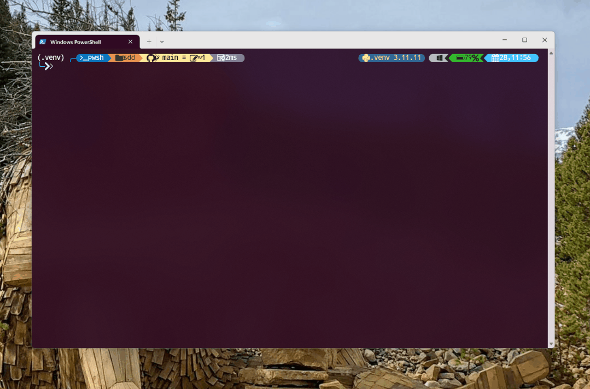

<div align="center">
    
    <h1>🪣 Spec Kit</h1>
    <h3><em>更快地构建高质量软件。</em></h3>
</div>

<p align="center">
    <strong>一个开源工具包，让你专注于产品场景和可预测的结果，而不是从头开始为每个部分进行氛围编码。</strong>
</p>

<p align="center">
    <a href="https://github.com/github/spec-kit/actions/workflows/release.yml"></a>
    <a href="https://github.com/github/spec-kit/stargazers"></a>
    <a href="https://github.com/github/spec-kit/blob/main/LICENSE"></a>
    <a href="https://github.github.io/spec-kit/"></a>
</p>

---

## 目录

- [🪣 什么是规范驱动开发？](#-什么是规范驱动开发)
- [✅ 入门](#-入门)
- [📹 视频概述](#-视频概述)
- [🤖 支持的AI代理](#-支持的ai代理)
- [⚙️ Specify CLI 参考](#-specify-cli-参考)
- [🎯 核心理念](#-核心理念)
- [🔄 开发阶段](#-开发阶段)
- [🧪 实验目标](#-实验目标)
- [📋 先决条件](#-先决条件)
- [📚 了解更多](#-了解更多)
- [📝 详细流程](#-详细流程)
- [🔧 故障排除](#-故障排除)
- [👥 维护者](#-维护者)
- [💬 支持](#-支持)
- [🙏 致谢](#-致谢)
- [📄 许可证](#-许可证)

## 🪣 什么是规范驱动开发？

规范驱动开发 **颠覆了** 传统的软件开发。几十年来，代码是王道 —— 规范只是我们构建并在"真正工作"开始编码后就丢弃的脚手架。规范驱动开发改变了这一点：**规范变得可执行**，直接生成工作实现，而不是仅仅指导它们。

## ✅ 入门

### 1. 安装 Specify CLI

选择你喜欢的安装方法：

#### 选项 1：持久安装（推荐）

安装一次，到处使用：

```bash
uv tool install specify-cli --from git+https://github.com/github/spec-kit.git
```

然后直接使用工具：

```bash
specify init <PROJECT_NAME>
specify check
```

要升级 specify，请运行：

```bash
uv tool install specify-cli --force --from git+https://github.com/github/spec-kit.git
```

#### 选项 2：一次性使用

直接运行而不安装：

```bash
uvx --from git+https://github.com/github/spec-kit.git specify init <PROJECT_NAME>
```

**持久安装的好处：**

- 工具保持安装并在 PATH 中可用
- 无需创建 shell 别名
- 更好的工具管理，使用 `uv tool list`, `uv tool upgrade`, `uv tool uninstall`
- 更干净的 shell 配置

### 2. 确立项目原则

在项目目录中启动你的 AI 助手。助手中有可用的 `/speckit.*` 命令。

使用 **`/speckit.constitution`** 命令创建你的项目治理原则和开发指南，这些将指导所有后续开发。

```bash
/speckit.constitution 创建专注于代码质量、测试标准、用户体验一致性和性能要求的原则
```

### 3. 创建规范

使用 **`/speckit.specify`** 命令描述你想要构建的内容。专注于 **什么** 和 **为什么**，而不是技术栈。

```bash
/speckit.specify 构建一个可以帮助我将照片组织到单独的相册中的应用程序。相册按日期分组，可以在主页上通过拖放重新组织。相册永远不会在其他嵌套相册中。在每个相册中，照片以平铺界面预览。
```

### 4. 创建技术实施计划

使用 **`/speckit.plan`** 命令提供你的技术栈和架构选择。

```bash
/speckit.plan 该应用程序使用 Vite 和最少数量的库。尽可能使用原生 HTML、CSS 和 JavaScript。图像不上传到任何地方，元数据存储在本地 SQLite 数据库中。
```

### 5. 分解为任务

使用 **`/speckit.tasks`** 从你的实施计划中创建一个可操作的任务列表。

```bash
/speckit.tasks
```

### 6. 执行实施

使用 **`/speckit.implement`** 执行所有任务并根据计划构建你的功能。

```bash
/speckit.implement
```

有关详细逐步说明，请参见我们的[综合指南](./spec-driven.md)。

## 📹 视频概述

想看看 Spec Kit 的实际操作？观看我们的[视频概述](https://www.youtube.com/watch?v=a9eR1xsfvHg&pp=0gcJCckJAYcqIYzv)！

[](https://www.youtube.com/watch?v=a9eR1xsfvHg&pp=0gcJCckJAYcqIYzv)

## 🤖 支持的AI代理

| 代理 | 支持 | 注释 |
|-----------------------------------------------------------|---------|---------------------------------------------------|
| [Claude Code](https://www.anthropic.com/claude-code) | ✅ | |
| [GitHub Copilot](https://code.visualstudio.com/) | ✅ | |
| [Gemini CLI](https://github.com/google-gemini/gemini-cli) | ✅ | |
| [Cursor](https://cursor.sh/) | ✅ | |
| [Qwen Code](https://github.com/QwenLM/qwen-code) | ✅ | |
| [opencode](https://opencode.ai/) | ✅ | |
| [Windsurf](https://windsurf.com/) | ✅ | |
| [Kilo Code](https://github.com/Kilo-Org/kilocode) | ✅ | |
| [Auggie CLI](https://docs.augmentcode.com/cli/overview) | ✅ | |
| [CodeBuddy CLI](https://www.codebuddy.ai/cli) | ✅ | |
| [Roo Code](https://roocode.com/) | ✅ | |
| [Codex CLI](https://github.com/openai/codex) | ✅ | |
| [Amazon Q Developer CLI](https://aws.amazon.com/developer/learning/q-developer-cli/) | ❌⚠️ | Amazon Q Developer CLI [不支持](https://github.com/aws/amazon-q-developer-cli/issues/3064) 自定义参数的斜杠命令。 |

## ⚙️ Specify CLI 参考

`specify` 命令支持以下选项：

### 命令

| 命令 | 描述 |
|-------------|----------------------------------------------------------------|
| `init` | 从最新模板初始化新 Specify 项目 |
| `check` | 检查已安装的工具 (`git`, `claude`, `gemini`, `code`/`code-insiders`, `cursor-agent`, `windsurf`, `qwen`, `opencode`, `codex`) |

### `specify init` 参数和选项

| 参数/选项 | 类型 | 描述 |
|------------------------|----------|------------------------------------------------------------------------------|
| `<project-name>` | 参数 | 新项目目录的名称（如果使用 `--here` 则可选，或使用 `.` 表示当前目录） |
| `--ai` | 选项 | 要使用的 AI 助手：`claude`, `gemini`, `copilot`, `cursor-agent`, `qwen`, `opencode`, `codex`, `windsurf`, `kilocode`, `auggie`, `roo`, `codebuddy`, 或 `q` |
| `--script` | 选项 | 要使用的脚本变体：`sh` (bash/zsh) 或 `ps` (PowerShell) |
| `--ignore-agent-tools` | 标志 | 跳过对 AI 代理工具（如 Claude Code）的检查 |
| `--no-git` | 标志 | 跳过 git 仓库初始化 |
| `--here` | 标志 | 在当前目录中初始化项目，而不是创建新目录 |
| `--force` | 标志 | 强制合并/覆盖在当前目录中初始化（跳过确认） |
| `--skip-tls` | 标志 | 跳过 SSL/TLS 验证（不推荐） |
| `--debug` | 标志 | 启用详细的调试输出以进行故障排除 |
| `--github-token` | 选项 | GitHub 令牌用于 API 请求（或设置 GH_TOKEN/GITHUB_TOKEN 环境变量） |

### 示例

```bash
# 基本项目初始化
specify init my-project

# 使用特定 AI 助手初始化
specify init my-project --ai claude

# 使用 Cursor 支持初始化
specify init my-project --ai cursor-agent

# 使用 Windsurf 支持初始化
specify init my-project --ai windsurf

# 使用 PowerShell 脚本初始化（Windows/跨平台）
specify init my-project --ai copilot --script ps

# 在当前目录中初始化
specify init . --ai copilot
# 或使用 --here 标志
specify init --here --ai copilot

# 在当前（非空）目录中强制合并而不确认
specify init . --force --ai copilot
# 或
specify init --here --force --ai copilot

# 跳过 git 初始化
specify init my-project --ai gemini --no-git

# 启用调试输出以进行故障排除
specify init my-project --ai claude --debug

# 使用 GitHub 令牌进行 API 请求（对企业环境有帮助）
specify init my-project --ai claude --github-token ghp_your_token_here

# 检查系统要求
specify check
```

### 可用的斜杠命令

运行 `specify init` 后，你的 AI 编码代理将可以访问这些斜杠命令以进行结构化开发：

#### 核心命令

规范驱动开发工作流程的基本命令：

| 命令 | 描述 |
|--------------------------|-----------------------------------------------------------------------|
| `/speckit.constitution` | 创建或更新项目治理原则和开发指南 |
| `/speckit.specify` | 定义你想要构建的内容（需求和用户故事） |
| `/speckit.plan` | 使用你选择的技术栈创建技术实施计划 |
| `/speckit.tasks` | 生成实施的可操作任务列表 |
| `/speckit.implement` | 执行所有任务以根据计划构建功能 |

#### 可选命令

增强质量和验证的附加命令：

| 命令 | 描述 |
|----------------------|-----------------------------------------------------------------------|
| `/speckit.clarify` | 澄清未充分规范的区域（建议在 `/speckit.plan` 之前；以前称为 `/quizme`） |
| `/speckit.analyze` | 跨工件一致性与覆盖分析（在 `/speckit.tasks` 之后，在 `/speckit.implement` 之前运行） |
| `/speckit.checklist` | 生成自定义质量检查清单，验证需求的完整性、清晰度和一致性（如"英语的单元测试"） |

### 环境变量

| 变量 | 描述 |
|------------------|------------------------------------------------------------------------------------------------|
| `SPECIFY_FEATURE` | 覆盖非 Git 仓库的功能检测。设置为功能目录名称（例如 `001-photo-albums`），以便在不使用 Git 分支时处理特定功能。<br/>**必须在使用 `/speckit.plan` 或后续命令之前在你正在使用的代理上下文中设置。 |

## 🎯 核心理念

规范驱动开发是一种强调以下内容的结构化过程：

- **意图驱动开发**，其中规范在"_什么_"之前定义"_如何_"
- **丰富的规范创建**，使用护栏和组织原则
- **多步精炼**，而不是从提示生成一次性代码
- **高度依赖**高级 AI 模型能力来解释规范

## 🔄 开发阶段

| 阶段 | 关注点 | 关键活动 |
|-------|-------|----------------|
| **0到1开发**（"绿地"） | 从头开始生成 | <ul><li>从高级需求开始</li><li>生成规范</li><li>规划实施步骤</li><li>构建生产就绪应用程序</li></ul> |
| **创意探索** | 并行实施 | <ul><li>探索多样化解决方案</li><li>支持多种技术栈和架构</li><li>试验 UX 模式</li></ul> |
| **迭代增强**（"棕地"） | 棕地现代化 | <ul><li>迭代添加功能</li><li>现代化遗留系统</li><li>适应流程</li></ul> |

## 🧪 实验目标

我们的研究和实验重点是：

### 技术独立性

- 使用多种技术栈创建应用程序
- 验证规范驱动开发是一种与特定技术、编程语言或框架无关的过程的假设

### 企业约束

- 演示关键任务应用程序开发
- 结合组织约束（云提供商、技术栈、工程实践）
- 支持企业设计系统和合规要求

### 用户中心开发

- 为不同用户群体和偏好构建应用程序
- 支持各种开发方法（从氛围编码到 AI 原生开发）

### 创意和迭代过程

- 验证并行实施探索的概念
- 提供强大的迭代功能开发工作流程
- 扩展过程以处理升级和现代化任务

## 📋 先决条件

- **Linux/macOS/Windows**
- [支持的](#-支持的ai代理) AI 编码代理。
- [uv](https://docs.astral.sh/uv/) 用于包管理
- [Python 3.11+](https://www.python.org/downloads/)
- [Git](https://git-scm.com/downloads)

如果你在代理中遇到问题，请开一个 issue，以便我们完善集成。

## 📚 了解更多

- **[完整的规范驱动开发方法论](./spec-driven.md)** - 深入了解完整过程
- **[详细演练](#-详细流程)** - 逐步实施指南

---

## 📝 详细流程

<details>
<summary>点击展开详细的逐步演练</summary>

你可以使用 Specify CLI 引导你的项目，这将在你的环境中引入所需的工件。运行：

```bash
specify init <project_name>
```

或在当前目录中初始化：

```bash
specify init .
# 或使用 --here 标志
specify init --here
# 在目录已包含文件时跳过确认
specify init . --force
# 或
specify init --here --force
```



你将被提示选择你正在使用的 AI 代理。你也可以在终端中主动指定：

```bash
specify init <project_name> --ai claude
specify init <project_name> --ai gemini
specify init <project_name> --ai copilot

# 或在当前目录中：
specify init . --ai claude
specify init . --ai codex

# 或使用 --here 标志
specify init --here --ai claude
specify init --here --ai codex

# 强制合并到非空的当前目录
specify init . --force --ai claude

# 或
specify init --here --force --ai claude
```

CLI 将检查你是否已安装 Claude Code、Gemini CLI、Cursor CLI、Qwen CLI、opencode、Codex CLI 或 Amazon Q Developer CLI。如果你没有安装，或者你希望在不检查正确工具的情况下获取模板，请在命令中使用 `--ignore-agent-tools`：

```bash
specify init <project_name> --ai claude --ignore-agent-tools
```

### **步骤 1：** 确立项目原则

转到项目文件夹并运行你的 AI 代理。在我们的示例中，我们使用 `claude`。


如果你看到可用的 `/speckit.constitution`、`/speckit.specify`、`/speckit.plan`、`/speckit.tasks` 和 `/speckit.implement` 命令，则表示配置正确。

第一步应该是使用 `/speckit.constitution` 命令确立你的项目治理原则。这有助于确保在所有后续开发阶段中保持一致的决策：

```text
/speckit.constitution 创建专注于代码质量、测试标准、用户体验一致性和性能要求的原则。包括关于这些原则应如何指导技术决策和实施选择的治理。
```

此步骤在 `.specify/memory/constitution.md` 文件中创建或更新你的项目基础指南，AI 代理将在规范、规划和实施阶段引用这些指南。

### **步骤 2：** 创建项目规范

随着你的项目原则确立，你现在可以创建功能规范。使用 `/speckit.specify` 命令，然后提供你想要开发的项目的具体需求。

>[!IMPORTANT]
>尽可能明确地说明你试图构建的_什么_和_为什么_。**此时不要专注于技术栈**。

示例提示：

```text
开发 Taskify，一个团队生产力平台。它应该允许用户创建项目，添加团队成员，
分配任务，评论并在看板风格的板之间移动任务。在此功能的初始阶段，
我们称之为"创建 Taskify"，让我们预先声明多个用户，预定义用户。
我想要五个用户，分为两类，一个产品经理和四个工程师。让我们创建三个
不同的示例项目。让我们拥有每个任务状态的标准看板列，如"To Do"，
"In Progress"，"In Review"和"Done"。此应用程序将没有登录，因为这只是
第一个测试，以确保我们的基本功能已设置。对于 UI 中的任务卡，
你应该能够在看板工作板的不同列之间更改任务的当前状态。
你应该能够为特定卡留下无限数量的评论。你应该能够，从该任务
卡，分配一个有效的用户。当你首次启动 Taskify 时，它会给你一个五名用户的列表
从中选择。将不需要密码。当你点击用户时，你进入主视图，显示
项目列表。当你点击项目时，你打开该项目的看板。你将看到列。
你将能够在不同列之间来回拖放卡片。你将看到任何
分配给你的卡片，当前登录用户，在不同颜色中，从所有其他卡片中快速
看到你的。你可以编辑你制作的任何评论，但不能编辑其他人制作的评论。你可以
删除你制作的任何评论，但不能删除其他人制作的评论。
```

输入此提示后，你应该看到 Claude Code 开始规划和规范起草过程。Claude Code 还将触发一些内置脚本来设置仓库。

完成此步骤后，你应该有一个新分支（例如 `001-create-taskify`），以及 `specs/001-create-taskify` 目录中的新规范。

生成的规范应包含用户故事和功能需求集，如模板中所定义。

在此阶段，你的项目文件夹内容应类似于以下内容：

```text
├── .specify
    ├── memory
    │    ├── constitution.md
    ├── scripts
    │    ├── check-prerequisites.sh
    │    ├── common.sh
    │    ├── create-new-feature.sh
    │    ├── setup-plan.sh
    │    └── update-claude-md.sh
    ├── specs
    │    ├── 001-create-taskify
    │        ├── spec.md
    └── templates
        ├── plan-template.md
        ├── spec-template.md
        └── tasks-template.md
```

### **步骤 3：** 功能规范澄清（规划前必需）

随着基线规范的创建，你可以继续澄清在第一次尝试中没有正确捕获的任何需求。

你应该在创建技术计划**之前**运行结构化澄清工作流程，以减少下游的返工。

首选顺序：
1. 使用 `/speckit.clarify`（结构化）— 顺序、基于覆盖的提问，将答案记录在澄清部分。
2. 如果仍有模糊之处，可选择后续进行随意的自由形式精炼。

如果你有意想要跳过澄清（例如，spike 或探索性原型），明确说明，以便代理不会因缺少澄清而阻塞。

示例自由形式精炼提示（如果仍需要在 `/speckit.clarify` 之后）：

```text
对于你创建的每个示例项目或项目，应该有 5 到 15 个
任务，每个项目随机分布在不同的完成状态中。确保
每个完成阶段至少有一个任务。
```

你还应该要求 Claude Code 验证**审查和验收清单**，检查符合要求/通过需求的项目，并将不符合要求的项目留空。可以使用以下提示：

```text
阅读审查和验收清单，如果功能规范符合标准，则检查清单中的每个项目。如果不符合，则留空。
```

重要的是利用与 Claude Code 的交互作为澄清和提问的机会 — **不要将其第一次尝试视为最终结果**。

### **步骤 4：** 生成计划

你现在可以具体说明技术栈和其他技术要求。你可以使用 `/speckit.plan` 命令，该命令内置在项目模板中，提示如下：

```text
我们将使用 .NET Aspire 生成此项目，使用 Postgres 作为数据库。前端应使用
Blazor 服务器与拖放任务板、实时更新。应该创建一个 REST API，包含项目 API，
任务 API 和通知 API。
```

此步骤的输出将包括许多实施细节文档，你的目录树将类似于：

```text
.
├── CLAUDE.md
├── memory
│    ├── constitution.md
├── scripts
│    ├── check-prerequisites.sh
│    ├── common.sh
│    ├── create-new-feature.sh
│    ├── setup-plan.sh
│    └── update-claude-md.sh
├── specs
│    ├── 001-create-taskify
│        ├── contracts
│        │    ├── api-spec.json
│        │    └── signalr-spec.md
│        ├── data-model.md
│        ├── plan.md
│        ├── quickstart.md
│        ├── research.md
│        └── spec.md
└── templates
    ├── CLAUDE-template.md
    ├── plan-template.md
    ├── spec-template.md
    └── tasks-template.md
```

检查 `research.md` 文档，确保使用了正确的技术栈，基于你的说明。如果任何组件突出，你可以要求 Claude Code 精炼它，甚至让它检查你想要使用的本地安装的平台/框架（例如 .NET）版本。

此外，如果你选择的技术栈是快速变化的（例如 .NET Aspire、JS 框架），你可能希望要求 Claude Code 研究其细节，提示如下：

```text
我希望你通过实施计划和实施细节，寻找可能
受益于额外研究的领域，因为 .NET Aspire 是一个快速变化的库。对于你识别的
需要进一步研究的领域，我希望你用关于特定的额外细节更新研究文档
我们将在 Taskify 应用程序中使用的版本，并生成并行研究任务以澄清
使用网络研究的任何细节。
```

在此过程中，你可能会发现 Claude Code 在研究错误的东西上卡住了 - 你可以用这样的提示帮助推动它朝着正确的方向前进：

```text
我认为我们需要将其分解为一系列步骤。首先，确定
在实施期间你需要做的任务列表
你不确定或会受益于进一步研究。写下这些任务的列表。然后对于这些任务中的每一个，
我希望你启动一个单独的研究任务，这样净结果是我们并行研究
所有这些非常具体的任务。我看到你正在做的事情看起来像你在
研究 .NET Aspire 一般，我认为这对我们没有多大帮助。这太不精确了
研究。研究需要帮助你解决一个特定的有针对性的问题。
```

>[!NOTE]
>Claude Code 可能过于积极，添加了你没有要求的组件。要求它澄清更改的理由和来源。

### **步骤 5：** 让 Claude Code 验证计划

随着计划的制定，你应该让 Claude Code 通读它，确保没有遗漏的部分。你可以使用这样的提示：

```text
现在我希望你去审核实施计划和实施细节文件。
阅读它，重点关注确定是否有
你需要做的任务序列
从阅读这个计划中显而易见。因为我并不确定是否足够。例如，
当我查看核心实施时，参考实施细节中的适当位置会很有用
因为它在核心实施或精炼的每个步骤中都会走一遍。
```

这有助于精炼实施计划，帮助你避免 Claude Code 在其规划周期中遗漏的潜在盲点。一旦初始精炼通过完成，请在进入实施之前让 Claude Code 再次通过清单。

你还可以要求 Claude Code（如果你安装了[GitHub CLI](https://docs.github.com/en/github-cli/github-cli)）继续并从当前分支创建一个到 `main` 的拉取请求，带有详细描述，以确保努力得到适当跟踪。

>[!NOTE]
>在让代理实施之前，还值得提示 Claude Code 交叉检查细节，查看是否有任何过度工程化的部分（记住 - 它可能过于积极）。如果存在过度工程化的组件或决策，你可以要求 Claude Code 解决它们。确保 Claude Code 遵循[宪法](base/memory/constitution.md)作为建立计划时必须遵守的基础部分。

### **步骤 6：** 使用 /speckit.tasks 生成任务分解

随着实施计划得到验证，你现在可以将计划分解为可在正确顺序执行的具体、可操作的任务。使用 `/speckit.tasks` 命令自动从你的实施计划生成详细的任务分解：

```text
/speckit.tasks
```

此步骤在你的功能规范目录中创建一个 `tasks.md` 文件，包含：

- **按用户故事组织的任务分解** - 每个用户故事成为一个独立的实施阶段，有自己的任务集
- **依赖管理** - 任务按组件之间的依赖关系排序（例如，模型在服务之前，服务在端点之前）
- **并行执行标记** - 可以并行运行的任务用 `[P]` 标记以优化开发工作流程
- **文件路径规范** - 每个任务包括实施应发生的确切文件路径
- **测试驱动开发结构** - 如果请求了测试，测试任务包括在内并排序为在实施之前编写
- **检查点验证** - 每个用户故事阶段包括检查点以验证独立功能

生成的 tasks.md 提供了 `/speckit.implement` 命令的清晰路线图，确保系统实施保持代码质量并允许用户故事的增量交付。

### **步骤 7：** 实施

准备就绪后，使用 `/speckit.implement` 命令执行你的实施计划：

```text
/speckit.implement
```

`/speckit.implement` 命令将：
- 验证所有先决条件已就位（宪法、规范、计划和任务）
- 从 `tasks.md` 解析任务分解
- 按正确顺序执行任务，遵守依赖关系和并行执行标记
- 遵循任务计划中定义的 TDD 方法
- 提供进度更新并适当处理错误

>[!IMPORTANT]
>AI 代理将执行本地 CLI 命令（如 `dotnet`、`npm` 等）- 确保你已在机器上安装所需工具。

实施完成后，测试应用程序并解决 CLI 日志中可能不可见的任何运行时错误（例如，浏览器控制台错误）。你可以将这些错误复制并粘贴回你的 AI 代理以解决。

</details>

---

## 🔧 故障排除

### Linux 上的 Git Credential Manager

如果你在 Linux 上遇到 Git 认证问题，可以安装 Git Credential Manager：

```bash
#!/usr/bin/env bash
set -e
echo "正在下载 Git Credential Manager v2.6.1..."
wget https://github.com/git-ecosystem/git-credential-manager/releases/download/v2.6.1/gcm-linux_amd64.2.6.1.deb
echo "正在安装 Git Credential Manager..."
sudo dpkg -i gcm-linux_amd64.2.6.1.deb
echo "配置 Git 使用 GCM..."
git config --global credential.helper manager
echo "清理..."
rm gcm-linux_amd64.2.6.1.deb
```

## 👥 维护者

- Den Delimarsky ([@localden](https://github.com/localden))
- John Lam ([@jflam](https://github.com/jflam))

## 💬 支持

如需支持，请开一个 [GitHub issue](https://github.com/github/spec-kit/issues/new)。我们欢迎错误报告、功能请求和关于使用规范驱动开发的问题。

## 🙏 致谢

此项目深受 [John Lam](https://github.com/jflam) 的工作和研究的影响和基于其工作。

## 📄 许可证

此项目根据 MIT 开源许可证的条款授权。请参阅 [LICENSE](./LICENSE) 文件以获取完整条款。