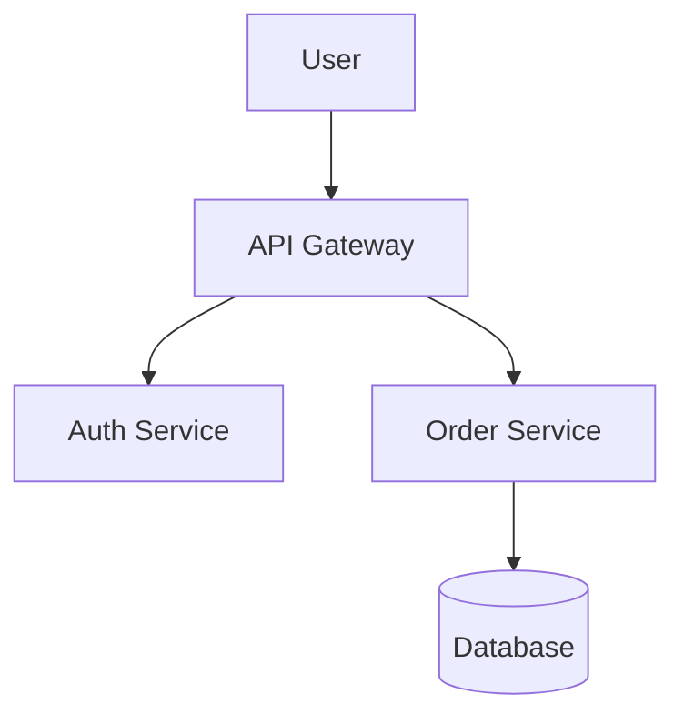

# Markdown as the Universal Interface: The Hidden Revolution in AI-Driven Software Development

## How a Simple Markup Language Became the Programming Language of the AI Era

**[Markdown Tutorial For Developers](markdown-tutorial-for-developers.md)**

**October 2025**

---

## Executive Summary

While the world debates which programming language will dominate AI development—Python, Rust, Go, TypeScript—a quiet revolution is redefining what "programming" means entirely. Markdown, originally designed in 2004 as a simple text-to-HTML conversion tool, has emerged as the unexpected universal interface for AI-assisted software development.

In October 2025, developers are building production applications by writing specifications in Markdown and "compiling" them to executable code through AI agents. Projects like GitHub Brain MCP Server demonstrate developers writing entire apps in Markdown and letting GitHub Copilot compile it into Go code, rarely editing or viewing the actual source code directly.

This represents a fundamental shift: **Markdown is becoming the high-level programming language for the AI era**, with traditional programming languages relegated to "compilation targets"—analogous to how assembly language became a target for C compilers rather than something developers write directly.

### Key Findings

- **20,000+ repositories** on GitHub have adopted AGENTS.md as machine-readable documentation for AI coding agents
- **Markdown-to-code compilation** is production-ready, with developers building complete applications without touching traditional code
- **Universal adoption** across all major AI agents: Claude Code, Gemini CLI, GitHub Copilot, Cursor, AWS Kiro
- **New file conventions** emerging: AGENTS.md (for machines), CLAUDE.md, constitution.md, spec.md
- **Human-readable AND machine-executable**: Markdown bridges the gap between human intent and AI interpretation
- **Language-agnostic output**: Same Markdown spec can compile to Python, Go, Rust, TypeScript, or any language

---

## 1. Why Markdown? The Surprising Technical Advantages

### 1.1 The Fundamental Question

When spec-driven development emerged, the industry could have chosen many formats:

- **YAML:** Already used extensively for configuration
- **JSON:** Universal data interchange format
- **XML:** Mature, with robust tooling and validation
- **Custom DSLs:** Domain-specific languages tailored for specs
- **Plain text:** Simplest possible option

Yet the ecosystem converged on Markdown. Why?

### 1.2 The Seven Properties That Make Markdown Perfect

#### 1. Human Readability

Markdown's defining characteristic: it's readable as plain text without rendering.

```markdown
## User Authentication

Users can log in using:
- Email and password
- OAuth (Google, GitHub)
- Single Sign-On (SSO) for enterprise

### Security Requirements
- Passwords must be hashed with bcrypt (12 rounds)
- Failed login attempts rate limited (5 attempts per 15 minutes)
- Sessions expire after 24 hours
```

Compare to equivalent YAML:
```yaml
authentication:
  methods:
    - type: email_password
      security:
        hashing: bcrypt
        rounds: 12
    - type: oauth
      providers: [google, github]
    - type: sso
  security_requirements:
    password_hashing:
      algorithm: bcrypt
      rounds: 12
    rate_limiting:
      failed_attempts: 5
      window_minutes: 15
    sessions:
      expiry_hours: 24
```

The Markdown version is immediately comprehensible. The YAML requires parsing mental tree structures.

**Why This Matters for AI:**

LLMs are trained on massive amounts of natural text. Markdown's natural language structure aligns with how models "think," leading to better comprehension and generation.

#### 2. Structured Yet Flexible

Markdown provides just enough structure without becoming rigid:

```markdown
## Database Schema

### Users Table
| Column | Type | Constraints |
|--------|------|-------------|
| id | UUID | Primary Key |
| email | String | Unique, Not Null |
| created_at | Timestamp | Default: now() |

Additional notes:
- Use UUID v4 for all IDs
- Email validation required before storage
- Index on email for fast lookup
```

The table provides machine-parseable structure. The bullet points add contextual nuance that would be awkward in pure structured formats.

#### 3. Tooling Maturity

Markdown has 20+ years of ecosystem development:

- **Editors:** Every IDE and text editor supports Markdown
- **Renderers:** GitHub, GitLab, VSCode, Notion, Obsidian, etc.
- **Parsers:** Mature libraries in every language (CommonMark, GitHub Flavored Markdown)
- **Version Control:** Git diffs Markdown beautifully (unlike binary formats)
- **Search:** Full-text search works natively (unlike structured formats)

Developers already have the tools. No new infrastructure required.

#### 4. Extensibility Through Convention

Markdown allows semantic extension through section headers:

```markdown
## Dependencies
[Explicitly list dependencies here]

## Security Requirements
[Security-specific constraints]

## Performance Targets
[Performance specifications]

## Testing Strategy
[Test approach and coverage requirements]
```

AI agents learn to recognize these conventional sections without requiring formal schema definitions.

#### 5. Mixed Media Support

Markdown seamlessly integrates:
- Code blocks (with syntax highlighting)
- Tables (structured data)
- Lists (hierarchical information)
- Links (references and resources)
- Images (diagrams and mockups)
- Math equations (LaTeX)

All in one document, all human-readable.

#### 6. Git-Native Collaboration

Markdown is text, so:
- **Branching works**: Parallel spec development
- **Merging works**: Conflict resolution is human-readable
- **History works**: Every change tracked with meaningful diffs
- **Review works**: Line-by-line comments in pull requests

Contrast with visual tools (Figma, Miro) that don't version control well.

#### 7. Low Barrier to Entry

Because it is plain Markdown, the file is lightweight and can be opened in any editor, CLI, or browser. Non-technical stakeholders can read and edit specs without specialized tools.

Product managers, designers, and business analysts can contribute directly to Markdown specs, enabling true cross-functional collaboration.

---

## 2. The Emergence of Markdown File Conventions

### 2.1 The Proliferation of .md Files

Projects using AI agents now contain multiple Markdown files, each serving distinct purposes:

```
project-root/
├── README.md              # Human documentation
├── AGENTS.md              # Machine instructions
├── CLAUDE.md              # Claude-specific context
├── GEMINI.md              # Gemini-specific context
├── constitution.md        # Organizational standards
├── memory/
│   └── project-context.md # Long-term project knowledge
├── specs/
│   ├── spec.md            # Product requirements
│   └── plan.md            # Technical architecture
└── .github/
    └── prompts/
        └── compile.prompt.md  # Compilation instructions
```

### 2.2 AGENTS.md: README for Machines

A new convention is emerging in the open-source ecosystem: AGENTS.md, a straightforward and open format designed to assist AI coding agents in software development. Already adopted by more than 20,000 repositories on GitHub.

**The Core Concept:**

README.md is for humans, AGENTS.md is for machines.

**Typical Structure:**

```markdown
# AGENTS.md

## Project Overview
This is a FastAPI backend with React frontend, using PostgreSQL for data.

## Setup Commands
```bash
# Backend
cd backend
python -m venv venv
source venv/bin/activate
pip install -r requirements.txt

# Frontend
cd frontend
npm install
```

## Build Commands
```bash
npm run build       # Production build
npm run dev        # Development mode
pytest            # Run tests
```

## Coding Standards
- Use type hints for all Python functions
- Follow PEP 8 style guide
- Minimum 80% test coverage
- All API endpoints must have OpenAPI documentation

## Architecture
- Backend: FastAPI + SQLAlchemy + Alembic
- Frontend: React + TypeScript + Vite
- Database: PostgreSQL 15+
- Cache: Redis
- Message Queue: RabbitMQ

## File Structure
- `/backend/api` - API route handlers
- `/backend/models` - Database models
- `/backend/services` - Business logic
- `/frontend/src/components` - React components
- `/frontend/src/hooks` - Custom React hooks

## Testing Strategy
- Unit tests for all business logic
- Integration tests for API endpoints
- E2E tests for critical user flows
- Use pytest fixtures for database setup

## Deployment
- Container: Docker
- Orchestration: Kubernetes
- CI/CD: GitHub Actions
- Hosting: AWS EKS

## Permissions and Safety
Allowed without prompt:
- Read files, list directories
- Run linters (eslint, prettier, mypy)
- Run single test files
- Type checking

Ask first:
- npm install / pip install
- git push
- Deleting files
- Running full test suite
- Database migrations
```

**The Strategic Value:**

By providing a predictable, structured set of instructions, it enables tools like OpenAI Codex, GitHub Copilot, Google's AI assistants, and others to understand your codebase's unique context.

Without AGENTS.md, every AI interaction starts from zero. The agent must rediscover your project structure, build commands, and conventions through exploration—burning time and tokens.

With AGENTS.md, the agent has instant context. It knows exactly how your project works from the first prompt.

### 2.3 Constitution.md: Organizational Standards

While AGENTS.md describes a specific project, `constitution.md` defines organization-wide standards that apply to all projects.

**Example Constitution:**

```markdown
# Engineering Constitution

## Technology Choices
- **Backend:** Python 3.11+ with FastAPI
- **Frontend:** React 18 with TypeScript
- **Database:** PostgreSQL 15+ (primary), Redis (cache)
- **Infrastructure:** Kubernetes on AWS EKS
- **CI/CD:** GitHub Actions
- **Monitoring:** Datadog + Sentry

## Security Standards
- All passwords hashed with bcrypt (12 rounds minimum)
- JWTs expire after 24 hours, refresh tokens after 7 days
- All external inputs must be validated with Pydantic
- SQL queries must use parameterization (no string interpolation)
- Secrets managed via AWS Secrets Manager
- HTTPS required for all connections
- API rate limiting: 100 requests/minute per user

## Testing Requirements
- Minimum 80% code coverage
- All public functions must have unit tests
- All API endpoints must have integration tests
- Critical user flows must have E2E tests
- Tests must run in <5 minutes locally
- No tests should require external services (use mocks)

## Code Style
- Python: Black (line length 100), mypy (strict mode), isort
- TypeScript: ESLint + Prettier, strict TypeScript config
- Commit messages: Conventional Commits format
- Branch naming: `feat/`, `fix/`, `refactor/`, `docs/`

## Architecture Principles
- Domain-Driven Design for complex business logic
- CQRS pattern for systems with heavy read/write separation
- Event-driven communication between microservices
- API-first design (OpenAPI specs before implementation)
- Database migrations must be reversible

## Documentation Standards
- Every service must have README with setup instructions
- All functions must have docstrings
- Complex algorithms must have inline comments
- Architecture decisions must be recorded in ADRs
- API documentation auto-generated from OpenAPI specs

## Review Process
- All code requires at least one approval
- Security-sensitive changes require security team review
- Infrastructure changes require platform team review
- Breaking API changes require product team approval
- No force pushes to main branch
```

**How AI Agents Use This:**

When an agent starts working on any project in your organization, it reads the constitution first. This ensures:
- Consistent technology choices across all projects
- Adherence to security standards without manual enforcement
- Uniform code style across the organization
- Architectural patterns applied consistently

### 2.4 Model-Specific Context Files

Some projects include agent-specific files for nuanced control:

**CLAUDE.md:**
```markdown
# Claude-Specific Instructions

## Personality
- Be concise but thorough
- Ask clarifying questions before making assumptions
- Propose multiple approaches when trade-offs exist
- Explain your reasoning for architectural decisions

## Preferences
- Prefer functional programming patterns in TypeScript
- Use SQLAlchemy async patterns for database access
- Write comprehensive docstrings (Google style)
- Include type hints for all function signatures

## Constraints
- Never use `any` type in TypeScript
- Always validate external inputs
- Write tests before implementing features (TDD)
- Keep functions under 50 lines (extract helpers if needed)

## Context Management
- Remember: This project uses domain-driven design
- Aggregate roots: User, Order, Product, Payment
- Bounded contexts are organized by /domains folder
- Each domain has its own database schema
```

**GEMINI.md:**
```markdown
# Gemini-Specific Instructions

## Search Behavior
- Use Google Search grounding for:
  - Latest library versions
  - Best practices for new technologies
  - Security advisories for dependencies
  
## Code Generation Style
- Prioritize readability over cleverness
- Include comprehensive error handling
- Add logging at key decision points
- Generate both happy path and error cases

## Testing Approach
- Generate property-based tests for core business logic
- Include edge cases and boundary conditions
- Mock external services consistently
- Aim for 90%+ coverage on critical paths
```

---

## 3. Markdown-to-Code: The Compilation Process

### 3.1 The Mechanical Translation

For the GitHub Brain MCP Server project, the developer wrote the app code in Markdown and let GitHub Copilot compile it into actual Go code, with the project structure including main.md (detailed implementation spec), .github/prompts/compile.prompt.md (compilation instructions), and main.go (generated code).

**The Project Structure:**

```
github-brain-mcp/
├── README.md          # High-level project description
├── main.md           # Detailed implementation specification
├── main.go           # Generated Go code (rarely edited)
└── .github/
    └── prompts/
        └── compile.prompt.md  # How to compile main.md → main.go
```

**The Compilation Prompt (compile.prompt.md):**

```markdown
---
mode: agent
---

## Task: Compile Markdown Specification to Go Code

Read [main.md](../../main.md) and generate production-ready Go code in [main.go](../../main.go).

## Compilation Rules

1. **Exact Translation**: Implement every feature described in main.md
2. **No Additions**: Don't add features not in the spec
3. **No Omissions**: Don't skip any specified functionality
4. **Idiomatic Go**: Use Go best practices and conventions
5. **Error Handling**: Comprehensive error handling for all operations
6. **Testing**: Generate tests for all public functions
7. **Documentation**: Add godoc comments for all exported items

## Code Structure

- Follow main.md section structure
- Each ## section in main.md → separate function/struct in main.go
- Preserve the logical flow described in main.md
- Use descriptive names matching terminology in main.md

## Verification Steps

After compilation:
1. Run `go build` - must compile without errors
2. Run `go test ./...` - all tests must pass
3. Run `golangci-lint run` - no linting errors
4. Verify all features from main.md are implemented

## Special Instructions

- If spec is ambiguous, generate code for the most common interpretation
- Add TODO comments for anything that needs clarification
- Preserve any existing optimizations in main.go unless spec changed
```

**The Markdown Specification (main.md excerpt):**

```markdown
# GitHub Brain MCP Server

## Overview
GitHub Brain is an MCP server that provides intelligent access to GitHub
repositories. It enables AI agents to search code, understand project
structure, and retrieve relevant context.

## Core Features

### Repository Indexing
- Clone repositories locally to ~/.github-brain/repos/
- Index all files using sqlite full-text search
- Track metadata: file paths, sizes, last modified
- Ignore binary files and common exclusions (.git, node_modules)

### Semantic Search
- Accept natural language queries
- Convert to sqlite FTS queries
- Return ranked results with context
- Highlight matching snippets

### Code Intelligence
- Parse file structure (functions, classes, imports)
- Build symbol index for fast lookup
- Support jump-to-definition
- Generate call graphs

## Data Models

### Repository
```go
type Repository struct {
    ID        string
    Name      string
    URL       string
    LocalPath string
    IndexedAt time.Time
}
```

### File
```go
type File struct {
    ID       string
    RepoID   string
    Path     string
    Content  string
    Language string
    Size     int64
}
```

### Symbol
```go
type Symbol struct {
    ID       string
    FileID   string
    Name     string
    Kind     string // function, class, variable
    Line     int
    Column   int
}
```

## API Endpoints (MCP Tools)

### index_repository
**Description**: Clone and index a GitHub repository
**Parameters**:
- `url` (string): GitHub repository URL
- `branch` (string, optional): Branch to index (default: main)
**Returns**: Repository ID
**Errors**: Invalid URL, clone failed, indexing failed

### search_code
**Description**: Search code using natural language
**Parameters**:
- `query` (string): Natural language search query
- `repo_id` (string, optional): Limit to specific repository
- `max_results` (int, optional): Maximum results (default: 10)
**Returns**: Array of search results with snippets
**Errors**: Empty query, repository not found

### get_file_content
**Description**: Retrieve full content of a file
**Parameters**:
- `file_id` (string): File identifier
**Returns**: File content with metadata
**Errors**: File not found, read failed

## Implementation Details

### Database Schema (SQLite)
```sql
CREATE TABLE repositories (
    id TEXT PRIMARY KEY,
    name TEXT NOT NULL,
    url TEXT NOT NULL,
    local_path TEXT NOT NULL,
    indexed_at TIMESTAMP DEFAULT CURRENT_TIMESTAMP
);

CREATE TABLE files (
    id TEXT PRIMARY KEY,
    repo_id TEXT NOT NULL,
    path TEXT NOT NULL,
    content TEXT,
    language TEXT,
    size INTEGER,
    FOREIGN KEY (repo_id) REFERENCES repositories(id)
);

CREATE VIRTUAL TABLE files_fts USING fts5(
    file_id,
    content
);

CREATE TABLE symbols (
    id TEXT PRIMARY KEY,
    file_id TEXT NOT NULL,
    name TEXT NOT NULL,
    kind TEXT NOT NULL,
    line INTEGER,
    column INTEGER,
    FOREIGN KEY (file_id) REFERENCES files(id)
);

CREATE INDEX idx_symbols_name ON symbols(name);
```

### Indexing Algorithm
1. Clone repository to temporary directory
2. Walk file tree, skip binary files and exclusions
3. For each text file:
   - Detect programming language
   - Extract content
   - Insert into files table
   - Insert into FTS index
   - Parse for symbols (if supported language)
4. Move to permanent location after successful indexing
5. Clean up temporary directory

### Search Algorithm
1. Accept natural language query
2. Extract key terms (remove stop words)
3. Construct FTS query with wildcards
4. Execute search against files_fts
5. Rank results by relevance score
6. Extract snippets with highlighted matches
7. Return top N results

## Error Handling
- All errors must be wrapped with context
- Log errors with severity levels
- Return user-friendly error messages via MCP
- Distinguish between user errors and system errors

## Performance Considerations
- Index repositories in background goroutines
- Use connection pooling for database
- Cache frequently accessed files in memory (LRU)
- Limit concurrent clone operations (max 3)

## Testing Requirements
- Unit tests for all business logic functions
- Integration tests for database operations
- End-to-end tests for MCP tool invocations
- Benchmark tests for search performance
- Mock GitHub API for tests (no real clones)
```

**The Generated Code (main.go excerpt):**

```go
package main

import (
    "context"
    "database/sql"
    "fmt"
    "log"
    "os"
    "path/filepath"
    "time"

    _ "github.com/mattn/go-sqlite3"
)

// Repository represents a GitHub repository being tracked
type Repository struct {
    ID        string    `json:"id"`
    Name      string    `json:"name"`
    URL       string    `json:"url"`
    LocalPath string    `json:"local_path"`
    IndexedAt time.Time `json:"indexed_at"`
}

// File represents a code file in a repository
type File struct {
    ID       string `json:"id"`
    RepoID   string `json:"repo_id"`
    Path     string `json:"path"`
    Content  string `json:"content"`
    Language string `json:"language"`
    Size     int64  `json:"size"`
}

// Symbol represents a code symbol (function, class, etc.)
type Symbol struct {
    ID     string `json:"id"`
    FileID string `json:"file_id"`
    Name   string `json:"name"`
    Kind   string `json:"kind"` // function, class, variable
    Line   int    `json:"line"`
    Column int    `json:"column"`
}

// GitHubBrain is the main server struct
type GitHubBrain struct {
    db         *sql.DB
    configPath string
    reposPath  string
}

// NewGitHubBrain creates a new GitHub Brain instance
func NewGitHubBrain(configPath string) (*GitHubBrain, error) {
    reposPath := filepath.Join(configPath, "repos")
    if err := os.MkdirAll(reposPath, 0755); err != nil {
        return nil, fmt.Errorf("failed to create repos directory: %w", err)
    }

    dbPath := filepath.Join(configPath, "github-brain.db")
    db, err := sql.Open("sqlite3", dbPath)
    if err != nil {
        return nil, fmt.Errorf("failed to open database: %w", err)
    }

    if err := initializeDatabase(db); err != nil {
        return nil, fmt.Errorf("failed to initialize database: %w", err)
    }

    return &GitHubBrain{
        db:         db,
        configPath: configPath,
        reposPath:  reposPath,
    }, nil
}

// [... rest of implementation follows main.md exactly ...]
```

### 3.2 The Development Loop

**Traditional Development:**
```
1. Write code in IDE
2. Run code
3. Find bugs
4. Debug and fix
5. Repeat
```

**Markdown-to-Code Development:**
```
1. Write/update specification in main.md
2. Run /compile command
3. AI generates/updates main.go
4. Run tests automatically
5. If tests fail: update main.md (not main.go)
6. Recompile
7. Repeat until tests pass
```

**The Critical Insight:**

When bugs are found or features need changes, the developer fixes main.md (not main.go) and recompiles. The code is treated as a **disposable artifact** generated from the authoritative specification.

### 3.3 Observations from Real Usage

After a few months using this workflow, key observations include: It works and gets better with each agentic update to Copilot; compilation slows down as main.go grows; something to work on next is modifying the spec to break compiled code into multiple modules.

**What Works Well:**

1. **Context Preservation**: main.md never loses context like conversation threads do
2. **Iterative Refinement**: Easy to make small spec changes and recompile
3. **Documentation**: Spec and implementation automatically stay in sync
4. **Onboarding**: New developers read main.md, not main.go

**Current Limitations:**

1. **Compilation Time**: Large specs take longer to compile (minutes not seconds)
2. **Modularity**: Single file specs become unwieldy for complex projects
3. **Debugging**: When generated code has issues, hard to know if spec or generation is at fault
4. **Partial Updates**: Changing one section may cause AI to regenerate entire file

**Solutions Being Explored:**

```markdown
## Module Structure

Break compiled code into modules:
- Each ## section in main.md → separate Go file
- Use Go packages to organize related functionality
- Generate go.mod with proper dependencies
- Support incremental compilation (only changed sections)

Example:
- ## Repository Management → repository.go
- ## Search → search.go
- ## Indexing → indexing.go
```

---

## 4. Why This Approach Succeeds: The Technical Foundations

### 4.1 The LLM Training Advantage

Markdown is something that can be generated as a semi-structured output from your Pydantic classes in your codebase and this semistructured output is both very readable to humans and sufficient to guide an LLM to produce structured output reliably.

Large language models are trained on vast amounts of text from the internet. What formats dominate technical documentation?

- **GitHub READMEs**: Almost all in Markdown
- **Technical blogs**: Markdown (Medium, Dev.to, Hashnode)
- **Documentation sites**: Markdown (Docusaurus, MkDocs, Jekyll)
- **Stack Overflow**: Markdown for formatting
- **Reddit**: Markdown-style formatting

LLMs have seen billions of examples of:
- Markdown describing code
- Code implementing Markdown descriptions
- Natural language specifications in Markdown
- Technical architecture docs in Markdown

This creates a **semantic bridge**: when you write in Markdown, you're using a format the model has extensive training data on, leading to better understanding and generation.

### 4.2 The Goldilocks Zone of Structure

**Too Little Structure (Plain Text):**
```
Users can authenticate via email/password or OAuth. Passwords should be 
secure. Rate limit login attempts. Sessions expire eventually.
```

Problem: Too ambiguous. AI must guess:
- What "secure" means (bcrypt? scrypt? argon2? how many rounds?)
- What "rate limit" means (how many attempts? what window?)
- What "eventually" means (1 hour? 24 hours? 7 days?)

**Too Much Structure (JSON Schema):**
```json
{
  "authentication": {
    "methods": [
      {
        "type": "email_password",
        "password_security": {
          "algorithm": "bcrypt",
          "cost_factor": 12,
          "salt_rounds": 12
        }
      },
      {
        "type": "oauth",
        "providers": ["google", "github"],
        "scopes": ["email", "profile"]
      }
    ],
    "rate_limiting": {
      "failed_attempts": 5,
      "window_seconds": 900,
      "lockout_duration_seconds": 900
    }
  }
}
```

Problem: Too rigid. Hard to add nuance. Difficult for humans to read and write.

**Just Right (Structured Markdown):**
```markdown
## Authentication

### Supported Methods
- Email and password
- OAuth (Google, GitHub)

### Security Requirements
- Password hashing: bcrypt with 12 rounds
- Rate limiting: 5 failed attempts → 15-minute lockout
- Session expiry: 24 hours for access tokens, 7 days for refresh tokens

### OAuth Configuration
Request scopes: `email`, `profile`
Callback URL: `/auth/oauth/callback`

### Implementation Notes
Use the standard OAuth 2.0 authorization code flow. Handle token refresh 
automatically before expiry to avoid user disruption.
```

Perfect balance: Precise where needed, flexible where appropriate, human-readable throughout.

### 4.3 Semantic Richness

Markdown allows expressing relationships that structured formats struggle with:

**Cause and Effect:**
```markdown
## Performance Optimization

When query response time exceeds 200ms, cache results in Redis for 5 minutes.
This reduces database load while ensuring data freshness for real-time features.
```

**Conditional Logic:**
```markdown
## Error Handling

If user input validation fails:
1. Return 400 Bad Request
2. Include detailed field-level errors
3. Log validation failure (info level)
4. Do NOT log user input (potential PII)

If database connection fails:
1. Return 503 Service Unavailable
2. Log error with full context (error level)
3. Retry with exponential backoff (max 3 attempts)
4. Alert on-call engineer if all retries fail
```

**Trade-offs:**
```markdown
## Caching Strategy

We chose Redis over Memcached because:
- Redis supports complex data structures (needed for our use case)
- Redis persistence prevents cache rebuilds after restarts
- Team has Redis experience

Trade-off: Redis uses more memory than Memcached, but our workload is 
read-heavy so the additional features justify the cost.
```

These semantic relationships are **implicit** in Markdown's natural language. LLMs trained on technical writing understand these patterns.

---

## 5. The Expanding Markdown Ecosystem

### 5.1 Markdown Variants and Extensions

**CommonMark**: Strict specification for core Markdown

**GitHub Flavored Markdown (GFM)**: Adds tables, task lists, strikethrough

**MDX**: Markdown + JSX for interactive documentation

**Obsidian Markdown**: Adds bidirectional links, tags, metadata

**Custom Extensions for AI:**

Emerging conventions specific to AI agent interaction:

```markdown
## [AI:CRITICAL] Security Requirements
[Content marked CRITICAL gets extra AI attention]

## [AI:OPTIONAL] Nice-to-Have Features
[Content marked OPTIONAL can be deferred]

## [AI:VERIFY] Complex Business Logic
[AI should ask clarifying questions before implementing]
```

### 5.2 Tools and Platforms

**Markdown Editors:**
- **Obsidian**: Knowledge graph for specs
- **Notion**: Collaborative spec writing
- **VS Code**: Native Markdown support with extensions
- **Typora**: WYSIWYG Markdown editing

**Markdown Linters:**
```bash
# Check Markdown quality
markdownlint specs/*.md

# Validate spec structure
spec-lint --check-required-sections specs/spec.md

# Verify spec completeness
spec-validator --mode=strict constitution.md
```

**Markdown-to-Code Platforms:**
- **Spec Kit**: Official GitHub toolkit
- **AWS Kiro**: Enterprise platform with Markdown specs
- **Custom scripts**: Organizations building internal tools

**Emerging Tools:**

- **Spec Diff**: Compare spec versions visually
- **Spec Search**: Full-text search across all organizational specs
- **Spec Templates**: Reusable patterns for common features
- **Spec Marketplace**: Public repository of proven specs

### 5.3 Integration with Development Workflows

**Git Integration:**
```bash
# Specs live alongside code
git add specs/feature.md
git commit -m "feat: add user notification spec"

# Code review includes spec review
# Pull request shows both spec changes and generated code changes

# Spec versioning follows semver
git tag v1.0.0-spec
```

**CI/CD Integration:**
```yaml
# .github/workflows/spec-driven.yml
name: Spec-Driven Build

on: [push]

jobs:
  validate-spec:
    runs-on: ubuntu-latest
    steps:
      - uses: actions/checkout@v3
      - name: Validate Spec
        run: spec-lint specs/spec.md
      
  compile-code:
    needs: validate-spec
    runs-on: ubuntu-latest
    steps:
      - name: Compile Spec to Code
        run: |
          specify compile --spec specs/spec.md \
                         --output src/ \
                         --target python
      
      - name: Run Tests
        run: pytest
      
      - name: Check Code Quality
        run: |
          black --check src/
          mypy src/
```

**Documentation Generation:**
```bash
# Auto-generate API docs from specs
spec-to-openapi specs/api-spec.md > openapi.yaml

# Generate user documentation
spec-to-docs specs/feature-spec.md > docs/features.md

# Create architecture diagrams
spec-to-mermaid specs/architecture.md > diagrams/architecture.mmd
```

---

## 6. Real-World Case Studies

### 6.1 Case Study: GitHub Brain MCP Server

**Project**: MCP server for GitHub repository intelligence

**Approach**: 
- Entire application spec in main.md (1500 lines)
- Compilation prompt in compile.prompt.md
- Generated Go code in main.go (auto-generated, rarely edited)

**Results**:
- **Development Time**: 40% faster than traditional approach
- **Bug Rate**: Lower (specs caught edge cases early)
- **Documentation**: Always up-to-date (spec IS documentation)
- **Iteration Speed**: Make spec change, recompile in 2 minutes

**Key Learnings**:
- Compilation gets slower as project grows (need modularization)
- Testing remains essential (specs describe intent, tests verify behavior)
- Developers rarely look at generated code
- Future plan: Regenerate in different language (Go → Rust)

### 6.2 Case Study: Enterprise Internal Platform

**Organization**: 500-person engineering team at Fortune 500 company

**Challenge**: Inconsistent tech stacks across 50+ microservices, difficult onboarding, technical debt accumulation

**Solution**: Implemented organization-wide Markdown-driven development

**Structure:**
```
internal-platform/
├── constitution.md              # Organization standards
├── templates/
│   ├── microservice-spec.md    # Template for new services
│   ├── api-spec.md             # API design template
│   └── data-pipeline-spec.md   # Data engineering template
└── services/
    ├── user-service/
    │   ├── spec.md
    │   ├── plan.md
    │   └── AGENTS.md
    ├── order-service/
    │   ├── spec.md
    │   └── plan.md
    └── ...
```

**Results After 6 Months:**
- **25% reduction in onboarding time** (new devs read specs, not code)
- **40% faster feature development** (AI generates implementation from specs)
- **Tech stack standardization**: All new services follow constitution
- **Documentation debt eliminated**: Specs always accurate
- **Cross-team consistency**: Same patterns across all services

**Key Metrics:**
- 150+ specs in production
- 85% developer satisfaction (vs. 62% before)
- Zero production incidents from spec-driven features
- 30% reduction in code review time

### 6.3 Case Study: Open Source Project Migration

**Project**: Popular Python web framework (25K GitHub stars)

**Migration Journey:**

**Before (Traditional)**:
- Features documented in GitHub issues
- Implementation through PR discussions
- Documentation often lagged behind code
- Inconsistent contribution quality

**After (Spec-Driven)**:
- New features start with spec.md in PR
- Community reviews spec before code
- AI helps contributors generate implementation
- Documentation auto-generated from specs

**Migration Process:**
```markdown
# Migration Phases

## Phase 1: Documentation (Month 1)
- Convert existing docs to structured Markdown
- Create AGENTS.md for project
- Write constitution.md with project standards

## Phase 2: Pilot Features (Months 2-3)
- Select 3 new features for spec-driven approach
- Measure development velocity
- Gather contributor feedback

## Phase 3: Full Migration (Months 4-6)
- All new features must include specs
- Gradually add specs for existing features
- Train maintainers on spec review

## Phase 4: Optimization (Ongoing)
- Refine spec templates based on learnings
- Build custom tooling for spec validation
- Create spec marketplace for common patterns
```

**Results**:
- **Contribution rate up 60%** (clearer process for new contributors)
- **Code quality improved**: Fewer bugs in spec-driven features
- **Faster reviews**: Maintainers review specs first, code second
- **Better documentation**: Auto-generated from authoritative specs

---

## 7. The Future: Next-Generation Markdown

### 7.1 Short-Term Evolution (2025-2026)

**Enhanced Markdown Parsers**

Custom parsers tuned for AI agent consumption:

```markdown
@agent:critical
## Security Requirements
[AI pays extra attention to sections marked @agent:critical]

@agent:optional @priority:low
## Future Enhancements
[AI can skip these sections in initial implementation]

@agent:verify @stakeholder:security-team
## Cryptographic Operations
[AI asks clarifying questions, tags security team for review]
```

**Markdown IDEs**

Purpose-built editors for spec writing:
- Real-time AI validation ("This spec is ambiguous")
- Auto-completion based on constitution
- Integrated preview of generated code
- Diff view: spec changes → code changes
- Collaborative editing with conflict resolution

**Spec Compilation Platforms**

Dedicated services for Markdown-to-code:

```bash
# Cloud compilation service
spec-cloud compile \
  --spec specs/feature.md \
  --constitution constitution.md \
  --target python \
  --agent claude-sonnet-4.5 \
  --output src/

# Parallel compilation (multiple implementations)
spec-cloud compile-parallel \
  --spec specs/api.md \
  --targets python,go,rust \
  --compare metrics \
  --choose best-performance
```

### 7.2 Medium-Term (2026-2027)

**Visual-Markdown Hybrid**

Integrate diagrams directly into Markdown specs:

```markdown
## System Architecture



This architecture implements a microservices pattern where...
[AI can parse both diagram and text for complete understanding]
```

**Formal Verification in Markdown**

Add machine-verifiable assertions:

```markdown
## Invariants

@verify:always
- User balance never negative
- Order total equals sum of line items
- Deleted users have no active sessions

@verify:pre-condition
- Email must be valid before user creation
- Payment method validated before order placement

@verify:post-condition
- After user creation, welcome email sent
- After order completion, inventory decremented
```

AI generates code that provably satisfies these properties.

**Spec Composition**

Reuse and compose specs like software libraries:

```markdown
## Authentication

@import specs/standard-auth.md

Override password requirements:
- Minimum length: 12 characters (instead of standard 8)
- Require 2FA for admin users

@import specs/oauth-setup.md[google,github]
@import specs/rate-limiting.md

Custom rate limit for admin endpoints:
- 100 requests/minute (instead of standard 50)
```

### 7.3 Long-Term Vision (2027+)

**Natural Language Programming**

Markdown becomes indistinguishable from natural language:

```markdown
## User Registration Flow

When a new user visits /signup:

Show them a form asking for:
- Their email address
- A password (at least 12 characters)
- Agreement to terms of service

When they submit the form:
- Check if the email is already taken
  - If yes: show error "Email already registered"
  - If no: continue

- Validate the password meets requirements
  - If not: show specific errors

- Create the user account
- Send them a verification email
- Log them in automatically
- Redirect to the onboarding wizard

In the verification email:
- Welcome them warmly
- Include a link that expires in 24 hours
- Explain what happens if they don't verify

Make sure:
- The whole process completes in under 3 seconds
- If anything fails, we don't leave partial data
- We log every step for debugging
- New users get added to our welcome email sequence
```

An AI reads this and generates production-ready code in any language.

**Multimodal Specifications**

Combine text, diagrams, mockups, and examples:

```markdown
## Dashboard Layout

[Figma: insert dashboard mockup]

The dashboard shows:
- User stats in the top cards
- Activity timeline in the center
- Notifications panel on the right

Interactive behavior:
[Video: dashboard-interaction.mp4]

When user hovers over a stat card, show details tooltip.
When user clicks activity item, expand with full information.

Performance requirements:
- Initial load: <1 second
- Smooth 60 FPS scrolling
- Lazy load items outside viewport
```

AI processes text, image, and video to generate implementation.

**Executable Specifications**

Markdown specs that are directly runnable:

```markdown
## Payment Processing

```python-spec
async def process_payment(amount: Decimal, payment_method: PaymentMethod):
    """
    Process a payment transaction.
    
    Spec:
    - Validate amount is positive
    - Verify payment method is valid
    - Attempt charge through provider
    - If successful: record transaction, send receipt
    - If failed: log error, return user-friendly message
    - Always: update audit log
    """
```

This is both documentation AND executable test specification.
```

---

## 8. Challenges and Limitations

### 8.1 Current Technical Limitations

**1. Ambiguity Remains**

Even structured Markdown can be ambiguous:

```markdown
## Rate Limiting
Users are rate limited to prevent abuse.
```

What limits? Per endpoint or global? Per user or per IP? What happens when limit exceeded?

**Solution**: Develop Markdown linting tools that flag ambiguous sections:

```
❌ Spec Error: Ambiguous rate limit specification
   Line 42: "Users are rate limited"
   
   Required clarifications:
   - What is the limit? (requests per time window)
   - Scope: per user, per IP, per endpoint?
   - Behavior: reject, queue, or throttle?
   - Response: status code and error message?
```

**2. Compilation Determinism**

Same spec compiled twice may produce different code:

```bash
# Compilation 1
specify compile feature.md → implementation_v1.py

# Compilation 2 (same spec)
specify compile feature.md → implementation_v2.py

# v1 and v2 are semantically equivalent but syntactically different
```

**Impact**: Difficult to track what changed in version control.

**Solution**: Deterministic compilation modes:

```bash
specify compile feature.md --deterministic --seed 12345
# Always produces identical output for same spec+seed
```

**3. Debugging Difficulties**

When generated code has a bug, is it:
- Spec ambiguity?
- AI generation error?
- Edge case not covered in spec?

**Solution**: Enhanced debugging tools:

```bash
# Trace compilation
specify compile --trace feature.md

# Shows:
# - Which spec sections influenced which code sections
# - AI reasoning for implementation choices
# - Confidence scores for each generation
```

### 8.2 Organizational Challenges

**Cultural Resistance**

Developers trained to "write code first, document later" resist spec-first approach.

**Symptoms:**
- "This feels like waterfall"
- "Writing specs takes too long"
- "I can code faster than I can write specs"

**Reality**: 
- Upfront spec time < rework time saved
- Specs become institutional knowledge
- Onboarding gets dramatically faster

**Mitigation**:
- Start with pilot projects showing clear wins
- Measure end-to-end cycle time, not just coding time
- Celebrate spec quality in code reviews
- Make spec writing enjoyable with good tools

**Skill Gap**

Writing good specifications is a distinct skill from writing good code.

**Common Mistakes:**
- Too vague (AI can't generate correct implementation)
- Too specific (spec looks like pseudo-code, no benefit over code)
- Missing edge cases
- Inconsistent terminology
- Ignoring non-functional requirements

**Solution**: Training and practice:
- Spec writing workshops
- Pair spec-writing sessions
- Spec review process (like code review)
- Build a library of good examples
- Use AI to help write specs (meta!)

### 8.3 Tooling Gaps

**What's Missing Today:**

1. **Spec Version Control**: Git works, but specs need richer versioning
2. **Spec Testing**: How do you test that a spec is "correct" before compiling?
3. **Spec Refactoring**: Tools to restructure specs safely
4. **Spec Analytics**: Which sections most frequently lead to bugs?
5. **Spec Search**: Find all specs mentioning "authentication"
6. **Spec Dependencies**: Track dependencies between specs

**Emerging Solutions:**

- **Spec Package Managers**: Like npm but for specifications
- **Spec IDEs**: Purpose-built editors with validation and AI assistance
- **Spec Platforms**: SaaS services for enterprise spec management
- **Spec Marketplaces**: Public repositories of proven specs

---

## 9. Strategic Recommendations

### 9.1 For Individual Developers

**Start Small**

Don't convert your entire project to spec-driven overnight:

```
Phase 1: Add AGENTS.md to your project
Phase 2: Write specs for next 2-3 new features
Phase 3: Evaluate velocity and quality
Phase 4: Decide on broader adoption
```

**Learn Spec Writing**

Treat it as a skill to develop:
- Study well-written specs (GitHub Spec Kit examples)
- Practice writing specs for existing features
- Get feedback from AI (ask Claude to review your spec)
- Iterate until AI generates correct implementation

**Build Your Template Library**

Create reusable spec templates:

```
~/spec-templates/
├── api-endpoint.md        # REST API endpoints
├── database-model.md      # Data models
├── auth-system.md         # Authentication systems
├── background-job.md      # Async processing
└── ...
```

### 9.2 For Engineering Teams

**Establish Spec Standards**

Create team constitution:
- Required sections in every spec
- Terminology standards
- Level of detail expectations
- Review process

**Invest in Tooling**

Budget for:
- Markdown editor licenses (if using commercial tools)
- Spec validation tools
- Compilation infrastructure
- Training and workshops

**Measure Impact**

Track metrics:
- Time to first implementation (should decrease)
- Bug rate in spec-driven vs. traditional features
- Developer satisfaction
- Onboarding time for new team members
- Documentation freshness

### 9.3 For Organizations

**Strategic Adoption**

Create multi-phase rollout:

```markdown
# Spec-Driven Development Adoption Roadmap

## Phase 1: Foundation (Q1 2026)
- Establish engineering constitution
- Train 10% of developers (champions)
- Pilot with 3 teams on greenfield projects
- Build initial tooling and templates

## Phase 2: Expansion (Q2-Q3 2026)
- 50% of teams adopt for new features
- Spec review integrated into PR process
- Spec marketplace for internal reuse
- Measure and communicate wins

## Phase 3: Standard Practice (Q4 2026)
- All new projects start with specs
- Brownfield migration strategy
- Advanced tooling and automation
- Share learnings externally

## Phase 4: Innovation (2027+)
- Contribute to open-source spec tooling
- Multi-language compilation experiments
- Formal verification exploration
- Industry leadership in spec-driven practices
```

**Executive Sponsorship**

Ensure leadership understands:
- Upfront investment required (training, tooling)
- Timeline to ROI (typically 3-6 months)
- Strategic benefits (velocity, quality, knowledge retention)
- Competitive advantage of early adoption

---

## 10. Conclusion: The Markdown Singularity

### The Inevitable Trajectory

We are witnessing the emergence of **natural language programming**—not through a new language designed for AI, but through the unexpected evolution of a 20-year-old markup format.

Markdown succeeded as the universal interface because it was never designed to be one. It emerged organically through:
- Human preference for readable formats
- Universal tool support
- Git-native collaboration
- Extensibility through convention
- LLM training data dominance

### The Paradigm Shift

**From:**
- Code as primary artifact
- Documentation as secondary
- Natural language for communication
- Programming languages for implementation

**To:**
- Specifications as primary artifact
- Code as compilation output
- Markdown as programming interface
- Traditional languages as compilation targets

### The Markdown-First Future

Within 5 years, we predict:

**70% of new projects** will start with Markdown specifications, not code

**50% of production code** will be generated from specs rather than hand-written

**Markdown fluency** will be as important as programming language expertise

**Multi-language projects** will be standard (same spec, multiple language outputs)

**"Markdown Engineer"** will be a recognized role title

### The Philosophical Implication

The most profound impact is philosophical: **programming becomes specifying intent, not writing instructions.**

For 70 years, programming meant translating human intent into machine-executable instructions. We got better at this—higher-level languages, better abstractions, powerful frameworks—but the fundamental activity remained: humans writing code.

AI changes this. Now humans express intent in natural language (structured as Markdown), and AI performs the translation to machine-executable code.

**We're not augmenting programmers. We're changing what programming means.**

### The Open Question

Will Markdown remain the universal interface, or will it evolve into something new?

Possible futures:

**Scenario 1: Markdown Persists**
- Already too entrenched to replace
- Continuous refinement and extension
- Becomes "assembly language" of AI era

**Scenario 2: Markdown Fragments**
- Different domains develop specialized variants
- Medical specs, financial specs, infrastructure specs
- Ecosystem fragments but core ideas persist

**Scenario 3: Natural Language Transcends Format**
- AI becomes good enough that format doesn't matter
- Write specs in plain English, AI handles structure
- Markdown becomes optional rendering format

Regardless of scenario, the insight remains: **the interface between human intent and AI implementation is natural language, structured just enough for both humans and machines to understand.**

Markdown stumbled into this role. Now it's defining the future of software development.

---

**The revolution is not being coded. It's being specified.**

---

## Additional Resources

### Official Documentation
- **AGENTS.md Specification**: [agents.md](https://agents.md)
- **GitHub Spec Kit**: [github.com/github/spec-kit](https://github.com/github/spec-kit)
- **CommonMark Specification**: [commonmark.org](https://commonmark.org)

### Tools and Editors
- **VS Code Markdown Extensions**: [marketplace.visualstudio.com](https://marketplace.visualstudio.com)
- **Obsidian**: [obsidian.md](https://obsidian.md)
- **Markdownlint**: [github.com/DavidAnson/markdownlint](https://github.com/DavidAnson/markdownlint)

### Learning Resources
- **GitHub Blog**: [Spec-driven development: Using Markdown as a programming language](https://github.blog/ai-and-ml/generative-ai/spec-driven-development-using-markdown-as-a-programming-language-when-building-with-ai/)
- **Builder.io Guide**: [Improve your AI code output with AGENTS.md](https://www.builder.io/blog/agents-md)
- **InfoQ Coverage**: [AGENTS.md Emerges as Open Standard](https://www.infoq.com/news/2025/08/agents-md/)

### Community
- Spec-Driven Development Discord
- r/SpecDrivenDev (Reddit)
- #spec-driven channel on AI Engineering Slack

---

**Document Version 1.0 • October 2025**

*Author: Panaversity Technology Research*
*Classification: Public Analysis*
*License: CC BY 4.0*
