# SpecKit Enterprise Enhancement Specification

## Solution Design: Company SDLC Process Integration

**Version**: 0.1.0-draft  
**Date**: 2026-01-26  
**Status**: Draft - Pending Review

---

## Executive Summary

This specification defines enhancements to GitHub Spec Kit that integrate with enterprise company
processes, adding product management workflow stages, Jira/Confluence integration, and automated
quality gates at Story, Epic, and PRD levels.

### Key Design Decisions (from Stakeholder Input)

| Decision Area | Selected Approach | Rationale |
|---------------|-------------------|-----------|
| Jira Integration | MCP Server Integration | Leverage existing MCP:JIRA connector from diagram |
| PRD Storage | Confluence + Git Sync | Dual persistence for enterprise + versioning |
| QA Approach | AI Self-Review | Agent validates against constitution + spec |
| Epic Flow | Manual Epic Switch | Human approval gate between epics |

---

## 1. New Workflow Overview

### Current SpecKit Flow (Simplified)
```
User → /specify → /plan → /tasks → /implement → Code
```

### Enhanced Enterprise Flow
```
PM → /prd → /epic-split → specify(EPIC) → /plan → /tasks → (per-story: implement → revision → qa) 
    → doc-qa → scrum-gate → [next-story | next-epic | prd-closure]
```

---

## 2. New Commands/Agents Specification

### 2.1 `/speckit.prd` - PRD Creation Agent

**Purpose**: Help Product Managers create comprehensive PRDs with codebase awareness.

**Role**: Product Manager Assistant

**Inputs**:
- Natural language feature/product idea
- Codebase context (existing features, architecture patterns)
- User persona context (optional)

**Outputs**:
- **Jira Idea Issue**: Created via MCP:JIRA with structured metadata
- **Confluence PRD Page**: Full PRD document with sections
- **Git Reference**: `specs/prd/[idea-id]/prd.md` - synced copy

**Key Behaviors**:
1. **Codebase Discovery**: Analyze existing code to understand:
   - Available features and capabilities
   - Technology stack constraints
   - Integration points and dependencies
   - Data models and entities already defined

2. **PRD Generation**: Create PRD sections:
   - Problem Statement
   - User Personas & Jobs-to-be-Done
   - Proposed Solution Overview
   - Success Metrics (OKRs/KPIs)
   - Constraints & Assumptions
   - Dependencies & Risks
   - Timeline Considerations

3. **Jira & Confluence Integration**:
   - Create Jira "Idea" issue type
   - Create linked Confluence page from PRD template
   - Store PRD-ID for downstream traceability

**File References**:
- `templates/prd-template.md` (NEW)
- `templates/commands/prd.md` (NEW)

---

### 2.2 `/speckit.epic-split` - Complexity Judge & Epic Creator

**Purpose**: Analyze PRD complexity and split into manageable Epics.

**Role**: Technical Product Manager / Architect

**Inputs**:
- PRD document (from `/speckit.prd` or manual)
- Codebase complexity signals
- Team velocity context (optional)

**Outputs**:
- **Complexity Assessment Report**: Sizing (S/M/L/XL) with justification
- **Epic Breakdown**: List of Epics with scope boundaries
- **Jira Epics**: Created via MCP:JIRA, linked to parent Idea
- **Feature Specification Update**: First Epic becomes active feature

**Key Behaviors**:
1. **Complexity Analysis**:
   - Count distinct user stories/capabilities
   - Assess technical domains touched (DB, API, UI, infra)
   - Identify external dependencies
   - Calculate change radius in codebase

2. **Splitting Heuristics**:
   - Target: 3-8 stories per Epic
   - Boundary: Clear deliverable/demo-able increment
   - Independence: Each Epic should be independently valuable
   - Priority: Map to business value/risk

3. **Epic Creation Flow**:
   ```
   PRD → Complexity Score → Split Decision
        ↓
   [Single Epic] OR [Multiple Epics]
        ↓
   Create Jira Epics → Link to Idea → Set first Epic as current
   ```

**Thresholds**:
| Complexity Score | Recommendation |
|------------------|----------------|
| 1-5 stories, single domain | Single Epic |
| 6-12 stories, 2-3 domains | 2-3 Epics |
| 13+ stories, 4+ domains | 4+ Epics with phases |

**File References**:
- `templates/commands/epic-split.md` (NEW)
- `templates/epic-breakdown-template.md` (NEW)

---

### 2.3 `/speckit.specify` - Enhanced with Epic Context

**Purpose**: Extend existing specify command to fetch and use Epic ID context.

**Changes from Current**:
1. **New Script Parameter**: `--epic-id <JIRA_EPIC_ID>`
2. **MCP Query**: Fetch Epic details, linked stories, acceptance criteria
3. **Context Injection**: Pass Epic metadata to specification generation
4. **Traceability**: Store Epic-ID in `spec.md` header metadata

**Updated Workflow**:
```bash
# Current
/speckit.specify "Add user authentication"

# Enhanced
/speckit.specify --epic PROJ-123 "Add user authentication"
# OR
/speckit.specify  # Auto-detects current Epic from project context
```

**Metadata Added to spec.md**:
```yaml
---
epic-id: PROJ-123
epic-title: User Authentication System
prd-id: PROJ-100
jira-project: PROJ
confluence-space: ENT
---
```

**File References**:
- `templates/commands/specify.md` (MODIFIED)
- `scripts/bash/create-new-feature.sh` (MODIFIED)
- `scripts/powershell/create-new-feature.ps1` (MODIFIED)

---

### 2.4 `/speckit.revision` - Code Quality Review

**Purpose**: Post-implementation review ensuring agent followed instructions.

**Level**: Story-level (runs after `/speckit.implement` for each story)

**Role**: Code Quality Reviewer

**Inputs**:
- Implemented code (git diff or staged changes)
- Original spec.md and plan.md
- Constitution (memory/constitution.md)
- Agent instruction context

**Outputs**:
- **Revision Report**: `specs/[branch]/reviews/revision-[story-id].md`
- **Issue List**: Categorized findings (blocking, warning, info)
- **Compliance Score**: Percentage adherence to guidelines

**Review Checklist** (automated):
1. **Constitution Compliance**:
   - [ ] Library-first principle followed (Article I)
   - [ ] CLI interfaces exposed (Article II)
   - [ ] Test-first approach used (Article III)
   - [ ] Simplicity gate passed (Article VII)
   - [ ] Anti-abstraction gate passed (Article VIII)

2. **Specification Alignment**:
   - [ ] All acceptance criteria addressed
   - [ ] No scope creep beyond spec
   - [ ] Error handling matches spec requirements

3. **Code Quality**:
   - [ ] No hardcoded secrets/credentials
   - [ ] Proper error handling
   - [ ] Logging added where appropriate
   - [ ] Documentation comments present

**Blocking vs Non-Blocking**:
- **Blocking**: Constitution violations, missing acceptance criteria
- **Warning**: Style issues, missing docs, suboptimal patterns
- **Info**: Suggestions, alternative approaches

**File References**:
- `templates/commands/revision.md` (NEW)
- `templates/revision-report-template.md` (NEW)

---

### 2.5 `/speckit.story-qa` - Story-Level QA

**Purpose**: Validate implemented story meets quality standards.

**Level**: Story-level (runs after `/speckit.revision` passes)

**Role**: QA Engineer

**Inputs**:
- Implemented code
- spec.md user scenarios
- plan.md test requirements
- quickstart.md validation scenarios

**Outputs**:
- **QA Report**: `specs/[branch]/reviews/qa-[story-id].md`
- **Test Results Summary**: Pass/fail with evidence
- **QA Status**: PASS | FAIL | CONDITIONAL_PASS

**QA Checklist**:
1. **Functional Testing**:
   - [ ] All user scenarios executable
   - [ ] Happy path works end-to-end
   - [ ] Error paths handled gracefully
   - [ ] Edge cases covered

2. **Integration Testing**:
   - [ ] API contracts honored
   - [ ] Data persistence correct
   - [ ] External integrations verified (or mocked appropriately)

3. **Acceptance Criteria**:
   - [ ] Each criterion verified with evidence
   - [ ] Success metrics measurable/measured

**Pass Criteria**:
- All functional tests pass
- All acceptance criteria verified
- No blocking issues from revision

**File References**:
- `templates/commands/story-qa.md` (NEW)
- `templates/qa-report-template.md` (NEW)

---

### 2.6 `/speckit.doc-qa` - Documentation QA

**Purpose**: Validate documentation quality and completeness.

**Level**: Story-level or Epic-level (configurable)

**Role**: Technical Writer / Documentation Reviewer

**Inputs**:
- Generated/updated documentation
- Code changes
- API contracts
- User-facing changes

**Outputs**:
- **Doc QA Report**: `specs/[branch]/reviews/doc-qa.md`
- **Coverage Analysis**: What's documented vs what changed
- **Quality Score**: Completeness, accuracy, clarity

**Documentation Checklist**:
1. **API Documentation**:
   - [ ] All new endpoints documented
   - [ ] Request/response examples provided
   - [ ] Error codes documented
   - [ ] Authentication requirements clear

2. **User Documentation**:
   - [ ] Feature usage explained
   - [ ] Screenshots/examples included (if UI)
   - [ ] Troubleshooting section (if needed)

3. **Code Documentation**:
   - [ ] Public APIs have docstrings
   - [ ] Complex logic has comments
   - [ ] README updated (if needed)

4. **Consistency**:
   - [ ] Terminology consistent with spec
   - [ ] No contradictions with existing docs
   - [ ] Links/references valid

**File References**:
- `templates/commands/doc-qa.md` (NEW)
- `templates/doc-qa-report-template.md` (NEW)

---

### 2.7 `/speckit.scrum-gate` - PRD/Epic Level Orchestrator

**Purpose**: Scrum master coordination for story completeness and epic progression.

**Level**: PRD/Epic level

**Role**: Scrum Master / Release Manager

**Inputs**:
- Current Epic status
- All story QA reports
- PRD progress
- Jira Epic/Idea state

**Outputs**:
- **Progress Report**: `specs/[branch]/progress/scrum-report.md`
- **Decision Recommendation**: Next action
- **Jira Updates**: Status transitions via MCP

**Decision Logic**:
```
┌─────────────────────────────────────────────────────────┐
│               SCRUM-GATE DECISION TREE                  │
├─────────────────────────────────────────────────────────┤
│                                                         │
│  Stories Complete?                                      │
│       │                                                 │
│       ├── NO ──► Which stories incomplete?              │
│       │          ──► Return to story implementation     │
│       │                                                 │
│       └── YES ─► All QA Passed?                         │
│                      │                                  │
│                      ├── NO ──► List failures           │
│                      │          ──► Return to QA/fix    │
│                      │                                  │
│                      └── YES ─► More Epics in PRD?      │
│                                     │                   │
│                                     ├── YES ──►        │
│                                     │   "Ready for next │
│                                     │    Epic: [name]"  │
│                                     │   ──► Manual gate │
│                                     │                   │
│                                     └── NO ──►          │
│                                         PRD Complete!   │
│                                         ──► Close Idea  │
│                                                         │
└─────────────────────────────────────────────────────────┘
```

**Jira Transitions** (via MCP):
- Story Done → Epic progress update
- All Stories Done → Epic "Ready for Review"
- Epic Approved → Next Epic "In Progress" OR Idea "Done"
- Idea Done → Close with resolution

**File References**:
- `templates/commands/scrum-gate.md` (NEW)
- `templates/scrum-report-template.md` (NEW)

---

## 3. Impact Analysis

### 3.1 Templates Impact

| Template | Change Type | Description |
|----------|-------------|-------------|
| `spec-template.md` | MODIFIED | Add Epic/PRD metadata section |
| `plan-template.md` | MODIFIED | Add traceability to Epic/Story |
| `tasks-template.md` | MODIFIED | Add story-level phase markers |
| `prd-template.md` | NEW | PRD document structure |
| `epic-breakdown-template.md` | NEW | Epic split documentation |
| `revision-report-template.md` | NEW | Code review findings |
| `qa-report-template.md` | NEW | QA test results |
| `doc-qa-report-template.md` | NEW | Documentation review |
| `scrum-report-template.md` | NEW | Progress/decision report |

### 3.2 Commands Impact

| Command | Change Type | Description |
|---------|-------------|-------------|
| `commands/specify.md` | MODIFIED | Add Epic fetch, metadata propagation |
| `commands/implement.md` | MODIFIED | Add story-level hooks for revision/QA |
| `commands/tasks.md` | MODIFIED | Story-level phase awareness |
| `commands/prd.md` | NEW | PRD creation workflow |
| `commands/epic-split.md` | NEW | Complexity analysis & Epic creation |
| `commands/revision.md` | NEW | Code quality review |
| `commands/story-qa.md` | NEW | Story QA validation |
| `commands/doc-qa.md` | NEW | Documentation QA |
| `commands/scrum-gate.md` | NEW | Epic/PRD orchestration |

### 3.3 Scripts Impact

| Script | Change Type | Description |
|--------|-------------|-------------|
| `create-new-feature.sh` | MODIFIED | Accept Epic ID parameter |
| `create-new-feature.ps1` | MODIFIED | Accept Epic ID parameter |
| `jira-integration.sh` | NEW | MCP:JIRA helper functions |
| `jira-integration.ps1` | NEW | MCP:JIRA helper functions |
| `confluence-sync.sh` | NEW | Confluence page management |
| `confluence-sync.ps1` | NEW | Confluence page management |

### 3.4 CLI (`src/specify_cli/__init__.py`) Impact

| Area | Change Type | Description |
|------|-------------|-------------|
| AGENT_CONFIG | NO CHANGE | No new agents (commands only) |
| Command templates | MODIFIED | 9 new command files to package |
| Scripts | MODIFIED | 4 new script files to include |
| Version | MODIFIED | Bump for feature release |

### 3.5 Directory Structure Changes

```
specs/
├── prd/                          # NEW: PRD documents
│   └── [idea-id]/
│       ├── prd.md                # Synced from Confluence
│       └── epic-breakdown.md     # Decision document
│
└── [feature-branch]/
    ├── spec.md                   # MODIFIED: Epic metadata
    ├── plan.md
    ├── tasks.md
    ├── reviews/                  # NEW: Review artifacts
    │   ├── revision-US1.md
    │   ├── qa-US1.md
    │   └── doc-qa.md
    └── progress/                 # NEW: Orchestration
        └── scrum-report.md
```

### 3.6 External Dependencies

| Dependency | Type | Purpose |
|------------|------|---------|
| MCP:JIRA | MCP Server | Jira issue management |
| MCP:Confluence | MCP Server | Page creation/updates |
| MCP:Git | MCP Server | Branch/commit operations |

---

## 4. Process Flow Diagram

```mermaid
%%{init: {'theme': 'base', 'themeVariables': { 'primaryColor': '#e1d5e7', 'primaryBorderColor': '#9673a6', 'primaryTextColor': '#000', 'lineColor': '#FF9933', 'secondaryColor': '#dae8fc', 'tertiaryColor': '#d5e8d4'}}}%%

flowchart TB
    subgraph PRD_PHASE["🎯 PRD Phase"]
        direction TB
        PM[/"👤 Product Manager"/]
        PRD_AGENT["🤖 /speckit.prd<br/>PRD Creation Agent"]
        JIRA_IDEA[("📋 Jira Idea")]
        CONFLUENCE[("📄 Confluence PRD")]
        GIT_PRD[("📁 specs/prd/")]
        
        PM -->|"Feature Idea"| PRD_AGENT
        PRD_AGENT -->|"Create"| JIRA_IDEA
        PRD_AGENT -->|"Create"| CONFLUENCE
        PRD_AGENT -->|"Sync"| GIT_PRD
        CONFLUENCE <-.->|"Bi-sync"| GIT_PRD
    end

    subgraph EPIC_PHASE["📊 Epic Planning Phase"]
        direction TB
        EPIC_AGENT["🤖 /speckit.epic-split<br/>Complexity Judge"]
        COMPLEXITY{{"Complexity<br/>Assessment"}}
        SINGLE_EPIC["Single Epic"]
        MULTI_EPIC["Multiple Epics"]
        JIRA_EPICS[("📋 Jira Epics")]
        
        EPIC_AGENT --> COMPLEXITY
        COMPLEXITY -->|"Simple"| SINGLE_EPIC
        COMPLEXITY -->|"Complex"| MULTI_EPIC
        SINGLE_EPIC --> JIRA_EPICS
        MULTI_EPIC --> JIRA_EPICS
    end

    subgraph SPEC_PHASE["📝 Specification Phase"]
        direction TB
        SPECIFY["🤖 /speckit.specify<br/>--epic PROJ-123"]
        PLAN["🤖 /speckit.plan"]
        TASKS["🤖 /speckit.tasks"]
        
        SPECIFY --> PLAN --> TASKS
    end

    subgraph STORY_LOOP["🔄 Story Implementation Loop"]
        direction TB
        
        subgraph IMPL["Implementation"]
            IMPLEMENT["🤖 /speckit.implement<br/>(per story)"]
        end
        
        subgraph QUALITY["Quality Gates"]
            REVISION["🤖 /speckit.revision<br/>Code Quality Review"]
            STORY_QA["🤖 /speckit.story-qa<br/>Story QA"]
            DOC_QA["🤖 /speckit.doc-qa<br/>Documentation QA"]
        end
        
        IMPLEMENT --> REVISION
        REVISION -->|"Pass"| STORY_QA
        REVISION -->|"Fail"| IMPLEMENT
        STORY_QA -->|"Pass"| DOC_QA
        STORY_QA -->|"Fail"| IMPLEMENT
        DOC_QA -->|"Pass"| NEXT_STORY
        DOC_QA -->|"Fail"| DOC_FIX["Fix Docs"]
        DOC_FIX --> DOC_QA
        
        NEXT_STORY{{"More Stories?"}}
    end

    subgraph ORCHESTRATION["🎛️ Orchestration Phase"]
        direction TB
        SCRUM_GATE["🤖 /speckit.scrum-gate<br/>Scrum Master Agent"]
        EPIC_COMPLETE{{"Epic<br/>Complete?"}}
        MORE_EPICS{{"More<br/>Epics?"}}
        HUMAN_GATE[/"👤 PM/SM Approval<br/>(Manual Gate)"/]
        CLOSE_IDEA["Close Jira Idea"]
        
        SCRUM_GATE --> EPIC_COMPLETE
        EPIC_COMPLETE -->|"No"| STORY_LOOP
        EPIC_COMPLETE -->|"Yes"| MORE_EPICS
        MORE_EPICS -->|"Yes"| HUMAN_GATE
        HUMAN_GATE -->|"Approved"| SPEC_PHASE
        MORE_EPICS -->|"No"| CLOSE_IDEA
    end

    %% Main Flow Connections
    PRD_PHASE --> EPIC_PHASE
    EPIC_PHASE --> SPEC_PHASE
    SPEC_PHASE --> STORY_LOOP
    NEXT_STORY -->|"No"| ORCHESTRATION
    NEXT_STORY -->|"Yes"| IMPL
    
    %% Styling
    style PRD_PHASE fill:#fff2cc,stroke:#d6b656
    style EPIC_PHASE fill:#e1d5e7,stroke:#9673a6
    style SPEC_PHASE fill:#d5e8d4,stroke:#82b366
    style STORY_LOOP fill:#dae8fc,stroke:#6c8ebf
    style ORCHESTRATION fill:#f8cecc,stroke:#b85450
```



---

## 5. Detailed Sequence Diagram


---

## 6. State Diagram


---

## 7. Command Summary Table

| Command | Phase | Level | Inputs | Outputs | Jira Actions |
|---------|-------|-------|--------|---------|--------------|
| `/speckit.prd` | PRD | Product | Feature idea | PRD doc, Jira Idea, Confluence | Create Idea |
| `/speckit.epic-split` | Planning | PRD | PRD doc | Epic breakdown, Jira Epics | Create Epics |
| `/speckit.specify` | Spec | Epic | Epic ID + description | Feature spec.md | Update Epic |
| `/speckit.plan` | Spec | Feature | spec.md | plan.md + artifacts | - |
| `/speckit.tasks` | Spec | Feature | plan.md | tasks.md | - |
| `/speckit.implement` | Build | Story | tasks.md | Code changes | Update Story |
| `/speckit.revision` | QA | Story | Code + spec | Revision report | - |
| `/speckit.story-qa` | QA | Story | Code + tests | QA report | Update Story |
| `/speckit.doc-qa` | QA | Story/Epic | Docs + code | Doc QA report | - |
| `/speckit.scrum-gate` | Orchestration | Epic/PRD | All reports | Progress report | Transition Epic/Idea |

---

## 8. Implementation Phases

### Phase 1: Foundation (MVP)
- [ ] `/speckit.prd` command + template
- [ ] `/speckit.epic-split` command + template
- [ ] Modified `/speckit.specify` with Epic ID support
- [ ] Jira/Confluence MCP integration scripts

### Phase 2: Quality Gates
- [ ] `/speckit.revision` command + template
- [ ] `/speckit.story-qa` command + template
- [ ] Modified `/speckit.implement` with story hooks

### Phase 3: Documentation & Orchestration
- [ ] `/speckit.doc-qa` command + template
- [ ] `/speckit.scrum-gate` command + template
- [ ] Progress tracking artifacts

### Phase 4: Polish
- [ ] CLI updates (if needed)
- [ ] Documentation updates
- [ ] Integration tests
- [ ] CHANGELOG / version bump

---

## 9. Open Questions

1. **Confluence Template**: Should we provide a default Confluence page template or rely on company templates?

2. **Jira Issue Types**: Does the company have custom Jira issue types for "Idea" or should we use existing (e.g., Initiative, Feature)?

3. **MCP Server Availability**: Are MCP:JIRA and MCP:Confluence already configured, or do we need installation guidance?

4. **Story Granularity**: Should `/speckit.revision` and `/speckit.story-qa` run automatically after each story, or should they be manual triggers?

5. **Rollback Strategy**: If Epic 2 fails catastrophically, should there be a mechanism to rollback or pause PRD delivery?

---

## 10. Appendix: Mermaid Diagrams for Individual Commands

### A. PRD Command Flow

```mermaid
flowchart LR
    subgraph Input
        A[Feature Idea]
        B[Codebase Context]
    end
    
    subgraph PRD_Agent["🤖 /speckit.prd"]
        C[Analyze Codebase]
        D[Generate PRD Sections]
        E[Identify Risks]
    end
    
    subgraph Output
        F[(Jira Idea)]
        G[(Confluence Page)]
        H[(specs/prd/)]
    end
    
    A --> PRD_Agent
    B --> PRD_Agent
    PRD_Agent --> F
    PRD_Agent --> G
    PRD_Agent --> H
```



### B. Epic Split Decision


### C. Story Quality Loop


---

*End of Specification Document*
