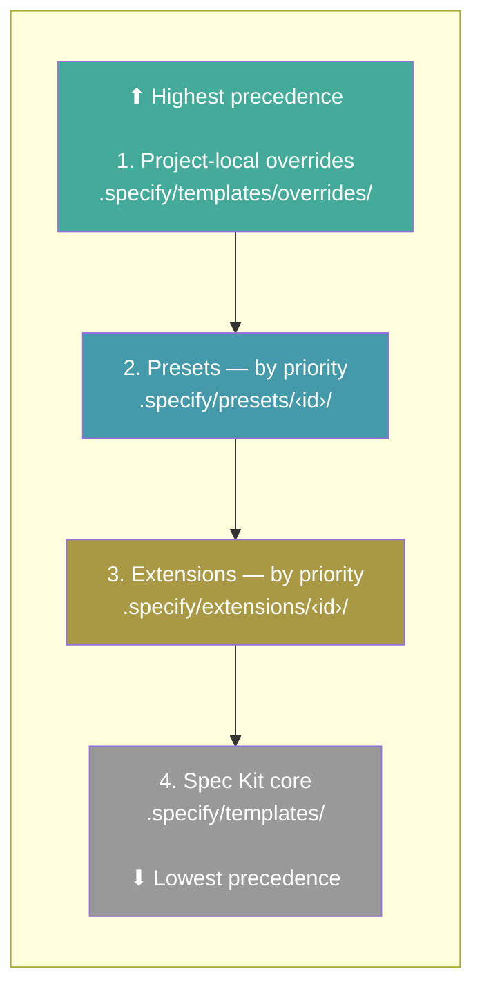
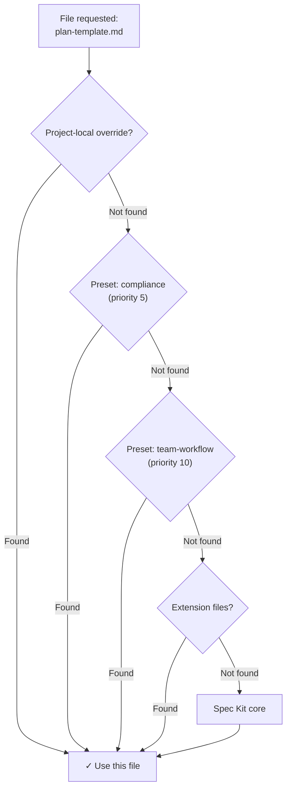

# Presets

Presets customize how Spec Kit works — overriding templates, commands, and terminology without changing any tooling. They let you enforce organizational standards, adapt the workflow to your methodology, or localize the entire experience. Multiple presets can be stacked with priority ordering.

## Search Available Presets

```bash
specify preset search [query]
```

| Option     | Description          |
| ---------- | -------------------- |
| `--tag`    | Filter by tag        |
| `--author` | Filter by author     |

Searches all active catalogs for presets matching the query. Without a query, lists all available presets.

## Install a Preset

```bash
specify preset add [<preset_id>]
```

| Option           | Description                                              |
| ---------------- | -------------------------------------------------------- |
| `--dev <path>`   | Install from a local directory (for development)         |
| `--from <url>`   | Install from a custom URL instead of the catalog         |
| `--priority <N>` | Resolution priority (default: 10; lower = higher precedence) |

Installs a preset from the catalog, a URL, or a local directory. Preset commands are automatically registered with supported active AI coding agent integrations. The generic integration currently delivers extension invocations but does not register preset command or skill overrides.

> **Note:** All preset commands require a project already initialized with `specify init`.

## Update a Preset

```bash
specify preset update <preset_id> [--from <url>] [--dev <path>] [--priority <N>]
```

Replaces an already-installed preset by running the normal `preset remove`
operation first and then the normal `preset add` operation. `--from`, `--dev`,
and `--priority` are forwarded to `preset add`; `--from` and `--dev` cannot be
combined. Without an explicit source, add resolves the preset through its usual
bundled and catalog lookup.

Update is deliberately destructive. Arguments are checked before anything is
removed: `--from` and `--dev` cannot be combined, `--priority` must be 1 or
higher, and the preset must already be installed. Beyond those checks the
replacement source itself is not inspected in advance. If removal succeeds but
replacement installation fails, the previous preset has already been removed.
The command reports a copy-pastable `specify preset add` retry command,
including the replacement source and priority. On Windows, the reported command
is explicitly formatted for PowerShell. There is no source pre-flight,
version comparison, manifest diff, staging, rollback, automatic repair, or
recovery transaction. A missing or invalid replacement source can therefore
leave the preset removed. With
`--from` or `--dev`, the replacement manifest's `preset.id` is not checked
against the requested ID before removal; a source declaring a different ID may
therefore install a different preset after the requested one has been removed.

A successful update follows normal remove and add behavior: it re-enables the
preset, recreates `installed_at`, removes local modifications tracked by the
preset, and treats an explicit `--from` or `--dev` as an intentional source
change. If constitution synchronization is enabled, both normal reconciliation
passes run. If add fails after removal, a generated constitution may remain
reconciled against the stack without the removed preset. The generated-file
guard still protects a hand-edited `.specify/memory/constitution.md`. No
update-specific constitution optimization is applied, so the normal remove and
add passes may rewrite the generated constitution even when the final resolved
content is unchanged.

## Remove a Preset

```bash
specify preset remove <preset_id>
```

Removes an installed preset and cleans up its registered commands.

## List Installed Presets

```bash
specify preset list
specify preset list --json
```

Lists installed presets with their versions, descriptions, template counts, and current status.

`--json` writes a JSON array to stdout. Every item has the keys `id`, `name`,
`description`, `version`, `author`, `priority`, `enabled`, `source`, and
`provides`. `author` is `null` when absent; `source` is `{"kind":"local"}`
for local, legacy, or malformed provenance, or
`{"kind":"catalog","catalog":"<catalog-name>"}` for a valid catalog source.
Preset `provides` contains `commands`, `templates`, and `scripts` counts. On
success, `--json` writes exactly one array to stdout and exits 0. A runtime
failure after option parsing writes exactly one `{"error":"..."}` object to
stderr and exits 1. If parsing raises a usage error and the raw `--json` token
is present, it writes that JSON error object to stderr and preserves the usage
exit code (normally 2). Without `--json`, including for help, the existing
human-readable behavior is unchanged.

Presets are printed in **resolution/precedence order**: the highest-precedence preset (lowest priority number) is listed first, and ties on priority are broken alphabetically by preset id. This matches the order used when composing commands and resolving templates, so the top entry is the one that wins for overlapping files.

## Preset Info

```bash
specify preset info <preset_id>
```

Shows detailed information about an installed or available preset, including its templates, metadata, and tags.

## Resolve a File

```bash
specify preset resolve <name>
```

Shows which file will be used for a given name by tracing the full resolution stack. Useful for debugging when multiple presets provide the same file.

## Enable / Disable a Preset

```bash
specify preset enable <preset_id>
specify preset disable <preset_id>
```

Disable a preset without removing it. A disabled preset is skipped during template and script resolution and stops contributing to command and skill resolution. Disabling also reconciles the command and skill artifacts the preset had generated:

- If the disabled preset was the only active provider for a materialized command or skill, that artifact is removed for the active integration.
- If a lower/fallback layer (another preset, an installed and enabled extension, or core) still provides the resource, the artifact is re-materialized from the remaining active layers instead of being deleted.

Disabling never deletes the preset itself — its directory, manifest, and registry entry stay in place, and `specify preset enable` restores its contribution. Artifact cleanup is best-effort: if cleanup fails, the affected provenance is preserved so re-running `specify preset disable` retries it. Cleanup is not part of a project-wide transaction, so a failed attempt can leave a materialized command or skill on disk until the retry. Re-enable with `enable`.

## Set Preset Priority

```bash
specify preset set-priority <preset_id> <priority>
```

Changes the resolution priority of an installed preset. Lower numbers take precedence. When multiple presets provide the same file, the one with the lowest priority number wins.

## Catalog Management

Preset catalogs control where `search` and `add` look for presets. Catalogs are checked in priority order (lower number = higher precedence).

> **A project's `.specify/preset-catalogs.yml` can point `add` and `search` at a catalog you didn't choose.** Before installing a preset in an unfamiliar project, run `specify preset catalog list` and inspect any catalog marked install-allowed — a project supplying that config, or marking a catalog install-allowed, is not evidence its presets were reviewed. Only mark a catalog `install_allowed` for one you authored or have vetted yourself; leave unfamiliar and community catalogs discovery-only.

### List Catalogs

```bash
specify preset catalog list
```

Shows all active catalogs with their priorities and install permissions.

### Add a Catalog

```bash
specify preset catalog add <url>
```

| Option                                       | Description                                        |
| -------------------------------------------- | -------------------------------------------------- |
| `--name <name>`                              | Required. Unique name for the catalog              |
| `--priority <N>`                             | Priority (default: 10; lower = higher precedence)  |
| `--install-allowed / --no-install-allowed`   | Whether presets can be installed from this catalog (default: discovery only). Only enable for a catalog you own and vet; never enable it for an unvetted public catalog. |
| `--description <text>`                       | Optional description                               |

Adds a catalog to the project's `.specify/preset-catalogs.yml`.

Re-adding the same named catalog with identical settings succeeds without changing the configuration; different settings are rejected.

### Remove a Catalog

```bash
specify preset catalog remove <name>
```

Removes a catalog from the project configuration.

### Catalog Resolution Order

Catalogs are resolved in this order (first match wins):

1. **Environment variable** — `SPECKIT_PRESET_CATALOG_URL` overrides all catalogs
2. **Project config** — `.specify/preset-catalogs.yml`
3. **User config** — `~/.specify/preset-catalogs.yml`
4. **Built-in defaults** — official catalog + community catalog

Example `.specify/preset-catalogs.yml`:

```yaml
catalogs:
  - name: "my-org-presets"
    url: "https://example.com/preset-catalog.json"
    priority: 5
    install_allowed: true
    description: "Our approved presets"
```

## File Resolution

Presets can provide command files, template files (like `plan-template.md`), and script files. Each file name is evaluated independently against the priority stack, so different files can come from different layers.

Templates and scripts are looked up from the stack when Spec Kit needs them. Commands use the same stack for replacement and composition, but are materialized into the active integration's directory only, instead of being re-resolved by agents or written to every detected agent directory (#2948). During preset install, Spec Kit registers command files for the preset being installed against the currently active integration; post-install, post-enable, post-disable, and post-removal reconciliation then recomputes and writes the effective command content for affected command names based on the active stack. Install and rescaffold remain active-only, but removal may also update previously targeted inactive directories recorded by the removed preset to restore the surviving command or skill layer. A non-active installed integration does not otherwise receive these command files until it becomes the default — `specify integration use <key>` (or `switch <key>`) rescaffolds enabled presets for the newly active integration. Agents do not re-resolve the stack each time they run a command.

By default, files use a **replace** strategy: the first match in the priority stack wins and is used entirely. Templates and commands can also use composition strategies: **prepend** places preset content before lower-priority content, **append** places it after lower-priority content, and **wrap** replaces `{CORE_TEMPLATE}` with lower-priority content. Scripts support **replace** and **wrap**; script wrappers use `$CORE_SCRIPT` as the placeholder.

### Regex Selectors

Instead of enumerating one entry per resource, a `provides.templates` entry can match several resources with a `regex:` prefix on its `name`:

```yaml
provides:
  templates:
    - type: command
      name: 'regex:^speckit\.(plan|tasks|implement)$'
      file: commands/workflow-guidance.md
      strategy: append

    - type: template
      name: 'regex:.*-template$'
      file: templates/common-policy.md
      strategy: prepend

    - type: script
      name: 'regex:^check-.*$'
      file: scripts/check-wrapper.sh
      strategy: wrap
```

An entry without the prefix keeps exact-name matching and is unaffected:

```yaml
provides:
  templates:
    - type: command
      name: speckit.plan
      file: commands/plan-guidance.md
      strategy: append
```

How selectors behave:

- `regex:` selectors are supported for all three resource types — `command`, `template`, and `script`.
- A `name` beginning with `regex:` is compiled as a Python regular expression. The pattern is matched with **full-match** semantics against the logical resource name (for example `speckit.plan`, `plan-template`, or `check-constitution`) — the same name you pass to `specify preset resolve` and see in `specify preset info`. It never matches file paths, directory names, or file extensions.
- A selector is eligible only against concrete resources provided by **lower layers** of the resolution stack: lower-priority presets, installed and enabled extensions, and Spec Kit core (including the bundled core pack in a wheel install). Project-local overrides and other `regex:` declarations are never matched, so selectors cannot chain off one another and cannot be satisfied by an override.
- Every concrete resource a selector matches behaves exactly as though the preset contained a separate exact-name entry with the same `file` and `strategy`. One declaration therefore expands into zero, one, or several concrete resources.
- Matching is recalculated whenever preset, extension, or active-integration state changes (add, remove, enable, disable, and priority changes), so adding or removing a lower layer updates the generated artifacts.
- For `command` entries the matches are expanded to concrete command names **before** registration. Registration, composition, reconciliation, and cleanup all run against those concrete names; the literal `regex:...` string is never stored as a command name in the preset registry, an agent directory, or the `.composed` cache.
- For `template` and `script` entries the selector participates in normal runtime resolution: when Spec Kit asks the stack for a concrete name, matching regex declarations from the ordered presets are considered alongside exact declarations.
- Composition and priority are unchanged. `replace`, `prepend`, `append`, and `wrap` compose against the normal resolution stack, and script entries still support only `replace` and `wrap`.

Zero-match and invalid patterns are handled as follows:

- A `regex:` selector that currently matches no lower-layer resource contributes nothing. Installing such a preset emits a warning; it does **not** fail the installation.
- `specify preset info` lists each selector's current concrete matches nested beneath the declaration, or `No current matches` when there are none.
- An invalid regular expression is rejected during manifest validation, so a preset with a malformed pattern fails to install with a clear validation error rather than at resolution time.

The resolution stack, from highest to lowest precedence:

1. **Project-local overrides** — `.specify/templates/overrides/`
2. **Installed presets** — sorted by priority (lower = checked first)
3. **Installed extensions** — sorted by priority
4. **Spec Kit core** — `.specify/templates/`

### Resolution Stack



Within each layer, files are organized by type:

| Type      | Subdirectory   | Override path                              |
| --------- | -------------- | ------------------------------------------ |
| Templates | `templates/`   | `.specify/templates/overrides/`            |
| Commands  | `commands/`    | `.specify/templates/overrides/`            |
| Scripts   | `scripts/`     | `.specify/templates/overrides/scripts/`    |

### Resolution in Action



### Example

```bash
specify preset add compliance --priority 5
specify preset add team-workflow --priority 10
```

For any file that both provide, `compliance` wins (priority 5 < 10). For files only one provides, that one is used. For files neither provides, the core default is used.

## FAQ

### Can I use multiple presets at the same time?

Yes. Presets stack by priority — each file is resolved independently from the highest-priority source that provides it. Use `specify preset set-priority` to control the order.

### How do I see which file is actually being used?

Run `specify preset resolve <name>` to trace the resolution stack and see which file wins.

### What's the difference between disabling and removing a preset?

**Disabling** (`specify preset disable`) keeps the preset installed — its files and registry entry are untouched — but stops it contributing to resolution. Templates and scripts it provided are skipped, and the command and skill artifacts it generated are reconciled against the remaining active layers: an artifact with no other active provider is removed, while one that still has a lower/fallback provider is re-materialized from that provider. This is useful for temporarily testing template/script behavior, or comparing command/skill output with and without a preset, without losing the installed preset. Re-enable anytime with `specify preset enable`, which re-materializes the preset's contribution.

**Removing** (`specify preset remove`) fully uninstalls the preset — deletes its files, unregisters its commands and skills from your AI coding agent, and removes it from the registry.

### Who maintains presets?

Most presets are independently created and maintained by their respective authors. The Spec Kit maintainers do not review, audit, endorse, or support preset code. Review a preset's source code before installing and use at your own discretion. For issues with a specific preset, contact its author or file an issue on the preset's repository.
