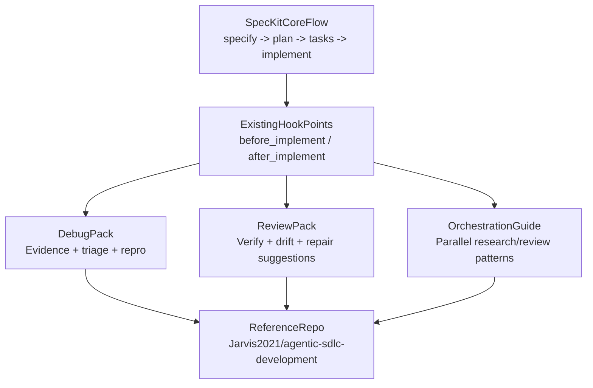

# RFC: Advanced AI Workflow Extensions for Spec Kit

**Status**: Proposal
**Author**: Community contribution
**Created**: 2026-03-09

---

## Summary

This document proposes a phased roadmap for advanced, opt-in AI workflow capabilities that can complement Spec Kit without changing its default core workflow.

The goal is not to turn Spec Kit into a stateful agent platform overnight. The goal is to identify a small set of high-value capabilities that become available through extensions, workflow packs, or documented integration patterns:

1. AI-assisted debugging with typed evidence capture
2. Advanced collaboration with resumable workflow state
3. Guided self-healing loops after implementation or test failures
4. Multi-agent orchestration patterns for bounded parallel work
5. Comprehensive workflow packs and plugin bundles
6. Lightweight semantic code operations for higher-confidence review and repair

These ideas are informed by a working open-source reference implementation in [`Jarvis2021/agentic-sdlc-development`](https://github.com/Jarvis2021/agentic-sdlc-development).

---

## Why This Proposal Exists

Spec Kit already provides a strong default workflow:

- `/speckit.constitution`
- `/speckit.specify`
- `/speckit.plan`
- `/speckit.tasks`
- `/speckit.implement`

It also already has promising extension work in [`extensions/RFC-EXTENSION-SYSTEM.md`](./RFC-EXTENSION-SYSTEM.md) and hook points in command templates such as [`templates/commands/implement.md`](../templates/commands/implement.md).

What appears less developed today are community-standard patterns for what happens after or around implementation:

- how to capture debugging evidence in a reusable format
- how to resume work across sessions without depending on chat history
- how to run review and repair loops in a disciplined way
- how to package advanced behaviors so they remain optional

These capabilities are increasingly relevant for teams using Spec-Driven Development in brownfield, multi-agent, and production-oriented environments.

---

## Design Intent

This roadmap follows four principles:

1. Keep Spec Kit core unchanged by default
2. Prefer extensions, hooks, and documented conventions over mandatory runtime services
3. Stay agent-agnostic and IDE-agnostic
4. Prove value with narrow workflows before proposing broader implementation changes

---

## Major Capability Gaps

### 1. AI-Assisted Debugging

Current Spec Kit workflows are strong on specification and implementation, but less opinionated on structured post-failure analysis.

Useful additions:

- typed evidence bundles for command, test, CI, and browser failures
- standard locations for captured evidence
- documented handoff from failed `/speckit.implement` runs into review/debug extensions

Community benefit:

- easier reproducibility
- clearer reviewer context
- less reliance on raw terminal logs and ad hoc issue descriptions

### 2. Advanced Collaboration and Resumability

Spec Kit is filesystem-oriented, which is a strength. A natural next step is documenting optional collaboration state conventions:

- plan status
- approvals
- review checkpoints
- event timeline
- resumable context snapshots

This should remain lightweight and local-first.

### 3. Guided Self-Healing

Self-healing should not mean silent autonomy. A community-friendly version would be:

- run verification
- classify failure
- surface evidence
- propose or execute bounded remediation through an extension hook
- require human review for high-risk or repeated failures

This fits naturally after `/speckit.implement` or inside optional verification packs.

### 4. Multi-Agent Orchestration

Spec Kit already acknowledges creative exploration and parallel solution work. A useful roadmap addition would document patterns for:

- research agents versus implementation agents
- bounded parallel review groups
- orchestration checkpoints
- handoff artifacts between agent roles

This should begin as documentation and examples, not a scheduler built into core.

### 5. Workflow Packs and Plugin Bundles

The extension RFC defines an excellent base for integrations. A complementary concept is workflow packs:

- debug packs
- review packs
- release packs
- semantic code packs
- brownfield modernization packs

These are not new core commands. They are composable bundles of hooks, commands, templates, and validation rules.

### 6. Semantic Code Operations

Some advanced workflows benefit from host-agnostic semantic operations:

- symbol search
- usage lookup
- rename preview
- structured impact analysis

This does not need to be mandatory. It can begin as a documented optional capability for higher-confidence review, debugging, and modernization packs.

---

## Proposed Phased Roadmap

### Phase 1: Documentation and Extension Patterns

Document how advanced workflows can fit into the existing extension RFC and hook system.

Deliverables:

- extension-oriented guidance for debugging, review, and repair workflows
- examples of optional hooks after `/speckit.tasks` and `/speckit.implement`
- explicit non-goals for keeping core lean

### Phase 2: Community Workflow Pack Conventions

Define lightweight conventions for packs that bundle:

- commands
- scripts
- hooks
- docs
- compatibility metadata

Deliverables:

- recommended pack structure
- examples of debug, verify, and retrospective packs
- guidance for publishing and cataloging these packs

### Phase 3: Evidence-Driven Debugging

Standardize how advanced packs can capture and use evidence.

Deliverables:

- recommended evidence schema or file conventions
- examples for test failures, CI failures, and runtime/browser failures
- human-review checkpoints for pack-driven repair suggestions

### Phase 4: Resumable Collaboration Metadata

Introduce optional conventions for persistent workflow state that remain local and transparent.

Deliverables:

- conventions for plans, approvals, tasks, traces, and event logs
- examples of resumable work between sessions or contributors
- compatibility guidance for existing projects

### Phase 5: Multi-Agent and Self-Healing Patterns

Only after phases 1 through 4 are validated in community extensions should Spec Kit document stronger patterns for:

- orchestrated review groups
- bounded repair loops
- semantic assistance for impact-aware change proposals

---

## Example Fit With Existing Spec Kit Concepts



---

## Example Reference Capabilities

The following capabilities can be reviewed in the reference repository to understand the maturity and ergonomics of these ideas:

- structured runtime state via `plan`, `resume`, `events`, and `trace`
- typed evidence capture for debugging and CI failures
- plugin manifests and capability toggles
- resumable session workflow state
- semantic code tooling abstraction

Reference repository:

- [`Jarvis2021/agentic-sdlc-development`](https://github.com/Jarvis2021/agentic-sdlc-development)

Useful entry points for reviewers:

- [`README.md`](https://github.com/Jarvis2021/agentic-sdlc-development/blob/main/README.md)
- [`AGENTS.md`](https://github.com/Jarvis2021/agentic-sdlc-development/blob/main/AGENTS.md)
- [`lib/session-runtime.js`](https://github.com/Jarvis2021/agentic-sdlc-development/blob/main/lib/session-runtime.js)
- [`lib/debug-fabric.js`](https://github.com/Jarvis2021/agentic-sdlc-development/blob/main/lib/debug-fabric.js)
- [`lib/plugin-runtime.js`](https://github.com/Jarvis2021/agentic-sdlc-development/blob/main/lib/plugin-runtime.js)

Concrete user-facing examples from that repository:

```bash
# scaffold a project
npx agentic-sdlc-development my-project

# create a structured plan and resumable workflow state
agentic-sdlc plan checkout-flow --title "Checkout flow hardening" --story PROJ-123
agentic-sdlc resume

# capture typed debug evidence
agentic-sdlc trace --kind debug --command "npm test" --test-output "FAIL tests/cart.test.js"

# inspect optional capability packs
agentic-sdlc plugins list
```

---

## Example Advanced Workflow

One maintainers-friendly future workflow could look like this:

1. Run `/speckit.implement`
2. Trigger an optional post-implement review/debug pack
3. Capture evidence from failing tests or CI output
4. Compare implementation against spec, plan, and tasks
5. Surface targeted remediation suggestions
6. Require explicit human confirmation before high-risk repairs

This keeps the core experience simple while allowing advanced teams to opt into stronger guardrails.

---

## Non-Goals

This proposal does not recommend:

- adding a mandatory runtime daemon to Spec Kit
- introducing vendor-specific orchestration logic into core
- forcing every user to adopt advanced debugging or self-healing workflows
- replacing the current spec-driven command chain
- merging a large implementation before maintainers agree on the direction

---

## Community Benefit

If pursued incrementally, these capabilities can help Spec Kit support:

- more reliable brownfield workflows
- clearer debugging and review loops
- stronger reuse through workflow packs
- higher-confidence multi-agent collaboration
- a better path from experimentation to production-oriented usage

---

## Suggested Next Steps

1. Validate whether maintainers want these ideas documented in core docs, extension docs, or discussions first
2. If there is interest, define a minimal workflow-pack convention that layers cleanly onto the extension RFC
3. Encourage one or two narrowly scoped community extensions that demonstrate the value before broader upstreaming
4. Revisit whether lightweight evidence and resumability conventions should become part of official extension guidance
