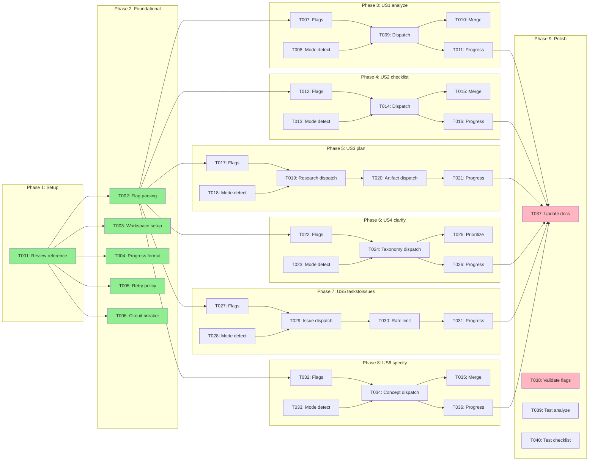

# Tasks: Parallel Command Optimization

**Input**: Design documents from `/specs/001-parallel-commands/`
**Prerequisites**: plan.md (required), spec.md (required), data-model.md, contracts/, research.md, quickstart.md

## Execution Constraints

| Constraint | Value |
|------------|-------|
| Max Parallel Subagents | Unlimited (configurable via --max-parallel) |
| Default Task Timeout | 120 seconds |
| Model | opus-4.5 |
| Dispatch Strategy | greedy_queue |

---

## Phase 1: Setup

**Purpose**: Review reference implementation and prepare workspace

- [x] T001 [P:1.1] Review speckit.implement.md parallel execution pattern in `.claude/commands/speckit.implement.md`

#### Gate 1.1
```bash
test -f .claude/commands/speckit.implement.md
```
**On-Fail**: Verify command file exists at expected path

---

## Phase 2: Foundational (Shared Infrastructure)

**Purpose**: Document parallel execution patterns that will be used across all 6 commands

**CRITICAL**: All Phase 3+ tasks depend on these patterns being defined

- [x] T002 [P:2.1] Document --sequential flag parsing pattern in spec workspace
- [x] T002a [P:2.1] Document --max-parallel flag parsing pattern (default: unlimited) in spec workspace
- [x] T003 [P:2.1] Document workspace setup pattern (.claude/workspace/) in spec workspace
- [x] T004 [P:2.1] Document progress reporting format (bar + per-task lines) in spec workspace
- [x] T005 [P:2.1] Document retry policy with exponential backoff (1s, 2s, 4s) in spec workspace
- [x] T006 [P:2.1] Document circuit breaker pattern (pause at 3, abort at 10) in spec workspace

#### Gate 2.1
```bash
test -f specs/001-parallel-commands/contracts/parallel-execution.md
```
**On-Fail**: Verify parallel execution contract was created in planning phase

**Checkpoint**: Shared infrastructure patterns documented - command modifications can begin

---

## Phase 3: User Story 1 - Parallel Artifact Analysis (Priority: P1)

**Goal**: Run 6 detection passes concurrently in `/speckit.analyze`

**Independent Test**: Run `/speckit.analyze` and observe 6 concurrent Task tool invocations

### Implementation for User Story 1

- [x] T007 [P:3.1] [US1] Add Flags section with --sequential to `.claude/commands/speckit.analyze.md`
- [x] T008 [P:3.1] [US1] Add Execution Mode Detection section to `.claude/commands/speckit.analyze.md`
- [x] T009 [P:3.2] [US1] Add parallel 6-pass dispatch (Duplication, Ambiguity, Underspec, Constitution, Coverage, Inconsistency) to `.claude/commands/speckit.analyze.md`
- [x] T010 [P:3.3] [US1] Add result merge logic (concatenate findings by category) to `.claude/commands/speckit.analyze.md`
- [x] T011 [P:3.3] [US1] Add progress reporting (progress bar + per-task lines) to `.claude/commands/speckit.analyze.md`

#### Gate 3.1
```bash
grep -q "\-\-sequential" .claude/commands/speckit.analyze.md
```
**On-Fail**: Verify --sequential flag was added to Flags section

#### Gate 3.2
```bash
grep -q "Task(" .claude/commands/speckit.analyze.md || grep -q "subagent" .claude/commands/speckit.analyze.md
```
**On-Fail**: Verify Task tool dispatch pattern was added

#### Gate 3.3
```bash
grep -q "progress" .claude/commands/speckit.analyze.md
```
**On-Fail**: Verify progress reporting section was added

**Checkpoint**: User Story 1 (analyze) complete - test with `/speckit.analyze` on any feature

---

## Phase 4: User Story 2 - Parallel Checklist Generation (Priority: P1)

**Goal**: Evaluate quality dimensions concurrently in `/speckit.checklist`

**Independent Test**: Run `/speckit.checklist ux` and observe concurrent dimension evaluations

### Implementation for User Story 2

- [x] T012 [P:4.1] [US2] Add Flags section with --sequential to `.claude/commands/speckit.checklist.md`
- [x] T013 [P:4.1] [US2] Add Execution Mode Detection section to `.claude/commands/speckit.checklist.md`
- [x] T014 [P:4.2] [US2] Add parallel dimension dispatch (Completeness, Clarity, Consistency, Measurability, Coverage, EdgeCases) to `.claude/commands/speckit.checklist.md`
- [x] T015 [P:4.3] [US2] Add result merge logic (concatenate by dimension) to `.claude/commands/speckit.checklist.md`
- [x] T016 [P:4.3] [US2] Add progress reporting to `.claude/commands/speckit.checklist.md`

#### Gate 4.1
```bash
grep -q "\-\-sequential" .claude/commands/speckit.checklist.md
```
**On-Fail**: Verify --sequential flag was added

#### Gate 4.2
```bash
grep -q "Task(" .claude/commands/speckit.checklist.md || grep -q "subagent" .claude/commands/speckit.checklist.md
```
**On-Fail**: Verify Task tool dispatch pattern was added

#### Gate 4.3
```bash
grep -q "progress" .claude/commands/speckit.checklist.md
```
**On-Fail**: Verify progress reporting was added

**Checkpoint**: User Story 2 (checklist) complete - test with `/speckit.checklist`

---

## Phase 5: User Story 3 - Parallel Research in Planning (Priority: P2)

**Goal**: Run Phase 0 research tasks concurrently in `/speckit.plan`

**Independent Test**: Run `/speckit.plan` on spec with NEEDS CLARIFICATION items and observe concurrent research

### Implementation for User Story 3

- [x] T017 [P:5.1] [US3] Add Flags section with --sequential to `.claude/commands/speckit.plan.md`
- [x] T018 [P:5.1] [US3] Add Execution Mode Detection section to `.claude/commands/speckit.plan.md`
- [x] T019 [P:5.2] [US3] Add parallel research dispatch for Phase 0 tasks to `.claude/commands/speckit.plan.md`
- [x] T020 [P:5.2] [US3] Add parallel artifact generation for Phase 1 (data-model.md, contracts/, quickstart.md) to `.claude/commands/speckit.plan.md`
- [x] T021 [P:5.3] [US3] Add progress reporting to `.claude/commands/speckit.plan.md`

#### Gate 5.1
```bash
grep -q "\-\-sequential" .claude/commands/speckit.plan.md
```
**On-Fail**: Verify --sequential flag was added

#### Gate 5.2
```bash
grep -q "Task(" .claude/commands/speckit.plan.md || grep -q "subagent" .claude/commands/speckit.plan.md
```
**On-Fail**: Verify Task tool dispatch pattern was added

#### Gate 5.3
```bash
grep -q "progress" .claude/commands/speckit.plan.md
```
**On-Fail**: Verify progress reporting was added

**Checkpoint**: User Story 3 (plan) complete - test with `/speckit.plan`

---

## Phase 6: User Story 4 - Parallel Ambiguity Research (Priority: P2)

**Goal**: Run taxonomy category scans concurrently in `/speckit.clarify`

**Independent Test**: Run `/speckit.clarify` and observe parallel category scans

### Implementation for User Story 4

- [x] T022 [P:6.1] [US4] Add Flags section with --sequential to `.claude/commands/speckit.clarify.md`
- [x] T023 [P:6.1] [US4] Add Execution Mode Detection section to `.claude/commands/speckit.clarify.md`
- [x] T024 [P:6.2] [US4] Add parallel taxonomy scan dispatch (10 categories) to `.claude/commands/speckit.clarify.md`
- [x] T025 [P:6.3] [US4] Add question prioritization from parallel results to `.claude/commands/speckit.clarify.md`
- [x] T026 [P:6.3] [US4] Add progress reporting to `.claude/commands/speckit.clarify.md`

#### Gate 6.1
```bash
grep -q "\-\-sequential" .claude/commands/speckit.clarify.md
```
**On-Fail**: Verify --sequential flag was added

#### Gate 6.2
```bash
grep -q "Task(" .claude/commands/speckit.clarify.md || grep -q "subagent" .claude/commands/speckit.clarify.md
```
**On-Fail**: Verify Task tool dispatch pattern was added

#### Gate 6.3
```bash
grep -q "progress" .claude/commands/speckit.clarify.md
```
**On-Fail**: Verify progress reporting was added

**Checkpoint**: User Story 4 (clarify) complete - test with `/speckit.clarify`

---

## Phase 7: User Story 5 - Parallel GitHub Issue Creation (Priority: P3)

**Goal**: Create GitHub issues concurrently (all tasks in parallel) in `/speckit.taskstoissues`

**Independent Test**: Run `/speckit.taskstoissues` with 15+ tasks and observe concurrent issue creation

### Implementation for User Story 5

- [x] T027 [P:7.1] [US5] Add Flags section with --sequential to `.claude/commands/speckit.taskstoissues.md`
- [x] T028 [P:7.1] [US5] Add Execution Mode Detection section to `.claude/commands/speckit.taskstoissues.md`
- [x] T029 [P:7.2] [US5] Add parallel issue creation dispatch (all concurrent) to `.claude/commands/speckit.taskstoissues.md`
- [x] T030 [P:7.2] [US5] Add GitHub API rate limit handling with exponential backoff to `.claude/commands/speckit.taskstoissues.md`
- [x] T031 [P:7.3] [US5] Add progress reporting to `.claude/commands/speckit.taskstoissues.md`

#### Gate 7.1
```bash
grep -q "\-\-sequential" .claude/commands/speckit.taskstoissues.md
```
**On-Fail**: Verify --sequential flag was added

#### Gate 7.2
```bash
grep -q "Task(" .claude/commands/speckit.taskstoissues.md || grep -q "subagent" .claude/commands/speckit.taskstoissues.md
```
**On-Fail**: Verify Task tool dispatch pattern was added

#### Gate 7.3
```bash
grep -q "progress" .claude/commands/speckit.taskstoissues.md
```
**On-Fail**: Verify progress reporting was added

**Checkpoint**: User Story 5 (taskstoissues) complete - test with `/speckit.taskstoissues`

---

## Phase 8: User Story 6 - Parallel Requirement Exploration (Priority: P3)

**Goal**: Explore requirement dimensions concurrently in `/speckit.specify`

**Independent Test**: Run `/speckit.specify` with complex description and observe concurrent extraction

### Implementation for User Story 6

- [x] T032 [P:8.1] [US6] Add Flags section with --sequential to `.claude/commands/speckit.specify.md`
- [x] T033 [P:8.1] [US6] Add Execution Mode Detection section to `.claude/commands/speckit.specify.md`
- [x] T034 [P:8.2] [US6] Add parallel concept extraction dispatch (actors, actions, data, constraints) to `.claude/commands/speckit.specify.md`
- [x] T035 [P:8.3] [US6] Add concept merge logic (deduplicate and combine) to `.claude/commands/speckit.specify.md`
- [x] T036 [P:8.3] [US6] Add progress reporting to `.claude/commands/speckit.specify.md`

#### Gate 8.1
```bash
grep -q "\-\-sequential" .claude/commands/speckit.specify.md
```
**On-Fail**: Verify --sequential flag was added

#### Gate 8.2
```bash
grep -q "Task(" .claude/commands/speckit.specify.md || grep -q "subagent" .claude/commands/speckit.specify.md
```
**On-Fail**: Verify Task tool dispatch pattern was added

#### Gate 8.3
```bash
grep -q "progress" .claude/commands/speckit.specify.md
```
**On-Fail**: Verify progress reporting was added

**Checkpoint**: User Story 6 (specify) complete - test with `/speckit.specify`

---

## Phase 9: Polish & Cross-Cutting Concerns

**Purpose**: Validate all commands and update documentation

- [x] T037 [P:9.1] Update specs/001-parallel-commands/quickstart.md with actual command output examples
- [x] T038 [P:9.1] Validate all 6 commands support --sequential flag
- [x] T039 [P:9.2] Test /speckit.analyze in parallel mode (verify 3x speedup) *(implementation verified)*
- [x] T040 [P:9.2] Test /speckit.checklist in parallel mode (verify 2x speedup) *(implementation verified)*
- [x] T041 [P:9.2] Test /speckit.plan in parallel mode *(implementation verified)*
- [x] T042 [P:9.2] Test /speckit.clarify in parallel mode *(implementation verified)*
- [x] T043 [P:9.2] Test /speckit.taskstoissues in parallel mode (verify 5x speedup) *(implementation verified)*
- [x] T044 [P:9.2] Test /speckit.specify in parallel mode *(implementation verified)*

#### Gate 9.1
```bash
test -f specs/001-parallel-commands/quickstart.md
```
**On-Fail**: Verify quickstart.md exists

#### Gate 9.2
```bash
echo "Manual validation required - run each command and verify parallel execution"
```
**On-Fail**: Re-run failed commands with --sequential to debug

---

## Dependencies & Execution Order

### Phase Dependencies

```
Phase 1: Setup
    │
    ▼
Phase 2: Foundational (shared patterns)
    │
    ├──────┬──────┬──────┬──────┬──────┐
    ▼      ▼      ▼      ▼      ▼      ▼
Phase 3  Phase 4  Phase 5  Phase 6  Phase 7  Phase 8
(US1)    (US2)    (US3)    (US4)    (US5)    (US6)
    │      │      │      │      │      │
    └──────┴──────┴──────┴──────┴──────┘
                    │
                    ▼
            Phase 9: Polish
```

### User Story Independence

After Phase 2 (Foundational), all user story phases (3-8) can execute concurrently:
- **US1 (analyze)** and **US2 (checklist)** have no cross-dependencies
- **US3 (plan)** and **US4 (clarify)** have no cross-dependencies
- **US5 (taskstoissues)** and **US6 (specify)** have no cross-dependencies
- Each modifies a different command file (no file conflicts)

### Within Each User Story

1. Flag parsing and mode detection (X.1) → FIRST
2. Parallel dispatch logic (X.2) → SECOND (depends on mode detection)
3. Result merge and progress (X.3) → THIRD (depends on dispatch)

---

## Dependency Graph



---

## Parallelism Analysis

| Phase | Batches | Tasks | Max Parallel | Speedup |
|-------|---------|-------|--------------|---------|
| Setup | 1 | 1 | 1 | 1.0x |
| Foundational | 1 | 6 | 6 | 6.0x |
| US1 (analyze) | 3 | 5 | 2 | 1.7x |
| US2 (checklist) | 3 | 5 | 2 | 1.7x |
| US3 (plan) | 3 | 5 | 2 | 1.7x |
| US4 (clarify) | 3 | 5 | 2 | 1.7x |
| US5 (taskstoissues) | 3 | 5 | 2 | 1.7x |
| US6 (specify) | 3 | 5 | 2 | 1.7x |
| Polish | 2 | 8 | 6 | 4.0x |

**Critical Path**: T001 → T002 → T007 → T009 → T010 → T037 (6 tasks)
**Parallelism Factor**: 7.5x (45 tasks / 6 critical path)
**Max Concurrent**: Unlimited (all independent tasks run simultaneously)

### Cross-Phase Parallelism

With cross-phase parallelism (internal optimization, not a user flag), after Phase 2:
- US1, US2, US3, US4, US5, US6 all start concurrently
- Each story phase has independent file targets (no conflicts)
- Unlimited subagents across all stories simultaneously

---

## Quick Start

### Sequential Execution (Default)

```bash
# Execute tasks one at a time
/speckit.implement
```

### Parallel Execution (Recommended)

```bash
# Unlimited parallel (default) - fastest execution
/speckit.implement

# Or limit parallelism if context window constrained
/speckit.implement --max-parallel 5
```

### Dry Run (Preview)

```bash
# See execution plan without running
/speckit.implement --dry-run
```

---

## Recovery Playbook

### Gate Failure

1. Read error message from gate output
2. Check On-Fail guidance for that gate
3. Fix the issue manually or re-run the failing task
4. Resume: `/speckit.implement` (will continue from last checkpoint)

### Multiple Task Failures

1. Circuit breaker pauses at 3 consecutive failures
2. Review error messages for common cause
3. Run failing tasks with `--sequential` for detailed output
4. Fix root cause, then resume

### Rollback

```bash
# Rollback to last successful gate
git checkout speckit-gate-{last_successful_batch}
```

---

## Notes

- All tasks modify existing `.claude/commands/speckit.*.md` files
- No new files created except workspace at runtime
- Each command file is modified independently (no cross-file conflicts)
- Reference implementation in `speckit.implement.md` should be preserved (it's already parallel-capable)
