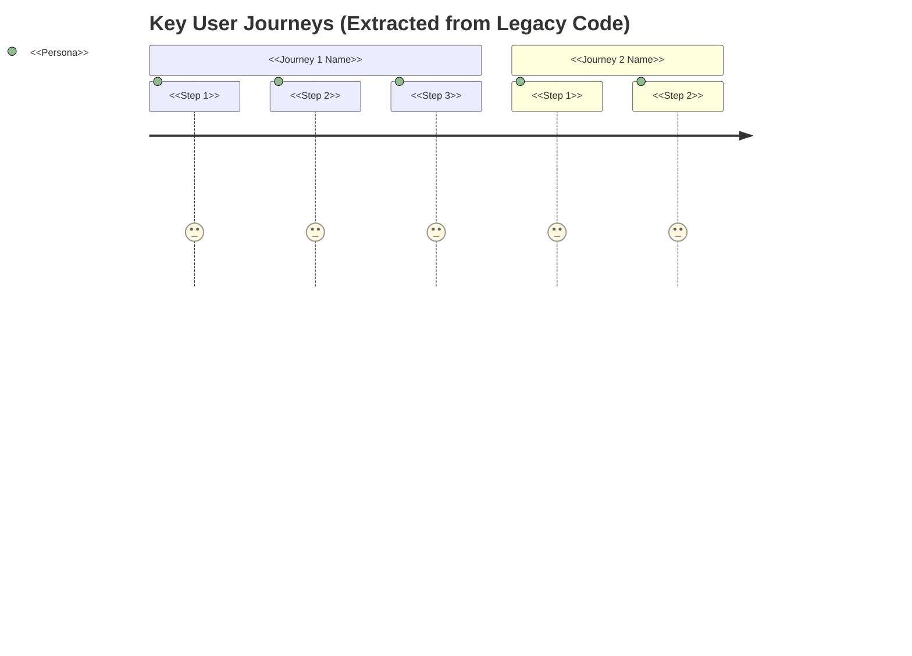

# Functional Specification - Legacy System Analysis

**Project**: <<PROJECT_NAME>>
**Legacy System Version**: <<LEGACY_VERSION>>
**Analysis Date**: <<ANALYSIS_DATE>>
**Analyst**: AI Agent
**Status**: Draft (For Modernization)

---

## Instructions for AI

This template is based on **Section A (Business Analysis)** from the Universal Meta-Prompt.
It is adapted for **legacy code analysis** to extract WHAT the system does (not HOW).

**Key Adaptations for Legacy Analysis**:

- Extract information from **actual code**, not imagination
- Every finding must include **Evidence** (file:line references)
- Focus on WHAT (business functionality), not HOW (implementation details)
- Identify **Known Quirks** and **Legacy Behaviors** that may need preservation
- Categorize features by criticality: CRITICAL, STANDARD, LEGACY QUIRKS

**Placeholders to Fill** (based on deep analysis of legacy code):

- `<<PROJECT_NAME>>` - Extract from package.json, pom.xml, README, etc.
- `<<LEGACY_VERSION>>` - Current version from codebase
- `<<ANALYSIS_DATE>>` - Current date (ISO 8601)
- `<<EXTRACT_FEATURES>>` - Scan controllers, routes, services for features
- `<<EXTRACT_PERSONAS>>` - Identify from auth/RBAC/user roles in code
- `<<EXTRACT_JOURNEYS>>` - Map workflows from code paths
- `<<EXTRACT_DATA_MODELS>>` - Parse from DB schemas, migrations, ORMs
- `<<EXTRACT_CONFIG>>` - List all config files and their purposes
- `<<EXTRACT_QUIRKS>>` - Find hardcoded values, workarounds, edge cases

---

## 1. Executive Summary

**WHAT**: <<1-2 sentences describing what the legacy system does>>

**WHO**: <<Primary user types/personas extracted from code>>

**WHY**: <<Business purpose derived from functionality analysis>>

**TOP 3 CAPABILITIES**:

1. <<Most important feature from code analysis>>
2. <<Second most important feature>>
3. <<Third most important feature>>

**Evidence**: Analysis of <<N>> files across <<M>> directories

---

## 2. Current State - Problem & Goals

### Current Business Objectives

Based on analysis of the legacy codebase, the system serves these objectives:

- <<Objective 1>> (Evidence: <<file:line>>)
- <<Objective 2>> (Evidence: <<file:line>>)
- <<Objective 3>> (Evidence: <<file:line>>)

### KPIs/Metrics (Extracted from Code)

| Metric | Current Implementation | Evidence |
|--------|----------------------|----------|
| <<Metric name>> | <<How it's tracked>> | <<file:line>> |
| <<Response time>> | <<Hardcoded timeout/config>> | <<file:line>> |
| <<Throughput>> | <<Rate limit/throttle config>> | <<file:line>> |

---

## 3. Personas & User Journeys

### Personas (Extracted from Code)

<<Extract from authentication, authorization, RBAC, user roles>>

| Persona | Evidence | Permissions/Capabilities |
|---------|----------|-------------------------|
| <<Admin>> | <<auth.js:45-67>> | <<Full access, user management, etc.>> |
| <<User>> | <<auth.js:89-102>> | <<Read/write own data, limited access>> |
| <<Guest>> | <<auth.js:115-120>> | <<Read-only public data>> |

### Top User Journeys (From Code Paths)

**Evidence**:

- Journey 1: <<controller paths, workflow files>>
- Journey 2: <<service methods, state machines>>

---

## 4. Scope / Out-of-Scope

### In Scope (Features Found in Legacy Code)

| Feature/Capability | Evidence (file:line) | Criticality |
|-------------------|---------------------|-------------|
| <<Feature 1>> | <<path/to/file:123>> | CRITICAL |
| <<Feature 2>> | <<path/to/file:456>> | STANDARD |
| <<Feature 3>> | <<path/to/file:789>> | STANDARD |

### Out of Scope (Not Found in Legacy Code)

| Capability | Rationale |
|-----------|-----------|
| <<Feature X>> | No evidence in codebase; may be external/deprecated |
| <<Feature Y>> | Only mentioned in comments, no implementation |

---

## 5. Functional Requirements (Extracted from Legacy Code)

### CRITICAL Features (Must Preserve Exactly)

#### FR-CRIT-001: <<Feature Name>>

- **As a** <<persona from code>>, **the system provides** <<capability extracted from code>>,
  **so that** <<business value inferred from usage>>.
- **Evidence**: <<controller/service/file:line-range>>
- **Current Implementation**:
  - <<Key code logic summary>>
  - <<Important config/constants>>
- **Acceptance Criteria** (derived from code/tests):
  - AC-1: <<Measurable condition from test or code logic>>
  - AC-2: <<Second condition>>
- **⚠️ CRITICAL**: This behavior MUST be preserved exactly in modernized system.

#### FR-CRIT-002: <<Next Critical Feature>>

<<Repeat structure>>

### STANDARD Features (Can Modernize Implementation)

#### FR-STD-001: <<Feature Name>>

- **As a** <<persona>>, **the system provides** <<capability>>, **so that** <<value>>.
- **Evidence**: <<file:line>>
- **Current Implementation**: <
>
- **Modernization Opportunity**: <<How this could be improved in new system>>
- **Acceptance Criteria**:
  - AC-1: <<Condition>>
  - AC-2: <<Condition>>

#### FR-STD-002: <<Next Standard Feature>>

<<Repeat structure>>

### LEGACY QUIRKS (Decide: Preserve or Fix)

#### FR-QUIRK-001: <<Quirk Name>>

- **Current Behavior**: <<Description of unexpected/undocumented behavior>>
- **Evidence**: <<file:line>>
- **Issue**: <<Why this is a quirk (hardcoded, workaround, anti-pattern)>>
- **Decision Needed**:
  - **Option A**: Preserve (for backward compatibility)
  - **Option B**: Fix/modernize (with migration plan)
- **Impact Analysis**: <<What breaks if changed>>

#### FR-QUIRK-002: <<Next Quirk>>

<<Repeat structure>>

---

## 6. Non-Negotiables (Extracted from Code Analysis)

These constraints are derived from code evidence and must be preserved:

1. **<<Non-Negotiable 1>>**
   **Rationale**: <<Why mandatory>>
   **Evidence**: <<file:line>>
   **Example**: <<Actual code snippet or config value>>

2. **<<Non-Negotiable 2>>** (e.g., PII Encryption)
   **Rationale**: All PII must be encrypted at rest
   **Evidence**: <<encryption-middleware.js:45-78>>
   **Example**: Uses AES-256-CBC with custom key derivation

3. **<<Non-Negotiable 3>>** (e.g., Audit Logging)
   **Rationale**: Regulatory compliance (GDPR, SOX)
   **Evidence**: <<audit-logger.js:12-34>>
   **Example**: All transactions logged to immutable audit table

---

## 7. Non-Functional Requirements (Legacy System)

### Performance (Extracted from Config/Code)

| Metric | Current Target | Evidence | Notes |
|--------|---------------|----------|-------|
| Response time | p95 < <<X>>ms | <<config.js:23>> | Hardcoded timeout |
| Throughput | <<Y>> req/min | <<rate-limiter.js:45>> | Per-user limit |
| Batch size | <<Z>> records | <<batch-processor.js:67>> | Max batch |

### Availability & Reliability

| Metric | Current Implementation | Evidence |
|--------|----------------------|----------|
| Uptime | <<SLA/config>> | <<deploy/config.yaml:12>> |
| Retry logic | <<3 attempts, exp backoff>> | <<http-client.js:89-102>> |
| Circuit breaker | <<Threshold: 5 failures>> | <<circuit-breaker.js:34>> |

### Security (Current Implementation)

| Aspect | Implementation | Evidence |
|--------|---------------|----------|
| Authentication | <<Session-based, 30min timeout>> | <<auth/session.js:45>> |
| Authorization | <<Role-based (admin/user/guest)>> | <<auth/rbac.js:23-67>> |
| Encryption | <<AES-256-CBC for PII>> | <<crypto/encrypt.js:12>> |
| Input validation | <<Schema-based (Joi)>> | <<validators/input.js:34>> |

### Accessibility, Privacy, Localization

| Aspect | Current State | Evidence |
|--------|--------------|----------|
| A11y | <<WCAG level/none>> | <<frontend analysis>> |
| Privacy | <<PII masking in logs>> | <<logger.js:56>> |
| I18n | <<EN only / multi-lang>> | <<i18n/locales/>> |

---

## 8. Data Models (Extracted from DB Schemas)

### Core Entities

#### Entity: <<EntityName>> (e.g., User)

**Evidence**: <<migrations/001_create_users.sql>> or <<models/User.js>>

| Field | Type | Constraints | PII | Notes |
|-------|------|-------------|-----|-------|
| id | UUID | PRIMARY KEY | No | Auto-generated |
| email | VARCHAR(255) | UNIQUE, NOT NULL | Yes | Encrypted |
| password_hash | VARCHAR(255) | NOT NULL | Yes | bcrypt |
| role | ENUM | admin/user/guest | No | Default: user |
| created_at | TIMESTAMP | NOT NULL | No | Auto |

**Relationships**:

- Has many: <<RelatedEntity>> (<<foreign_key_field>>)
- Belongs to: <<ParentEntity>> (<<foreign_key_field>>)

**Evidence**: <<schema.sql:45-78>> or <<ORM model file>>

#### Entity: <<NextEntityName>>

<<Repeat structure>>

---

## 9. Configuration Mapping (All Config Files)

| Config File | Purpose | Key Settings | Migration Strategy |
|-------------|---------|--------------|-------------------|
| `.env.example` | Env var template | DB_URL, API_KEY, etc. | Keep, update keys |
| `config/app.js` | App settings | PORT, LOG_LEVEL, TIMEOUT | Migrate to env vars |
| `config/database.yml` | DB connection | host, port, credentials | Use connection string |
| `logging.conf` | Log settings | Format, level, output | Modernize to structured logging |
| `nginx.conf` | Reverse proxy | Routing, SSL | Migrate to K8s Ingress/ALB |

**Evidence**: Analysis of <<N>> config files

---

## 10. API Contracts (Extracted from Code)

### REST Endpoints

| Method | Path | Purpose | Auth Required | Request | Response | Evidence |
|--------|------|---------|--------------|---------|----------|----------|
| GET | `/api/users` | List users | Yes (admin) | Query params | User[] | <<routes/users.js:23>> |
| POST | `/api/users` | Create user | Yes (admin) | UserInput | User | <<routes/users.js:45>> |
| GET | `/api/users/:id` | Get user | Yes | - | User | <<routes/users.js:67>> |
| PUT | `/api/users/:id` | Update user | Yes (self/admin) | UserInput | User | <<routes/users.js:89>> |
| DELETE | `/api/users/:id` | Delete user | Yes (admin) | - | 204 | <<routes/users.js:112>> |

### Request/Response Schemas (Extract from code validators or examples)

<<Paste actual schemas found in code>>

---

## 11. Integration Points (External Systems)

| External System | Purpose | Protocol | Auth Method | Evidence |
|----------------|---------|----------|-------------|----------|
| <<Payment Gateway>> | Process payments | REST API | API Key | <<services/payment.js:34>> |
| <<Email Service>> | Send notifications | SMTP | Username/Password | <<services/email.js:56>> |
| <<Analytics>> | Track events | HTTP POST | Bearer token | <<services/analytics.js:78>> |

**Evidence**: Scan for external HTTP calls, SDK usage, message queue producers/consumers

---

## 12. Known Quirks & Legacy Behaviors

### Quirk 1: <<Name>>

- **Description**: <<What happens>>
- **Evidence**: <<file:line>>
- **Root Cause**: <<Why it exists (workaround, bug, limitation)>>
- **Impact**: <<Who is affected, when>>
- **Decision Needed**: Preserve or fix in modernization?

### Quirk 2: <<Name>>

<<Repeat>>

---

## 13. Risks, Assumptions, Decisions (RAD)

### Risks (Identified from Code Analysis)

| Risk | Evidence | Impact | Mitigation |
|------|----------|--------|------------|
| <<Missing input validation>> | <<file:line>> | HIGH | Add validation layer |
| <<Hardcoded credentials>> | <<file:line>> | CRITICAL | Move to secrets manager |
| <<Race condition in concurrent writes>> | <<file:line>> | MEDIUM | Add locking mechanism |

### Assumptions (Made During Analysis)

1. <<Assumption 1>>: <<Description>> (Unable to verify from code; needs user confirmation)
2. <<Assumption 2>>: <<Description>>

### Decisions Needed

1. **<<Decision 1>>**: Should we preserve <<legacy quirk X>>?
   **Options**: A) Preserve, B) Fix
   **Owner**: User
   **Deadline**: Before modernization begins

---

## 14. Value / Business Case (Legacy System)

### Current Value Delivered

Based on code analysis, the legacy system delivers:

- <<Value 1>>: <<Quantify if possible (N users, M transactions/day)>>
- <<Value 2>>: <<Business capability>>
- <<Value 3>>: <<Cost savings/revenue>>

### Modernization Drivers

Why modernize (inferred from code analysis):

1. **Technical Debt**: <<Language version EOL, framework outdated, etc.>>
2. **Performance Issues**: <<Identified bottlenecks from code>>
3. **Security Risks**: <<Vulnerabilities found>>
4. **Scalability Limits**: <<Architecture constraints>>

---

## 15. Next Steps

1. **User Review**: Validate extracted features and quirks with stakeholders
2. **Decision Points**: Resolve all "Decision Needed" items in FR-QUIRK sections
3. **Clarifications**: Address assumptions that couldn't be verified from code
4. **Modernization Planning**: Use this spec as input to technical-spec.md

---

## Appendix: Analysis Metadata

- **Files Analyzed**: <<N>> files
- **Lines of Code**: <<M>> LOC
- **Languages Detected**: <<List>>
- **Frameworks Detected**: <<List>>
- **Database**: <<Type, version>>
- **Analysis Tool**: AI Agent with legacy code analysis capability
- **Analysis Duration**: <<X>> hours/minutes
- **Confidence Level**: <<HIGH/MEDIUM/LOW>> based on code completeness

---

## END OF FUNCTIONAL SPECIFICATION

This document serves as the "WHAT" for the modernization effort.
For "HOW" (architecture, target stack, migration), see `technical-spec.md`.
