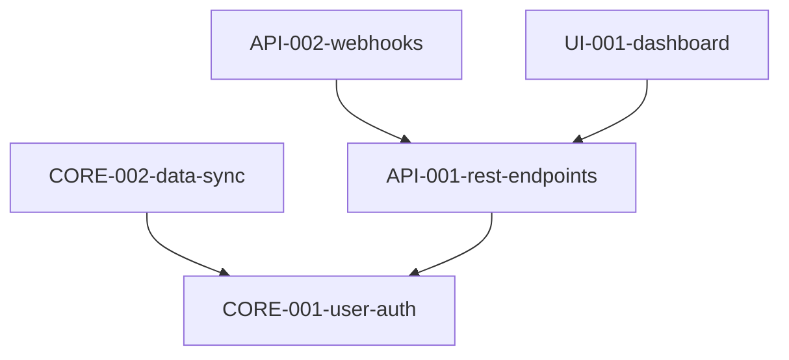

# /spectrena.deps - AI-Assisted Dependency Analysis

Analyze all specifications and generate a dependency graph showing which specs depend on others.

## Instructions

1. **Gather specs using MCP**: Call the `dep_graph_analyze` MCP tool to get all specifications with their content.

2. **Analyze dependencies**: For each spec, determine if it depends on other specs by looking for:
   - Explicit mentions of other specs (e.g., "depends on SPEC-001", "requires CORE-002")
   - Technical dependencies (e.g., if SPEC-002 uses auth and SPEC-001 implements auth)
   - Logical flow (e.g., "data sync" depends on "user auth" being implemented first)
   - Shared components or infrastructure

   **Dependency criteria**:
   - A spec **depends on** another if it requires functionality from it
   - A spec **depends on** another if it extends or builds upon it
   - A spec **depends on** another if it cannot be implemented until the other is complete
   - Avoid circular dependencies (A depends on B, B depends on A)

3. **Generate Mermaid graph**: Create a dependency graph in Mermaid format:
   ```mermaid
   graph TD
       SPEC-001-standalone
       SPEC-002-depends-on-001 --> SPEC-001-standalone
       SPEC-003-depends-on-both --> SPEC-001-standalone
       SPEC-003-depends-on-both --> SPEC-002-depends-on-001
   ```

   **Format rules**:
   - Use full spec IDs (e.g., `CORE-001-user-auth`)
   - Direction: `SPEC --> DEPENDENCY` (spec depends on dependency)
   - Include standalone specs (no dependencies) as single nodes
   - One dependency per line

4. **Present to user**: Show the proposed dependency graph and explain:
   - How many specs analyzed
   - How many dependencies found
   - Any interesting patterns or potential issues
   - Ask user to review and confirm

5. **Save if approved**: If user approves, call `dep_graph_save` MCP tool with the Mermaid graph content (without the ``` fences).

6. **Validate**: Run `sw dep check` to validate the graph for cycles and missing specs.

## Example Output

After analysis, present something like:

```
Analyzed 5 specifications:
- CORE-001-user-auth (standalone)
- CORE-002-data-sync (depends on CORE-001)
- API-001-rest-endpoints (depends on CORE-001)
- API-002-webhooks (depends on API-001)
- UI-001-dashboard (depends on API-001)

Proposed dependency graph:



This creates a clear implementation order:
1. CORE-001-user-auth (no dependencies)
2. CORE-002-data-sync, API-001-rest-endpoints (depend on CORE-001)
3. API-002-webhooks, UI-001-dashboard (depend on API-001)

Does this look correct? (yes/no)
```

If user says yes, save the graph and validate it.

## Error Handling

- If `dep_graph_analyze` returns no specs, instruct user to create specs first with `/spectrena.specify`
- If a cycle is detected by `sw dep check`, explain the cycle and ask user how to resolve it
- If specs are referenced that don't exist, warn the user

## Notes

- This command uses MCP tools: `dep_graph_analyze()` and `dep_graph_save()`
- The graph is saved to `deps.mermaid` in the project root
- Use `sw dep show` to view the graph later
- Use `sw dep add/rm` to manually adjust dependencies
- Use `sw ready` to see which specs are ready to implement
