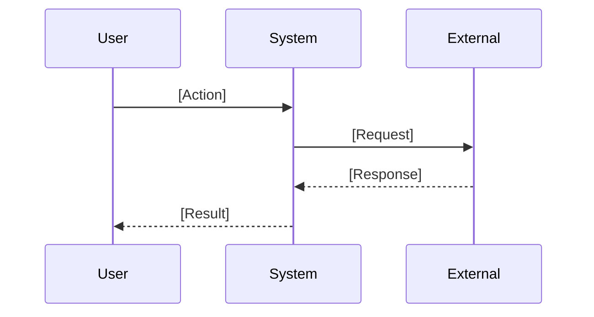

# Specification: {FEATURE_TITLE}

<!-- prettier-ignore-start -->
<!-- markdownlint-disable -->
<!--
SPEC WEIGHT: [ ] LIGHTWEIGHT  [ ] STANDARD  [x] FORMAL

Weight Guidelines:
- LIGHTWEIGHT: Bug fixes, small enhancements, config changes (<2 days work)
  Required sections: Quick Reference, Problem/Solution, Requirements, Acceptance Criteria

- STANDARD: New features, integrations, moderate complexity (2-10 days work)
  Required sections: All LIGHTWEIGHT + Data Model, Security, Test Requirements

- FORMAL: Major systems, compliance-sensitive, cross-team impact (>10 days work)
  Required sections: All sections, full sign-off

Mark your weight above, then delete non-required sections for lighter specs.

CLARIFICATION MARKERS:
Use [NEEDS CLARIFICATION: description] for decisions requiring stakeholder input.
These markers trigger the /spectrena.clarify workflow.
Maximum 3 markers per spec—use only for critical ambiguities.
Remove markers once resolved (move decision to Key Decisions table).
-->
<!-- markdownlint-enable -->
<!-- prettier-ignore-end -->

**Spec ID**: {SPEC_ID}  
**Component**: {COMPONENT}  
**Weight**: {WEIGHT}  
**Version**: 1.0  
**Status**: DRAFT | IN REVIEW | APPROVED | IMPLEMENTING | COMPLETE  
**Created**: {DATE}  
**Author**: [Name]

---

## Quick Reference

> One-paragraph executive summary. Write this last.

**What**: [Single sentence: what capability this adds]  
**Why**: [Single sentence: what problem this solves]  
**Impact**: [Single sentence: measurable outcome when complete]

**Success Metrics**:

| Metric             | Target  | How Measured |
| ------------------ | ------- | ------------ |
| [Primary metric]   | [Value] | [Method]     |
| [Secondary metric] | [Value] | [Method]     |

---

## Problem Statement

### Current State

[2-3 paragraphs describing the current situation. What exists today? What pain points do users experience? Include concrete examples.]

### Desired State

[2-3 paragraphs describing the target state. What will be true when this is complete? How will the user experience change?]

### Why Now

[1 paragraph: Why is this the right time to solve this? What's the cost of delay? What enables us to solve it now?]

---

## Solution Overview

### Approach

[2-4 paragraphs describing the high-level solution approach. Stay at the "what" level—implementation details belong in plan.md.]

### Scope

**In Scope**:

- [Capability or behavior that IS included]
- [Capability or behavior that IS included]
- [Capability or behavior that IS included]

**Out of Scope**:

- [Capability explicitly NOT included] — [Why excluded or where it's tracked]
- [Capability explicitly NOT included] — [Why excluded or where it's tracked]

**Future Considerations**:

- [Capability that may be added later] — [Conditions for inclusion]

### Key Decisions

<!--
Record significant decisions made during spec development.
Move resolved [NEEDS CLARIFICATION] items here with their resolution.
-->

| Decision           | Options Considered   | Rationale         |
| ------------------ | -------------------- | ----------------- |
| [What was decided] | [Option A, Option B] | [Why this choice] |

---

## Requirements

### Functional Requirements

<!--
Priority levels:
- CRITICAL: System unusable without this
- HIGH: Major functionality gap without this
- MEDIUM: Important but workarounds exist
- LOW: Nice to have

Use [NEEDS CLARIFICATION: ...] in Notes column for ambiguous requirements.
Example: [NEEDS CLARIFICATION: auth method - email/password vs SSO vs OAuth?]
-->

| ID     | Requirement           | Priority | Notes |
| ------ | --------------------- | -------- | ----- |
| FR-001 | [The system shall...] | CRITICAL |       |
| FR-002 | [The system shall...] | HIGH     |       |
| FR-003 | [The system shall...] | MEDIUM   |       |

### Non-Functional Requirements

| ID      | Requirement                                        | Priority | Notes |
| ------- | -------------------------------------------------- | -------- | ----- |
| NFR-001 | [Performance: Response time < Xms for Y operation] |          |       |
| NFR-002 | [Availability: System available 99.X% of time]     |          |       |
| NFR-003 | [Scalability: Support N concurrent users]          |          |       |

### User Stories

<!--
Format:
- **As** a [role],
- **I** need to
  - [action]
  - ...
- **so** that [outcome].
Each story needs testable acceptance criteria.
Stories map to tasks during /spectrena.tasks phase.
-->

**US-001: [Story Title]**

- **As** a [role],
- **I** need to
  - [action]
  - ...
- **so** that [outcome].

Acceptance:

- [ ] [Specific testable condition]
- [ ] [Specific testable condition]

Independent Test: [How this can be tested in isolation]

**US-002: [Story Title]**

- **As** a [role],
- **I** need to
  - [action]
  - ...
- **so** that [outcome].

Acceptance:

- [ ] [Specific testable condition]
- [ ] [Specific testable condition]

Independent Test: [How this can be tested in isolation]

---

## Data Model

<!--
SPEC BOUNDARY: Define WHAT data exists and business rules.
PLAN BOUNDARY: Define HOW it's stored (schemas, indexes, SQL).

Key Entities format matches spectrena convention for /spectrena.plan parsing.
-->

### Key Entities

<!--
List entities with business meaning only. No implementation details.
Format: [Entity]: [What it represents, key attributes without types]
-->

- **[Entity 1]**: [What it represents, key attributes without implementation]
- **[Entity 2]**: [What it represents, relationships to other entities]
- **[Entity 3]**: [What it represents, lifecycle notes]

### Entity Details

<!-- Expand each entity. Delete this section for LIGHTWEIGHT specs. -->

**[Entity Name]**

- **Purpose**: [What this entity represents in business terms]
- **Key Attributes**: [List essential attributes and their business meaning—no types]
- **Relationships**: [How this relates to other entities]
- **Lifecycle**: [When created, what triggers updates, when deleted]
- **Business Rules**:
  - [Rule about this entity]
  - [Rule about this entity]
- **Open Questions**: [NEEDS CLARIFICATION: retention policy not specified] _(if any)_

**[Entity Name]**

- **Purpose**: [What this entity represents]
- **Key Attributes**: [Essential attributes]
- **Relationships**: [Related entities]

### State Transitions

<!-- Include if entity has meaningful state. Delete otherwise. -->

```
[State diagram in text or mermaid - keep simple]

DRAFT → ACTIVE → COMPLETED
          ↓
       CANCELLED
```

**Transition Rules**:

- DRAFT → ACTIVE: [What must be true]
- ACTIVE → COMPLETED: [What must be true]
- ACTIVE → CANCELLED: [What must be true]

---

## Interfaces

<!--
SPEC BOUNDARY: Define WHAT operations exist, inputs/outputs, behavior.
PLAN BOUNDARY: Define HOW they're implemented (REST/GraphQL, specific endpoints, schemas).

Operations here become API contracts in plan.md.
-->

### Operations

<!--
Define operations at business level. No HTTP verbs, no JSON schemas.
Implementation details (REST paths, request/response bodies) go in plan.md contracts/.
-->

**[Operation Name]**

- **Purpose**: [What business function this enables]
- **Trigger**: [What initiates this operation]
- **Inputs**:
  - `[input]` (required): [Business meaning, valid values]
  - `[input]` (optional): [Business meaning, default behavior]
- **Outputs**: [What information is returned]
- **Behavior**:
  - [What happens during normal execution]
  - [Side effects or state changes]
- **Error Conditions**:
  - [Condition]: [Expected behavior]
  - [Condition]: [Expected behavior]

**[Operation Name]**

- **Purpose**: [Business function]
- **Inputs**: [Key inputs]
- **Outputs**: [Key outputs]
- **Behavior**: [Summary]

### Integration Points

<!-- External systems this feature interacts with -->

| System     | Direction | Purpose                    | Data Exchanged |
| ---------- | --------- | -------------------------- | -------------- |
| [System A] | Inbound   | [Why we receive from them] | [What data]    |
| [System B] | Outbound  | [Why we send to them]      | [What data]    |

---

## Workflows

### [Primary Workflow Name]

**Actors**: [Who participates]  
**Preconditions**: [What must be true before starting]  
**Postconditions**: [What is true after completion]



**Steps**:

1. [Actor] [does what] → [result]
2. [Actor] [does what] → [result]
3. [Actor] [does what] → [result]

**Alternate Flows**:

- At step [N], if [condition]: [what happens instead]

**Error Flows**:

- If [error condition]: [system behavior, user sees what]

---

## Security and Compliance

### Authorization

| Operation   | Required Permission  | Notes |
| ----------- | -------------------- | ----- |
| [Operation] | [Role or permission] |       |
| [Operation] | [Role or permission] |       |

### Data Classification

| Data Element | Classification                            | Handling Requirements |
| ------------ | ----------------------------------------- | --------------------- |
| [Data type]  | [Public/Internal/Confidential/Restricted] | [Special handling]    |

### Compliance Requirements

<!-- Delete sections that don't apply -->

**GDPR/HIPAA/ITAR/EAR/ETC** (if applicable):

- [ ] All data stored in compliant infrastructure
- [ ] Access limited to approved persons
- [ ] Export controls documented
- [ ] [Specific requirement]

**Audit Requirements**:

- Events to log: [List events requiring audit trail]
- Retention: [How long audit logs retained]
- Access: [Who can access audit logs]

**Data Protection**:

- PII handling: [Requirements]
- Encryption: [At rest, in transit requirements]
- Retention/deletion: [Policy]

---

## Test Requirements

### Success Criteria

<!--
Measurable outcomes that define "done".
Format matches spectrena SC-XXX convention for traceability.
These become validation targets in /spectrena.plan quickstart.md.
-->

| ID     | Criterion                                                                                            | Measurement    |
| ------ | ---------------------------------------------------------------------------------------------------- | -------------- |
| SC-001 | [Measurable metric, e.g., "Users can complete account creation in under 2 minutes"]                  | [How verified] |
| SC-002 | [Measurable metric, e.g., "System handles 1000 concurrent users without degradation"]                | [How verified] |
| SC-003 | [User satisfaction metric, e.g., "90% of users successfully complete primary task on first attempt"] | [How verified] |
| SC-004 | [Business metric, e.g., "Reduce support tickets related to X by 50%"]                                | [How verified] |

### Acceptance Criteria

<!--
Gherkin format for unambiguous testing.
Maps to user stories above.
-->

**Scenario**: [User action or workflow name] _(maps to US-001)_

```gherkin
Given [initial state]
When [action taken]
Then [expected result]
And [additional verification]
```

**Scenario**: [Another scenario] _(maps to US-002)_

```gherkin
Given [initial state]
When [action taken]
Then [expected result]
```

### Test Scenarios

<!-- Key scenarios that must be tested. Detailed test cases go in plan.md. -->

| ID     | Scenario                  | Type        | Priority | Maps To |
| ------ | ------------------------- | ----------- | -------- | ------- |
| TS-001 | [Happy path description]  | Functional  | CRITICAL | US-001  |
| TS-002 | [Error handling scenario] | Functional  | HIGH     | FR-003  |
| TS-003 | [Performance under load]  | Performance | HIGH     | NFR-001 |
| TS-004 | [Security boundary test]  | Security    | CRITICAL | NFR-002 |

### Performance Criteria

| Operation   | Metric        | Target    | Conditions        |
| ----------- | ------------- | --------- | ----------------- |
| [Operation] | Response time | < [X]ms   | [Load conditions] |
| [Operation] | Throughput    | > [X]/sec | [Conditions]      |

---

## Constraints and Assumptions

### Technical Constraints

- [Constraint]: [Impact on solution]
- [Constraint]: [Impact on solution]

### Business Constraints

- [Timeline, budget, resource constraint]
- [Policy or process constraint]

### Assumptions

<!-- Things we're assuming are true. If wrong, revisit spec. -->

- [Assumption about users, systems, or environment]
- [Assumption about dependencies]

### Dependencies

| Dependency          | Type                   | Status   | Impact if Delayed |
| ------------------- | ---------------------- | -------- | ----------------- |
| [What we depend on] | [System/Team/External] | [Status] | [Impact]          |

### Risks

| Risk                  | Likelihood | Impact | Mitigation          |
| --------------------- | ---------- | ------ | ------------------- |
| [What could go wrong] | H/M/L      | H/M/L  | [How we address it] |

---

## Open Questions

<!--
Track unresolved questions here AND inline with [NEEDS CLARIFICATION: ...] markers.
The /spectrena.clarify command scans for markers and uses this table.
Move resolved items to Key Decisions table with resolution rationale.

Maximum 4 [NEEDS CLARIFICATION] markers in spec—more indicates scope creep.
-->

| #   | Question                      | Location            | Owner         | Due    | Status |
| --- | ----------------------------- | ------------------- | ------------- | ------ | ------ |
| 1   | [Question needing resolution] | [Section or FR-XXX] | [Who decides] | [Date] | OPEN   |
| 2   | [Question needing resolution] | [Section or FR-XXX] | [Who decides] | [Date] | OPEN   |

### Clarifications Log

<!--
Record resolved clarifications here before moving to Key Decisions.
This creates an audit trail of how ambiguities were resolved.
-->

| Date | Question | Resolution | Decided By |
| ---- | -------- | ---------- | ---------- |
|      |          |            |            |

---

## References

### Internal

- [Link to related spec]
- [Link to architecture doc]
- [Link to prior art]

### External

- [Link to standard or regulation]
- [Link to vendor documentation]

---

## Approval

<!-- FORMAL weight requires sign-off. STANDARD/LIGHTWEIGHT may skip. -->

| Role                 | Name | Date | Status  |
| -------------------- | ---- | ---- | ------- |
| Author               |      |      | DRAFT   |
| Technical Review     |      |      | PENDING |
| Security Review      |      |      | PENDING |
| Product Owner        |      |      | PENDING |
| Compliance (if ITAR) |      |      | PENDING |

---

## Changelog

| Version | Date   | Author | Changes               |
| ------- | ------ | ------ | --------------------- |
| 1.0     | [Date] | [Name] | Initial specification |

---

<!-- prettier-ignore-start -->
<!-- markdownlint-disable -->
<!--
SPECTRENA WORKFLOW INTEGRATION

This template is compatible with spectrena's /spectrena.\* commands:

1. /spectrena.specify — Creates this spec from feature description
   - Fills in sections from user input
   - Adds [NEEDS CLARIFICATION] markers for ambiguities
   - Creates checklists/requirements.md for validation

2. /spectrena.clarify — Resolves [NEEDS CLARIFICATION] markers
   - Scans spec for markers (max 3 recommended)
   - Prompts for resolution
   - Updates Clarifications Log and Key Decisions

3. /spectrena.plan — Creates implementation plan from this spec
   - Reads Key Entities → generates data-model.md
   - Reads Operations → generates contracts/api-spec.json
   - Reads Success Criteria → generates quickstart.md

4. /spectrena.tasks — Breaks plan into executable tasks
   - User Stories (US-XXX) map to task groups
   - Requirements (FR-XXX) map to acceptance criteria
   - Test Scenarios (TS-XXX) map to verification tasks

5. /spectrena.implement — Executes tasks with code generation

SECTION MAPPING:

- Quick Reference → plan.md header
- Key Entities → data-model.md
- Operations → contracts/
- Success Criteria → quickstart.md validation
- User Stories → tasks.md task groups
- Requirements → task acceptance criteria

================================================================================
SPECTRENA INTEGRATION (if using Spectrena lineage tracking)
================================================================================

Register this spec for lineage tracking:

spec_register(
spec_id="[PROJECT]-SPEC-[NNN]",
title="[Feature Name]",
spec_path="specs/[NNN]-[slug]/spec.md"
)

After /spectrena.plan, register the plan:

plan_register(
plan_id="[spec_id]:plan",
spec_id="[spec_id]",
plan_path="specs/[NNN]-[slug]/plan.md",
tech_stack={"backend": "...", "db": "..."}
)

After /spectrena.tasks, register each task:

task_register(
task_id="[spec_id]:task-01",
plan_id="[spec_id]:plan",
title="[Task title from tasks.md]"
)

Implement with full traceability:

/spectrena.implement [task_id]

Lineage enables:

- FR-XXX → task → code change tracing
- "What implemented this requirement?" queries
- "What spec drove this code?" reverse lookups
-->
<!-- markdownlint-enable -->
<!-- prettier-ignore-end -->
