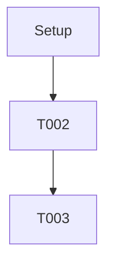

# Tasks: [FEATURE NAME]

**Input**: Design documents from `/specs/[###-feature-name]/`
**Prerequisites**: `plan.md` (required), `spec.md` (required), `research.md`, `data-model.md`, `contracts/`, `quickstart.md`

## Task Formatting Rules

- Every task MUST use the exact pattern: `- [ ] T### [P?] [Story?] Description (path)`.
- `T###` increases sequentially without gaps.
- `[P]` indicates the task can run in parallel; omit if sequential.
- `[US#]` ties the task to a user story. Omit for Setup/Foundational/Polish phases.
- Append `DependsOn: T001,T002` at the end of the description when dependencies exist.
- Reference real file paths inside parentheses.

## Dependency Registry

| Task ID | DependsOn | Rationale |
|---------|-----------|-----------|
| T001 | - | [Why this task has no dependencies] |
| T002 | T001 | [Explain dependency] |

## Mermaid Dependency Graph

## Phase Overview

1. **Phase 1 – Setup**: Shared infrastructure and repository scaffolding.
2. **Phase 2 – Foundational**: Cross-cutting components that block every story.
3. **Phase 3+ – User Stories**: One phase per story in priority order from spec.md.
4. **Final Phase – Polish**: Hardening, documentation, QA.

## Definition of Done per User Story

### User Story 1 (Priority: P1)

- [ ] Feature-specific functionality complete.
- [ ] Acceptance scenarios from spec validated.
- [ ] Linked tests (if requested) implemented and passing.
- [ ] Documentation and telemetry updated.

### User Story 2 (Priority: P2)

- [ ] Feature functionality complete.
- [ ] Acceptance scenarios validated.
- [ ] Linked tests passing.
- [ ] Documentation updated.

### User Story 3 (Priority: P3)

- [ ] Feature functionality complete.
- [ ] Acceptance scenarios validated.
- [ ] Linked tests passing.
- [ ] Documentation updated.

> Add additional user stories as needed and ensure each includes a Definition of Done checklist.

## Phase 1 – Setup (Shared Infrastructure)

**Goal**: Establish tooling, repository structure, and baseline dependencies.

- [ ] T001 Create project structure per implementation plan (path/to/structure)
- [ ] T002 [P] Configure linting and formatting tools (path/to/config)
- [ ] T003 [P] Initialize project dependencies (path/to/config) DependsOn: T001

## Phase 2 – Foundational (Blocking Prerequisites)

**Goal**: Provide infrastructure required by all user stories.

- [ ] T004 Establish data persistence baseline (path/to/migrations)
- [ ] T005 [P] Implement authentication/authorization framework (path/to/auth) DependsOn: T004
- [ ] T006 Setup domain-wide error handling (path/to/middleware)

## Phase 3 – User Story 1: [Title]

**Independent Test**: [Describe how this story is validated end-to-end.]

### Tests (if required)

- [ ] T007 [P] [US1] Create contract tests for [endpoint] (tests/contract/...) DependsOn: T004

### Implementation

- [ ] T008 [P] [US1] Implement domain model updates (src/models/...) DependsOn: T004
- [ ] T009 [US1] Build service logic (src/services/...) DependsOn: T008
- [ ] T010 [US1] Expose API/UI entry point (src/api/...) DependsOn: T009

## Phase 4 – User Story 2: [Title]

**Independent Test**: [Describe validation strategy.]

### Tests (if required)

- [ ] T011 [P] [US2] Add contract coverage (tests/contract/...)

### Implementation

- [ ] T012 [P] [US2] Extend data model (src/models/...)
- [ ] T013 [US2] Service integration (src/services/...)
- [ ] T014 [US2] Interface wiring (src/api/...)

## Phase 5 – User Story 3: [Title]

**Independent Test**: [Describe validation strategy.]

### Tests (if required)

- [ ] T015 [P] [US3] Add contract coverage (tests/contract/...)

### Implementation

- [ ] T016 [P] [US3] Extend data model (src/models/...)
- [ ] T017 [US3] Service integration (src/services/...)
- [ ] T018 [US3] Interface wiring (src/api/...)

## Final Phase – Polish & Cross-Cutting

- [ ] T019 Harden logging and observability (path/to/logging)
- [ ] T020 [P] Update documentation and quickstart (docs/...)
- [ ] T021 [P] Validate quickstart.md walkthrough (specs/.../quickstart.md)

## Task Metrics Summary

- **Total Tasks**: [COUNT]
- **Parallel-Friendly Tasks**: [COUNT]
- **Story Allocation**:
  - US1: [COUNT]
  - US2: [COUNT]
  - US3: [COUNT]
- **MVP Recommendation**: [Typically US1 completion]
