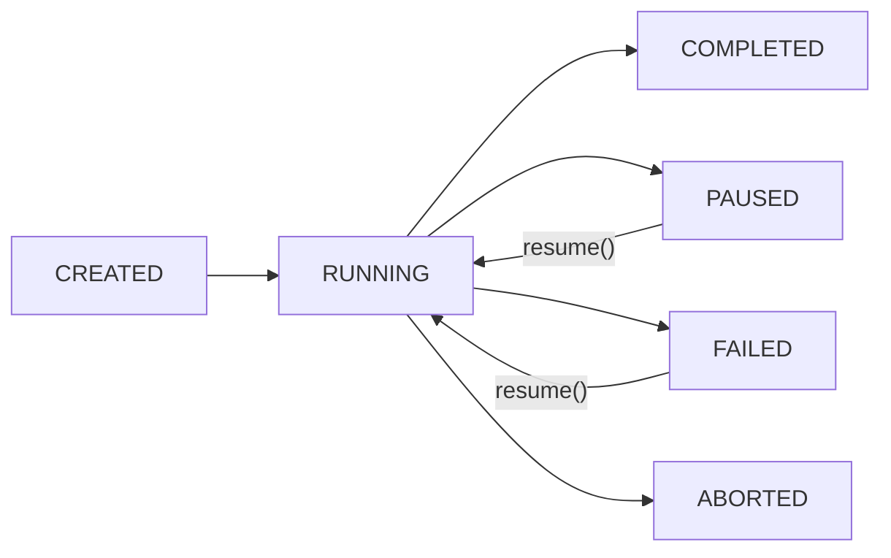
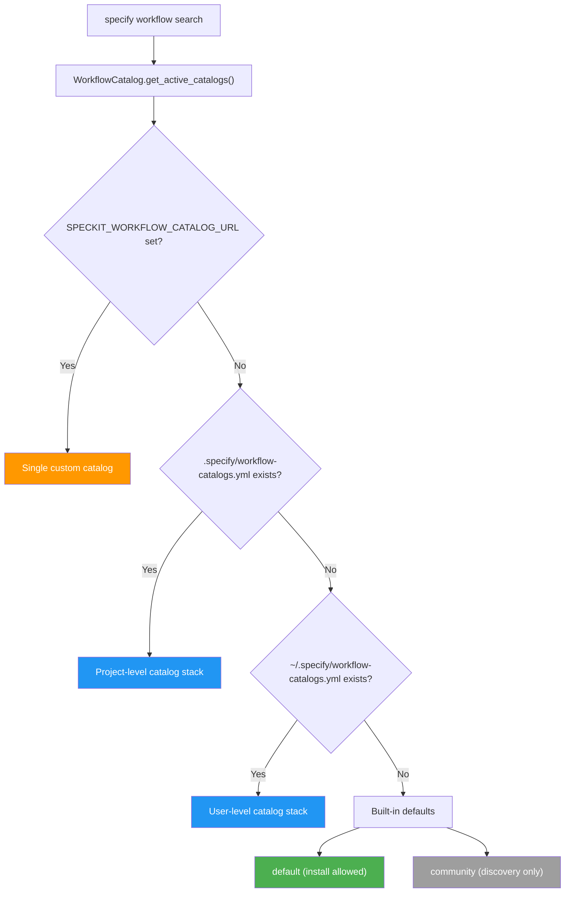

# Workflow System Architecture

This document describes the internal architecture of the workflow engine — how definitions are parsed, steps are dispatched, state is persisted, and catalogs are resolved.

For usage instructions, see [README.md](README.md).

## Execution Model

When `specify workflow run` is invoked, the engine loads a YAML definition, resolves inputs, and dispatches steps sequentially through the step registry:

```mermaid
flowchart TD
    A["specify workflow run my-workflow"] --> B["WorkflowEngine.load_workflow()"]
    B --> C["WorkflowDefinition.from_yaml()"]
    C --> D["_resolve_inputs()"]
    D --> E["validate_workflow()"]
    E --> F["RunState.create()"]
    F --> G["_execute_steps()"]
    G --> H{Step type?}
    H -- command --> I["CommandStep.execute()"]
    H -- shell --> J["ShellStep.execute()"]
    H -- slot --> V["SlotStep.execute()"]
    H -- gate --> K["GateStep.execute()"]
    H -- "if" --> L["IfThenStep.execute()"]
    H -- switch --> M["SwitchStep.execute()"]
    H -- "while/do-while" --> N["Loop steps"]
    H -- "fan-out/fan-in" --> O["Fan-out/fan-in"]

    I --> P{Result status?}
    J --> P
    V --> P
    K --> P
    L --> P
    M --> P
    N --> P
    O --> P
    P -- "COMPLETED / SKIPPED" --> Q{Has next_steps?}
    P -- PAUSED --> R["Save state → exit"]
    P -- FAILED --> S["Log error → exit"]
    Q -- Yes --> G
    Q -- No --> T{More steps?}
    T -- Yes --> G
    T -- No --> U["Status = COMPLETED"]

    style R fill:#ff9800,color:#fff
    style S fill:#f44336,color:#fff
    style U fill:#4caf50,color:#fff
```



### Sequential Execution

Steps execute sequentially. Each step receives a `StepContext` containing resolved inputs, accumulated step results, and workflow-level defaults. After execution, the step's output is stored in `context.steps[step_id]` and made available to subsequent steps via expressions like `{{ steps.specify.output.file }}`.

### Nested Steps (Control Flow)

Steps like `if`, `switch`, `while`, and `do-while` return `next_steps` — inline step definitions that the engine executes recursively via `_execute_steps()`. Nested steps share the same `StepContext` and `RunState`, so their outputs are visible to later top-level steps.

### State Persistence and Resume

The engine saves `RunState` to disk after each step, enabling resume from the exact point of interruption:



When a `gate` step pauses execution, the engine persists `current_step_index`
and all accumulated `step_results`. On `specify workflow resume <run_id>`, the
same executor replays completed occurrences into their contexts without
executing them, then continues at the unfinished occurrence.

New runs use a versioned execution tree. Each occurrence owns its result,
selected child sequences, and optional workflow binding. A binding stores the
target, frozen definition, private inputs, and `workflow_dir`; the called
workflow remains a private scope in the same run. Fan-out items have separate
contexts. Each occurrence, including a workflow call, is checkpointed as the
active step before its start is logged and before it executes, so status
reports it while it runs. Binding and selected expansions are
checkpointed before child side effects, results before an occurrence is done,
and logs after the checkpoint.
Legacy runs enter through their top-level index once. Inputs and tree
transitions share one atomic state checkpoint; the inputs file is a
compatibility mirror. A checkpoint failure prevents further writes by that
executor instance.

### Occurrence lifecycle

`Execution.step()` is the common runner for registered steps and workflow calls.
`execute_step()` and `workflow()` return a `StepResult`, a subtree outcome, or an
unknown-implementation failure. The runner alone performs `begin`, `finish`,
`settle`, and best-effort `leave` on exception unwinding; the phase and field
allow-lists in `transition()` reject invalid operations. The public, stateless
`StepBase.execute()` extension contract is unchanged.

All occurrence mutations pass through `Execution.transition()`. It checks the
allowed source phase and fields, derives the destination phase, validates the
candidate with the same node rules used on load, projects results, and saves
under the run lock. Callers cannot supply a destination phase.

| Operation | Meaning |
|-----------|---------|
| `begin` | Mark this occurrence active and checkpoint before `step_started` or its callback; a failed checkpoint leaves no start event |
| `expand` / `bind` | Freeze children and their source before child execution |
| `rebind` / `iterate` | Persist updated binding or the next loop occurrence |
| `outputs` | Children finished; declared workflow outputs remain to finalize |
| `finish` / `settle` | Record an own-step result or subtree outcome; clear activity |
| `leave` | Clear activity on exception unwinding; the run handler saves the failure/pause |

`phase` identifies the continuation point, `active` identifies entered occurrences
(several may be active in a fan-out), and `outcome` identifies a subtree halt or
completion. A container's own result may be completed while its children are
paused. `current_step_id` is a compatibility status view updated as
occurrences are entered, rather than a resume cursor. Completion does not
reconcile this scalar; during parallel fan-out it may name an item that has
already finished, while the tree's per-occurrence `active` flags remain
authoritative.
Status reporting uses a bound call's recorded result when available. If an
interruption or exception leaves the active call unfinished without a result,
its scope inherits the run's paused or failed status; completed calls keep
their own recorded status.

`notify()` emits events and callbacks only after the corresponding checkpoint.
Persistence is mandatory lifecycle behavior, not a listener. Existing container
events describe completion of their own expansion; calls finish after their
children and declared outputs. Completed replay emits neither events nor saves.
Entering an unfinished container on resume checkpoints activity without repeating
its expansion event.

Execution schema version 2 stores fan-out templates as shared YAML sources on
their parent occurrence. Raw `step_template` configuration is not published in
persisted step outputs. Frozen expansion results and aggregated `fan_results`
are separate: `result_view()` adds the aggregate for reporting and downstream
steps, while items always receive the frozen expansion view. This also preserves
YAML-native template scalars without putting them in JSON result records.

Resume validates tree structure, root snapshot, and the legacy offset together,
before any writes. The offset must be within the workflow and no later than the
saved root index. Main-format checkpoints without a tree still adapt once;
private, unreleased version-1 trees are rejected rather than silently interpreted
as the new format.

## Step Types

The engine ships with 13 built-in step types, each in its own subpackage under `src/specify_cli/workflows/step/`:

| Type Key | Class | Purpose | Returns `next_steps`? |
|----------|-------|---------|-----------------------|
| `command` | `CommandStep` | Invoke an installed Spec Kit command via integration CLI | No |
| `prompt` | `PromptStep` | Send an arbitrary inline prompt to integration CLI | No |
| `shell` | `ShellStep` | Run a shell command, capture output | No |
| `init` | `InitStep` | Bootstrap a project (equivalent to `specify init`) | No |
| `slot` | `SlotStep` | Named workflow slot; skipped when unfilled | No |
| `gate` | `GateStep` | Interactive human review/approval | No (pauses in CI) |
| `if` | `IfThenStep` | Conditional branching (then/else) | Yes |
| `switch` | `SwitchStep` | Multi-branch dispatch on expression | Yes |
| `while` | `WhileStep` | Loop while condition is truthy | Yes (if true) |
| `do-while` | `DoWhileStep` | Loop, always runs body at least once | Yes (always) |
| `fan-out` | `FanOutStep` | Dispatch per item over a collection | No (engine expands) |
| `fan-in` | `FanInStep` | Aggregate results from fan-out | No |
| `workflow` | `WorkflowStep` | Execute an installed workflow in a private scope | No (engine enters scope) |

## Step Registry

All step types register into `STEP_REGISTRY` via `_register_builtin_steps()` in `src/specify_cli/workflows/__init__.py`. The registry maps `type_key` strings to step instances:

```python
STEP_REGISTRY: dict[str, StepBase]  # e.g., {"command": CommandStep(), "gate": GateStep(), ...}
```

Registration is explicit — each step class is imported and instantiated. New step types follow the same pattern: subclass `StepBase`, set `type_key`, implement `execute()` and optionally `validate()`.

## Expression Engine

Workflow definitions use Jinja2-like `{{ expression }}` syntax for dynamic values. The expression engine in `src/specify_cli/workflows/expressions.py` supports:

| Feature | Syntax | Example |
|---------|--------|---------|
| Variable access | `{{ inputs.name }}` | Dot-path traversal into context |
| Step outputs | `{{ steps.plan.output.file }}` | Access previous step results |
| Comparisons | `==`, `!=`, `>`, `<`, `>=`, `<=` | `{{ count > 5 }}` |
| Boolean logic | `and`, `or`, `not` | `{{ items and status == 'ok' }}` |
| Membership | `in`, `not in` | `{{ 'error' not in status }}` |
| Literals | strings, numbers, booleans, lists | `{{ true }}`, `{{ [1, 2] }}` |
| Filter: `default` | `{{ val \| default('fallback') }}` | Fallback for `None` or an empty string |
| Filter: `join` | `{{ list \| join(', ') }}` | Join list elements |
| Filter: `contains` | `{{ text \| contains('sub') }}` | Substring/membership check |
| Filter: `map` | `{{ list \| map('attr') }}` | Extract attribute from each item |
| Filter: `from_json` | `{{ steps.emit.output.stdout \| from_json }}` | Parse a JSON string into a typed value (raises on invalid JSON) |
| Filter: `to_json` | `{{ obj \| to_json }}` | Serialize a value to a JSON string (inverse of `from_json`; mapping keys must be strings) |
| Filter: `upper` | `{{ text \| upper }}` | Uppercase a string (strings only) |
| Filter: `lower` | `{{ text \| lower }}` | Lowercase a string (strings only) |
| Filter: `split` | `{{ csv \| split(',') }}` | Split a string on a separator into a list |
| Filter: `length` | `{{ items \| length }}` | Length of a list or string (mappings rejected) |

**Single expressions** (`{{ expr }}` only) return typed values. **Mixed templates** (`"text {{ expr }} more"`) return interpolated strings.

**Filter argument strictness (new filters).** The five filters added in #4766 validate their supported inputs and raise `ValueError` naming the problem rather than leaking a Python `TypeError`/`AttributeError`: `upper`/`lower` accept only strings, `split` requires a string value and a non-empty string separator, `length` accepts only lists and strings, and `to_json` requires a JSON-serializable value whose mapping keys are strings, and additionally rejects non-finite floats (`NaN`, `Infinity`, `-Infinity`), which `json.dumps` would otherwise emit as bare tokens that are not valid JSON. Keys are checked before serialization because `json.dumps` would otherwise coerce `1` to `"1"` (colliding with an existing `"1"` key), while `sort_keys=True` raises an ordering `TypeError` on mixed key types — both surfacing as a generic "not JSON-serializable" that hides the authoring mistake. Coercion is deliberately rejected for these filters: a type mismatch almost always means the pipeline is wired to the wrong variable, and a coerced result (e.g. `"3"` for an int) would hide that. Arity is checked before the argument expression is evaluated, so a filter used with the wrong number of arguments — `| upper('x')`, `| split` with no separator, `| split(',', 1)`, `| join` bare — is reported as a known filter misused, distinct from an entirely unknown name.

The older filters are more permissive and are unchanged: `join` stringifies unsupported value shapes and elements, and `map`/`contains` return fallback values for unsupported inputs rather than raising.

**`to_json` output is deterministic.** It pins `sort_keys=True` and `ensure_ascii=False`, so the same value always serializes to the same bytes regardless of dict insertion order or platform, and non-ASCII text is not `\uXXXX`-escaped. This buys reproducibility only — it does **not** make the result safe to pass through a shell, because expression interpolation adds no quoting or escaping. See [Interpolation and shell safety](../docs/reference/workflows.md#interpolation-and-shell-safety) before interpolating JSON into a `run` field.

**Filters and comparisons.** The parser splits on the top-level `|` before looking for operators, so a comparison or other trailing token after a filter is rejected as ambiguous rather than silently evaluated (`{{ items | default(0) > 5 }}` raises) — the same holds for the new filters. The count a `length` filter would produce does not exist before the filter runs, so there is no way to write `{{ items | length > 0 }}`; the only supported branching form is the filtered value's own truthiness in a `condition:`, since `length` returns `0` for an empty input:

```yaml
condition: "{{ inputs.items | length }}"   # 0 -> False, any non-zero count -> True
```

### Namespace

The expression evaluator builds a namespace from the `StepContext`:

| Key | Source | Available when |
|-----|--------|----------------|
| `inputs` | Resolved workflow inputs | Always |
| `steps` | Accumulated step results | After first step |
| `item` | Current iteration item | Inside fan-out |
| `fan_in` | Aggregated results | Inside fan-in |

## Input Resolution

When a workflow is executed, `_resolve_inputs()` validates and coerces provided values against the `inputs:` schema:

| Declared Type | Coercion | Example |
|---------------|----------|---------|
| `string` | None (pass-through) | `"my-feature"` |
| `number` | `float()` → `int()` if whole | `"42"` → `42` |
| `boolean` | `"true"/"1"/"yes"` → `True` | `"false"` → `False` |
| `enum` | Validates against allowed values | `["full", "backend-only"]` |

Missing required inputs raise `ValueError`. Inputs with `default` values use the default when not provided.

## Catalog System



Catalogs are fetched with a 1-hour cache (per-URL, SHA256-hashed cache files in `.specify/workflows/.cache/`). Each catalog entry has a `priority` (for merge ordering) and `install_allowed` flag.

When `specify workflow add <id>` installs from catalog, it downloads the workflow YAML from the catalog entry's `url` field into `.specify/workflows/<id>/workflow.yml`.

## State and Configuration Locations

| Component | Location | Format | Purpose |
|-----------|----------|--------|---------|
| Workflow definitions | `.specify/workflows/{id}/workflow.yml` | YAML | Installed workflow definitions |
| Workflow registry | `.specify/workflows/workflow-registry.json` | JSON | Installed workflows metadata |
| Run state | `.specify/workflows/runs/{run_id}/state.json` | JSON | Persisted execution state |
| Run inputs | `.specify/workflows/runs/{run_id}/inputs.json` | JSON | Resolved input values |
| Run log | `.specify/workflows/runs/{run_id}/log.jsonl` | JSONL | Append-only event log |
| Catalog cache | `.specify/workflows/.cache/*.json` | JSON | Cached catalog entries (1hr TTL) |
| Project catalogs | `.specify/workflow-catalogs.yml` | YAML | Project-level catalog sources |
| User catalogs | `~/.specify/workflow-catalogs.yml` | YAML | User-level catalog sources |

## Module Structure

```text
src/specify_cli/
├── workflows/
│   ├── __init__.py          # STEP_REGISTRY + _register_builtin_steps()
│   ├── base.py              # StepBase, StepContext, StepResult, StepStatus, RunStatus
│   ├── catalog.py           # WorkflowCatalog, WorkflowCatalogEntry, WorkflowRegistry
│   ├── engine.py            # WorkflowDefinition, WorkflowEngine, RunState, validate_workflow()
│   ├── expressions.py       # evaluate_expression(), evaluate_condition(), filters
│   └── steps/
│       ├── command/         # Dispatch command to AI integration
│       ├── shell/           # Run shell command
│       ├── init/            # Bootstrap a project (specify init)
│       ├── slot/            # Named workflow slot; skipped when unfilled
│       ├── gate/            # Human review checkpoint
│       ├── if_then/         # Conditional branching
│       ├── prompt/          # Arbitrary inline prompts
│       ├── switch/          # Multi-branch dispatch
│       ├── while_loop/      # While loop
│       ├── do_while/        # Do-while loop
│       ├── fan_out/         # Sequential per-item dispatch
│       └── fan_in/          # Result aggregation
└── __init__.py              # CLI commands: specify workflow run/resume/status/
                             #   list/add/remove/search/info,
                             #   specify workflow catalog list/add/remove
```
